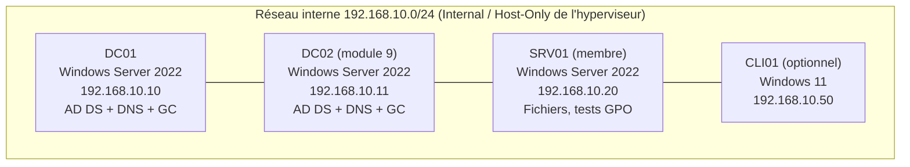
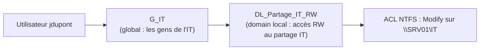

# Cours complet : Active Directory Domain Services (AD DS)
## Théorie + Pratique sur Windows Server 2022

---

## Table des matières

1. **[Module 1](#module-1-introduction-et-concepts-fondamentaux)** - Introduction et concepts fondamentaux
2. **[Module 2](#module-2-architecture-logique-et-physique)** - Architecture logique et physique d'AD
3. **[Module 3](#module-3-lab-preparation-de-lenvironnement)** - Lab : préparation de l'environnement
4. **[Module 4](#module-4-installation-du-premier-controleur-de-domaine)** - Installation du premier contrôleur de domaine
5. **[Module 5](#module-5-dns-et-active-directory)** - DNS et Active Directory
6. **[Module 6](#module-6-objets-ad-utilisateurs-groupes-ordinateurs-ou)** - Objets AD : utilisateurs, groupes, ordinateurs, OU
7. **[Module 7](#module-7-strategies-de-groupe-gpo)** - Stratégies de groupe (GPO)
8. **[Module 8](#module-8-roles-fsmo-et-catalogue-global)** - Rôles FSMO et catalogue global
9. **[Module 9](#module-9-replication-sites-et-services)** - Réplication, sites et services
10. **[Module 10](#module-10-approbations-trusts-et-multi-domaines)** - Approbations (trusts) et topologies multi-domaines
11. **[Module 11](#module-11-administration-avec-powershell)** - Administration avec PowerShell
12. **[Module 12](#module-12-securite-et-durcissement-hardening)** - Sécurité et durcissement (hardening)
13. **[Module 13](#module-13-sauvegarde-restauration-et-maintenance)** - Sauvegarde, restauration et maintenance
14. **[Module 14](#module-14-depannage-troubleshooting)** - Dépannage (troubleshooting)
15. **[Module 15](#module-15-projet-final-et-scenarios-dexamen)** - Projet final et scénarios d'examen

---

# Module 1 - Introduction et concepts fondamentaux

## 1.1 Qu'est-ce qu'Active Directory ?

Active Directory Domain Services (AD DS) est le service d'annuaire de Microsoft. Un annuaire est une base de données hiérarchique, distribuée et répliquée qui stocke des informations sur les ressources du réseau : utilisateurs, ordinateurs, groupes, imprimantes, partages, etc.

AD DS fournit trois fonctions essentielles :

- **Authentification** : vérifier l'identité d'un utilisateur ou d'une machine (protocole Kerberos, et NTLM en secours/legacy).
- **Autorisation** : déterminer ce qu'une identité a le droit de faire (jetons d'accès, SID, ACL).
- **Administration centralisée** : gérer des milliers de machines et d'utilisateurs depuis un point central (GPO, délégation).

## 1.2 Vocabulaire indispensable

| Terme | Définition |
|---|---|
| **Domaine** | Unité administrative et de sécurité de base. Ex. : `corp.lab.local` |
| **Arbre (tree)** | Ensemble de domaines partageant un espace de noms DNS contigu |
| **Forêt (forest)** | Ensemble d'un ou plusieurs arbres. Limite de sécurité réelle d'AD |
| **Contrôleur de domaine (DC)** | Serveur qui héberge une copie de la base AD (NTDS.dit) et répond aux authentifications |
| **OU (Unité d'organisation)** | Conteneur hiérarchique pour organiser les objets et cibler les GPO |
| **Schéma** | Définition de tous les types d'objets et attributs possibles dans la forêt |
| **Catalogue global (GC)** | DC qui détient une copie partielle de tous les objets de la forêt |
| **SID** | Security Identifier, identifiant de sécurité unique d'un objet |
| **GUID** | Identifiant unique universel, immuable, de chaque objet AD |
| **DN (Distinguished Name)** | Chemin LDAP complet : `CN=Jean Dupont,OU=IT,DC=corp,DC=lab,DC=local` |
| **UPN** | User Principal Name, ex. : `jdupont@corp.lab.local` |
| **sAMAccountName** | Nom de connexion "pré-Windows 2000", ex. : `CORP\jdupont` |

## 1.3 Les protocoles sous-jacents

- **LDAP** (389/tcp, LDAPS 636/tcp) : protocole d'accès et d'interrogation de l'annuaire.
- **Kerberos** (88/tcp-udp) : authentification par tickets (TGT, TGS). C'est le protocole par défaut.
- **DNS** (53/tcp-udp) : localisation des services via les enregistrements SRV. **AD ne fonctionne pas sans DNS.**
- **SMB** (445/tcp) : partages SYSVOL et NETLOGON (scripts, GPO).
- **RPC** (135/tcp + ports dynamiques 49152-65535) : réplication, gestion à distance.
- **NTP** (123/udp) : synchronisation du temps. Kerberos tolère 5 minutes de décalage maximum par défaut.

## 1.4 La base de données NTDS.dit

- Emplacement par défaut : `C:\Windows\NTDS\ntds.dit`
- Moteur : ESE (Extensible Storage Engine)
- Contient plusieurs partitions (naming contexts) :
  - **Schema** : répliquée à toute la forêt
  - **Configuration** : topologie (sites, services), répliquée à toute la forêt
  - **Domain** : objets du domaine, répliquée aux DC du domaine
  - **Partitions applicatives** : ex. `DomainDnsZones`, `ForestDnsZones`

---

# Module 2 - Architecture logique et physique

## 2.1 Structure logique

```
Forêt : lab.local
│
├── Arbre 1 : lab.local (domaine racine de forêt)
│   └── corp.lab.local (domaine enfant)
│
└── Arbre 2 : autresociete.com (autre espace de noms, même forêt)
```

Points clés :

- La **forêt est la limite de sécurité**. Un administrateur d'un domaine peut, par des techniques d'escalade, compromettre toute la forêt. Ne considérez jamais le domaine comme une frontière de sécurité.
- Tous les domaines d'une forêt partagent le même **schéma** et la même partition de **configuration**.
- Des **approbations bidirectionnelles transitives** existent automatiquement entre tous les domaines d'une forêt.

## 2.2 Structure physique

- **Sites** : représentent la topologie réseau réelle (LAN bien connectés). Servent à optimiser la réplication et à orienter les clients vers le DC le plus proche.
- **Subnets** : plages IP associées aux sites.
- **Site links** : liens logiques entre sites avec coût, planification et intervalle de réplication.

## 2.3 Niveaux fonctionnels

Windows Server 2022 ne crée pas de nouveau niveau fonctionnel : le maximum reste **Windows Server 2016** (forêt et domaine). Le niveau fonctionnel détermine les fonctionnalités disponibles et la version minimale des DC.

| Niveau | Fonctionnalités notables |
|---|---|
| 2008 R2 | Corbeille AD (Recycle Bin), Managed Service Accounts |
| 2012 | gMSA amélioré, KDC claims |
| 2012 R2 | Protected Users, Authentication Policies/Silos |
| 2016 | PAM (Privileged Access Management), rolling NTLM secrets pour les comptes membres de Protected Users |

## 2.4 Bonnes pratiques de conception (design)

1. **Une seule forêt, un seul domaine** dans 90 % des cas. La complexité multi-domaines se justifie rarement.
2. Nom DNS : utilisez un sous-domaine d'un domaine public que vous possédez, ex. `ad.entreprise.com` ou `corp.entreprise.com`. Évitez `.local` en production (réservé mDNS), mais il reste acceptable pour un lab.
3. Minimum **deux DC par domaine** pour la redondance.
4. Structure d'OU basée sur **l'administration et les GPO**, pas sur l'organigramme de l'entreprise.

---

# Module 3 - Lab : préparation de l'environnement

## 3.1 Topologie du lab

Nous allons construire progressivement ce lab tout au long du cours :



**Ressources minimales par VM** : 2 vCPU, 4 Go RAM (2 Go possible pour un DC de lab), 60 Go de disque (dynamique). Hyperviseur au choix : Hyper-V, VMware Workstation, VirtualBox, Proxmox.

Domaine du lab : **`corp.lab.local`** - NetBIOS : **`CORP`**.

## 3.2 Installation de Windows Server 2022

1. Téléchargez l'ISO d'évaluation Windows Server 2022 (180 jours) depuis le site Microsoft Evaluation Center.
2. Installez l'édition **Standard (Desktop Experience)** pour suivre le cours en GUI. (En production, Server Core est recommandé pour les DC : surface d'attaque réduite.)
3. Définissez un mot de passe administrateur local robuste, ex. `P@ssLab2022!` (lab uniquement).

## 3.3 Configuration post-installation de DC01

Ouvrez PowerShell **en administrateur** et exécutez :

```powershell
# 1. Renommer le serveur
Rename-Computer -NewName "DC01" -Restart

# --- Après redémarrage ---

# 2. Identifier l'interface réseau
Get-NetAdapter

# 3. Configurer une IP statique (OBLIGATOIRE pour un DC)
New-NetIPAddress -InterfaceAlias "Ethernet" `
    -IPAddress 192.168.10.10 `
    -PrefixLength 24 `
    -DefaultGateway 192.168.10.1

# 4. DNS : pointer vers soi-même (loopback en secondaire après promotion)
Set-DnsClientServerAddress -InterfaceAlias "Ethernet" -ServerAddresses 192.168.10.10

# 5. Fuseau horaire
Set-TimeZone -Id "Romance Standard Time"   # adaptez à votre région
# Pour Madagascar : Set-TimeZone -Id "E. Africa Standard Time"

# 6. Vérifications
Get-NetIPConfiguration
Test-NetConnection 192.168.10.1
```

> **Règle d'or n°1** : un contrôleur de domaine a toujours une **IP statique** et son horloge doit être fiable (le DC détenteur du rôle PDC Emulator synchronise le temps de tout le domaine).

---

# Module 4 - Installation du premier contrôleur de domaine

## 4.1 Installation du rôle AD DS

### Méthode GUI
1. **Server Manager** → *Manage* → *Add Roles and Features*.
2. Type : *Role-based or feature-based installation*.
3. Cochez **Active Directory Domain Services** (acceptez les fonctionnalités associées : outils RSAT, module PowerShell).
4. Installez (pas de redémarrage nécessaire à ce stade).

### Méthode PowerShell (recommandée)
```powershell
Install-WindowsFeature AD-Domain-Services -IncludeManagementTools
```

## 4.2 Promotion en contrôleur de domaine (nouvelle forêt)

### Méthode GUI
1. Dans Server Manager, cliquez sur le drapeau jaune → **Promote this server to a domain controller**.
2. *Add a new forest* → Root domain name : `corp.lab.local`.
3. Niveaux fonctionnels : **Windows Server 2016** (le maximum).
4. Cochez **DNS server** et **Global Catalog** (GC).
5. Mot de passe **DSRM** (Directory Services Restore Mode) : notez-le précieusement, il sert pour la restauration hors-ligne. Ex. lab : `DsrmP@ss2022!`
6. Ignorez l'avertissement sur la délégation DNS (normal en lab).
7. NetBIOS : `CORP`.
8. Chemins par défaut (NTDS, logs, SYSVOL) → *Next* → *Install*. Le serveur redémarre.

### Méthode PowerShell
```powershell
$dsrm = Read-Host -AsSecureString "Mot de passe DSRM"

Install-ADDSForest `
    -DomainName "corp.lab.local" `
    -DomainNetbiosName "CORP" `
    -ForestMode "WinThreshold" `
    -DomainMode "WinThreshold" `
    -InstallDns:$true `
    -SafeModeAdministratorPassword $dsrm `
    -Force
```
(`WinThreshold` = niveau Windows Server 2016.)

## 4.3 Vérifications post-promotion (à connaître par cœur)

```powershell
# État général du domaine et de la forêt
Get-ADDomain | Select-Object Name, DomainMode, PDCEmulator, InfrastructureMaster, RIDMaster
Get-ADForest | Select-Object Name, ForestMode, SchemaMaster, DomainNamingMaster, GlobalCatalogs

# Le DC est-il opérationnel ?
Get-ADDomainController -Filter * | Select-Object Name, IPv4Address, Site, IsGlobalCatalog

# Diagnostic complet du DC
dcdiag /v

# Enregistrements SRV DNS (critique !)
nslookup -type=SRV _ldap._tcp.dc._msdcs.corp.lab.local

# Partages SYSVOL et NETLOGON présents ?
net share

# Services essentiels
Get-Service NTDS, DNS, KDC, Netlogon, DFSR | Format-Table Name, Status
```

Si `dcdiag` passe tous les tests et que les enregistrements SRV répondent, votre DC est fonctionnel.

## 4.4 Ce qui s'est passé sous le capot

- Création de `C:\Windows\NTDS\ntds.dit` (base) et des journaux de transaction.
- Création de `C:\Windows\SYSVOL` avec les partages `SYSVOL` et `NETLOGON`.
- Enregistrement de dizaines d'enregistrements **SRV** dans la zone DNS `_msdcs.corp.lab.local`.
- Le serveur détient les **5 rôles FSMO** ([module 8](#module-8-roles-fsmo-et-catalogue-global)) et devient GC.
- Le compte Administrateur local devient l'**Administrateur du domaine** (et de l'entreprise, car domaine racine de forêt).

## 4.5 Exercice pratique n°1

1. Installez DC01 et promouvez-le comme décrit.
2. Exécutez `dcdiag /v` et identifiez les tests exécutés.
3. Avec `nslookup`, retrouvez l'enregistrement SRV du KDC Kerberos (`_kerberos._tcp`).
4. Trouvez le fichier `ntds.dit` et notez sa taille initiale.

---

# Module 5 - DNS et Active Directory

## 5.1 Pourquoi DNS est vital

Les clients localisent les contrôleurs de domaine **exclusivement via DNS** (enregistrements SRV). 90 % des pannes AD "mystérieuses" sont des problèmes DNS. Symptômes classiques : lenteurs d'ouverture de session, GPO non appliquées, échec de jonction au domaine, erreurs de réplication.

## 5.2 Zones intégrées à Active Directory

Une zone DNS *AD-integrated* est stockée dans l'annuaire (partitions `DomainDnsZones` / `ForestDnsZones`) et non dans un fichier plat. Avantages :

- Réplication multi-maîtres via la réplication AD (chiffrée, compressée).
- **Mises à jour dynamiques sécurisées** : seule la machine propriétaire de l'enregistrement peut le modifier (anti-spoofing).
- Pas de configuration de transfert de zone à maintenir.

## 5.3 Configuration recommandée

```powershell
# Vérifier les zones
Get-DnsServerZone

# Créer la zone de recherche inversée (bonne pratique)
Add-DnsServerPrimaryZone -NetworkID "192.168.10.0/24" -ReplicationScope "Forest" -DynamicUpdate Secure

# Redirecteurs (forwarders) vers des DNS publics pour la résolution Internet
Set-DnsServerForwarder -IPAddress 1.1.1.1, 8.8.8.8

# Vieillissement/nettoyage (scavenging) pour purger les enregistrements obsolètes
Set-DnsServerScavenging -ScavengingState $true -RefreshInterval 7.00:00:00 -NoRefreshInterval 7.00:00:00 -ApplyOnAllZones

# Tester
Resolve-DnsName dc01.corp.lab.local
Resolve-DnsName google.com
```

## 5.4 Règles DNS d'or pour les DC

1. Chaque DC pointe vers **un autre DC en DNS primaire** et vers **lui-même (127.0.0.1) en secondaire** (quand il y a plusieurs DC).
2. Les clients pointent **uniquement vers les DC** - jamais vers la box Internet ou 8.8.8.8 directement.
3. La résolution Internet passe par les **redirecteurs** du serveur DNS.
4. Activez le **scavenging**, sinon la zone accumule des enregistrements morts pendant des années.

## 5.5 Exercice pratique n°2

1. Créez la zone inverse `10.168.192.in-addr.arpa` et vérifiez que l'enregistrement PTR de DC01 apparaît (forcez avec `ipconfig /registerdns`).
2. Configurez les redirecteurs et validez la résolution d'un domaine public.
3. Avec `Get-DnsServerResourceRecord -ZoneName "_msdcs.corp.lab.local"`, listez les enregistrements SRV et identifiez ceux de Kerberos, LDAP et GC.

---

# Module 6 - Objets AD : utilisateurs, groupes, ordinateurs, OU

## 6.1 Outils d'administration

| Outil | Usage |
|---|---|
| **ADUC** (`dsa.msc`) | Utilisateurs et ordinateurs - l'outil du quotidien |
| **ADAC** (`dsac.exe`) | Centre d'administration moderne, corbeille AD, visionneuse PowerShell |
| **ADSI Edit** (`adsiedit.msc`) | Édition bas niveau des attributs - outil de chirurgien, dangereux |
| **GPMC** (`gpmc.msc`) | Gestion des GPO |
| **Sites and Services** (`dssite.msc`) | Sites, subnets, réplication |
| **Domains and Trusts** (`domain.msc`) | Approbations, UPN suffixes |

Astuce ADUC : activez *View → Advanced Features* pour voir les conteneurs cachés et l'onglet *Attribute Editor*.

## 6.2 Concevoir la structure d'OU

Ne confondez pas **conteneurs par défaut** (`Users`, `Computers` - on ne peut PAS y lier de GPO) et **OU** (créées par vous, cibles de GPO et de délégation).

Structure proposée pour le lab :

```
corp.lab.local
├── OU=CORP
│   ├── OU=Utilisateurs
│   │   ├── OU=Direction
│   │   ├── OU=IT
│   │   ├── OU=Comptabilite
│   │   └── OU=RH
│   ├── OU=Ordinateurs
│   │   ├── OU=Postes
│   │   └── OU=Portables
│   ├── OU=Serveurs
│   ├── OU=Groupes
│   └── OU=Comptes-Service
└── OU=Admin          (comptes et groupes d'administration - tiering)
```

```powershell
# Création de la structure en PowerShell
$base = "DC=corp,DC=lab,DC=local"
New-ADOrganizationalUnit -Name "CORP" -Path $base
$corp = "OU=CORP,$base"
"Utilisateurs","Ordinateurs","Serveurs","Groupes","Comptes-Service" |
    ForEach-Object { New-ADOrganizationalUnit -Name $_ -Path $corp }
"Direction","IT","Comptabilite","RH" |
    ForEach-Object { New-ADOrganizationalUnit -Name $_ -Path "OU=Utilisateurs,$corp" }
"Postes","Portables" |
    ForEach-Object { New-ADOrganizationalUnit -Name $_ -Path "OU=Ordinateurs,$corp" }
New-ADOrganizationalUnit -Name "Admin" -Path $base
```

> Par défaut, les OU sont créées avec la **protection contre la suppression accidentelle** (`ProtectedFromAccidentalDeletion`). Laissez-la activée.

## 6.3 Utilisateurs

```powershell
# Créer un utilisateur
New-ADUser -Name "Jean Dupont" `
    -GivenName "Jean" -Surname "Dupont" `
    -SamAccountName "jdupont" `
    -UserPrincipalName "jdupont@corp.lab.local" `
    -Path "OU=IT,OU=Utilisateurs,OU=CORP,DC=corp,DC=lab,DC=local" `
    -AccountPassword (Read-Host -AsSecureString "Mot de passe") `
    -ChangePasswordAtLogon $true `
    -Enabled $true

# Recherches courantes
Get-ADUser -Filter {Enabled -eq $false}                          # comptes désactivés
Get-ADUser -Filter * -SearchBase "OU=IT,OU=Utilisateurs,OU=CORP,DC=corp,DC=lab,DC=local"
Search-ADAccount -PasswordExpired                                # mots de passe expirés
Search-ADAccount -AccountInactive -TimeSpan 90.00:00:00 -UsersOnly  # inactifs 90 jours
Search-ADAccount -LockedOut                                      # comptes verrouillés

# Actions courantes
Unlock-ADAccount jdupont
Set-ADAccountPassword jdupont -Reset -NewPassword (Read-Host -AsSecureString)
Disable-ADAccount jdupont
Move-ADObject -Identity (Get-ADUser jdupont).DistinguishedName -TargetPath "OU=RH,OU=Utilisateurs,OU=CORP,DC=corp,DC=lab,DC=local"
```

### Création en masse depuis un CSV

`utilisateurs.csv` :
```csv
Prenom,Nom,Login,Service
Alice,Martin,amartin,Comptabilite
Bob,Durand,bdurand,IT
Chloe,Bernard,cbernard,RH
```

```powershell
$pwd = ConvertTo-SecureString "Bienvenue2026!" -AsPlainText -Force
Import-Csv .\utilisateurs.csv | ForEach-Object {
    New-ADUser -Name "$($_.Prenom) $($_.Nom)" `
        -GivenName $_.Prenom -Surname $_.Nom `
        -SamAccountName $_.Login `
        -UserPrincipalName "$($_.Login)@corp.lab.local" `
        -Path "OU=$($_.Service),OU=Utilisateurs,OU=CORP,DC=corp,DC=lab,DC=local" `
        -Department $_.Service `
        -AccountPassword $pwd -ChangePasswordAtLogon $true -Enabled $true
}
```

## 6.4 Groupes : types, étendues et stratégie AGDLP

**Deux types** :

- *Security* : porte des permissions (possède un SID). Le type utile.
- *Distribution* : listes de diffusion mail uniquement.

**Trois étendues (scopes)** :

| Étendue | Peut contenir | Utilisable sur | Usage |
|---|---|---|---|
| **Global (G)** | Utilisateurs du même domaine | Toute la forêt | Regrouper des personnes par rôle |
| **Domain Local (DL)** | Utilisateurs/groupes de toute la forêt | Ressources du domaine local | Porter les permissions sur les ressources |
| **Universal (U)** | Objets de toute la forêt | Toute la forêt | Multi-domaines (membership répliqué dans le GC) |

**Stratégie AGDLP** - *Accounts → Global groups → Domain Local groups → Permissions* :



```powershell
New-ADGroup -Name "G_IT" -GroupScope Global -GroupCategory Security `
    -Path "OU=Groupes,OU=CORP,DC=corp,DC=lab,DC=local"
New-ADGroup -Name "DL_Partage_IT_RW" -GroupScope DomainLocal -GroupCategory Security `
    -Path "OU=Groupes,OU=CORP,DC=corp,DC=lab,DC=local"

Add-ADGroupMember -Identity "G_IT" -Members jdupont, bdurand
Add-ADGroupMember -Identity "DL_Partage_IT_RW" -Members "G_IT"

Get-ADGroupMember "G_IT" -Recursive
Get-ADPrincipalGroupMembership jdupont | Select-Object Name
```

## 6.5 Ordinateurs et jonction au domaine

Sur SRV01 (PowerShell admin) :

```powershell
# Prérequis : DNS du client = 192.168.10.10
Set-DnsClientServerAddress -InterfaceAlias "Ethernet" -ServerAddresses 192.168.10.10
Rename-Computer -NewName "SRV01" -Restart

# Après redémarrage : jonction directement dans la bonne OU
Add-Computer -DomainName "corp.lab.local" `
    -OUPath "OU=Serveurs,OU=CORP,DC=corp,DC=lab,DC=local" `
    -Credential CORP\Administrator -Restart
```

> Bonne pratique : redirigez les conteneurs par défaut avec `redircmp` et `redirusr` pour que les nouvelles machines/utilisateurs atterrissent dans une OU gérée par GPO :
> ```cmd
> redircmp "OU=Ordinateurs,OU=CORP,DC=corp,DC=lab,DC=local"
> ```

## 6.6 Délégation de contrôle

Principe du moindre privilège : le helpdesk n'a pas besoin d'être Domain Admin pour réinitialiser des mots de passe.

1. Créez le groupe `G_Helpdesk`.
2. Clic droit sur l'OU `Utilisateurs` → **Delegate Control**.
3. Ajoutez `G_Helpdesk` → tâche : *Reset user passwords and force password change at next logon*.
4. Vérifiez avec l'onglet *Security → Advanced* de l'OU.

## 6.7 Corbeille AD (Recycle Bin)

```powershell
# Activation (IRRÉVERSIBLE, mais toujours souhaitable)
Enable-ADOptionalFeature "Recycle Bin Feature" `
    -Scope ForestOrConfigurationSet -Target "corp.lab.local"

# Restaurer un objet supprimé
Get-ADObject -Filter {displayName -like "*Dupont*"} -IncludeDeletedObjects |
    Restore-ADObject
```

## 6.8 Exercice pratique n°3

1. Créez la structure d'OU complète du 6.2.
2. Importez 10 utilisateurs via CSV.
3. Mettez en place AGDLP pour un partage `\\SRV01\Compta` : `G_Comptabilite` → `DL_Compta_RW` → ACL NTFS.
4. Déléguez la réinitialisation de mots de passe à `G_Helpdesk` et testez avec un compte helpdesk (via ADUC sur SRV01 avec RSAT).
5. Supprimez un utilisateur test puis restaurez-le via la corbeille AD.

---

# Module 7 - Stratégies de groupe (GPO)

## 7.1 Concepts

Une **GPO** est un ensemble de paramètres appliqués aux **utilisateurs** et/ou **ordinateurs**. Elle se compose de :

- **GPC** (Group Policy Container) : objet dans AD (version, liens).
- **GPT** (Group Policy Template) : fichiers dans `\\corp.lab.local\SYSVOL\corp.lab.local\Policies\{GUID}`.

Deux moitiés dans chaque GPO :

- **Computer Configuration** : appliquée au démarrage + rafraîchissement (~90-120 min).
- **User Configuration** : appliquée à l'ouverture de session + rafraîchissement.

## 7.2 Ordre d'application : LSDOU

```
Local → Site → Domain → OU (parent → enfant)
```
**Le dernier appliqué gagne** en cas de conflit (donc l'OU la plus proche de l'objet). Modificateurs :

- **Enforced** (sur un lien) : la GPO gagne toujours et traverse les blocages.
- **Block Inheritance** (sur une OU) : bloque les GPO venant d'au-dessus (sauf Enforced).
- **Security Filtering** : n'appliquer la GPO qu'à certains groupes (nécessite *Read* + *Apply Group Policy*).
- **WMI Filtering** : filtrer par requête WMI (ex. : seulement Windows 11) - coûteux, à utiliser avec parcimonie.
- **Loopback Processing** (Merge/Replace) : appliquer des paramètres *utilisateur* selon l'*ordinateur* (salles de formation, RDS, kiosques).

## 7.3 GPO essentielles à créer dans le lab

### GPO 1 : fond d'écran et lecteur réseau (User)
1. GPMC → clic droit sur `OU=Utilisateurs` → *Create a GPO... and Link it here* → `GPO-U-Bureautique`.
2. *User Config → Preferences → Windows Settings → Drive Maps* : mapper `S:` sur `\\SRV01\Partage`.
3. *User Config → Policies → Admin Templates → Desktop → Desktop Wallpaper*.

### GPO 2 : sécurité des postes (Computer)
`GPO-C-Securite-Postes` liée à `OU=Ordinateurs` :

- Pare-feu Windows activé sur les 3 profils.
- Windows Defender : protection en temps réel forcée.
- *Interactive logon: Do not display last user name* = Enabled.
- Verrouillage de session après 15 min d'inactivité.

### GPO 3 : politique de mots de passe du domaine
La politique de mot de passe du domaine vit dans la **Default Domain Policy** (unique GPO au niveau domaine à effet pour les mots de passe) :

- Longueur minimale : 14
- Historique : 24
- Verrouillage : 5 tentatives / 15 min

> Pour des politiques différenciées par groupe, utilisez les **Fine-Grained Password Policies** (PSO) via ADAC → System → Password Settings Container :
> ```powershell
> New-ADFineGrainedPasswordPolicy -Name "PSO-Admins" -Precedence 10 `
>     -MinPasswordLength 20 -LockoutThreshold 5 `
>     -LockoutDuration 00:30:00 -LockoutObservationWindow 00:30:00 `
>     -ComplexityEnabled $true -MaxPasswordAge 365.00:00:00
> Add-ADFineGrainedPasswordPolicySubject "PSO-Admins" -Subjects "Domain Admins"
> ```

## 7.4 Cycle de vie et diagnostic

```powershell
# Forcer l'application immédiate (sur le client)
gpupdate /force

# Qu'est-ce qui s'applique et pourquoi ?
gpresult /r                # résumé console
gpresult /h rapport.html   # rapport HTML détaillé

# Côté serveur : modélisation et résultats
# GPMC → Group Policy Modeling / Group Policy Results

# Sauvegarder toutes les GPO (à scripter en tâche planifiée !)
Backup-GPO -All -Path "C:\Backup\GPO"
# Restaurer
Restore-GPO -Name "GPO-C-Securite-Postes" -Path "C:\Backup\GPO"
```

Bonnes pratiques GPO :

1. Convention de nommage claire : `GPO-U-*` (user), `GPO-C-*` (computer).
2. Peu de GPO monolithiques plutôt que 200 micro-GPO (temps de logon).
3. Désactivez la moitié inutilisée (Computer ou User) dans les détails de la GPO.
4. **Ne modifiez jamais** Default Domain Policy / Default Domain Controllers Policy sauf pour leur rôle prévu (mots de passe / droits des DC).
5. Testez sur une OU pilote avant tout déploiement large.
6. Installez les **modèles ADMX** récents dans le *Central Store* : `\\corp.lab.local\SYSVOL\corp.lab.local\Policies\PolicyDefinitions`.

## 7.5 Exercice pratique n°4

1. Créez les 3 GPO ci-dessus et validez sur SRV01/CLI01 avec `gpresult /h`.
2. Créez une GPO qui interdit le Panneau de configuration, liez-la à `OU=Comptabilite`, vérifiez qu'un compte IT n'est pas affecté.
3. Testez *Block Inheritance* sur une sous-OU puis contournez-le avec *Enforced*.
4. Mettez en place une PSO de 20 caractères pour les Domain Admins et vérifiez avec :
   `Get-ADUserResultantPasswordPolicy Administrator`

---

# Module 8 - Rôles FSMO et catalogue global

## 8.1 Les 5 rôles FSMO

AD est multi-maîtres pour l'écriture, sauf pour 5 opérations sensibles confiées à des maîtres uniques (**Flexible Single Master Operations**) :

| Rôle | Portée | Fonction | Impact si indisponible |
|---|---|---|---|
| **Schema Master** | Forêt | Modifications du schéma | Aucune au quotidien (extension schéma impossible) |
| **Domain Naming Master** | Forêt | Ajout/suppression de domaines | Aucune au quotidien |
| **PDC Emulator** | Domaine | Temps (NTP), verrouillages, changements de mdp prioritaires, GPO (éditeur par défaut), compat NT4 | **Impact immédiat** : dérive temps, verrouillages incohérents |
| **RID Master** | Domaine | Distribue les pools de RID aux DC (SID = SID domaine + RID) | Création d'objets bloquée quand les pools s'épuisent |
| **Infrastructure Master** | Domaine | Références inter-domaines (phantoms) | Aucun impact si tous les DC sont GC ou domaine unique |

## 8.2 Localiser, transférer, saisir

```powershell
# Localiser
netdom query fsmo
# ou
Get-ADDomain  | Select-Object PDCEmulator, RIDMaster, InfrastructureMaster
Get-ADForest | Select-Object SchemaMaster, DomainNamingMaster

# Transfert propre (les deux DC sont en ligne)
Move-ADDirectoryServerOperationMasterRole -Identity "DC02" `
    -OperationMasterRole PDCEmulator, RIDMaster

# SAISIE (seizure) - uniquement si l'ancien détenteur est MORT et ne reviendra JAMAIS
Move-ADDirectoryServerOperationMasterRole -Identity "DC02" `
    -OperationMasterRole SchemaMaster -Force
```

> **Règle absolue** : après une saisie, l'ancien détenteur ne doit **jamais** être reconnecté au réseau sans avoir été rétrogradé/réinstallé (risque de duplication de RID/USN rollback).

## 8.3 Catalogue global (GC)

- Copie **partielle** (attributs marqués PAS - Partial Attribute Set) de **tous les objets de la forêt**.
- Écoute sur les ports **3268** (LDAP GC) et **3269** (LDAPS GC).
- Nécessaire pour : les ouvertures de session (résolution des groupes universels), les recherches à l'échelle forêt, Exchange.
- Recommandation moderne : **tous les DC sont GC** (sauf grosse forêt multi-domaines avec contrainte Infrastructure Master).

```powershell
# Rendre un DC GC (ou vérifier)
Get-ADDomainController -Filter * | Select Name, IsGlobalCatalog
Set-ADObject -Identity (Get-ADDomainController "DC02").NTDSSettingsObjectDN -Replace @{options=1}
```

## 8.4 Exercice pratique n°5
1. Identifiez les 5 rôles avec `netdom query fsmo`.
2. (Après le [module 9](#module-9-replication-sites-et-services), quand DC02 existera) Transférez PDC Emulator vers DC02 puis revenez en arrière.
3. Expliquez par écrit pourquoi le PDC Emulator est le rôle le plus critique au quotidien.

---

# Module 9 - Réplication, sites et services

## 9.1 Déploiement de DC02 (redondance)

Sur DC02 (déjà renommé, IP `192.168.10.11`, DNS → `192.168.10.10`) :

```powershell
Install-WindowsFeature AD-Domain-Services -IncludeManagementTools

$dsrm = Read-Host -AsSecureString "Mot de passe DSRM"
Install-ADDSDomainController `
    -DomainName "corp.lab.local" `
    -InstallDns:$true `
    -Credential (Get-Credential CORP\Administrator) `
    -SafeModeAdministratorPassword $dsrm `
    -Force
```

Après redémarrage, ajustez le DNS des deux DC (croisé + loopback) :
```powershell
# Sur DC01 :
Set-DnsClientServerAddress -InterfaceAlias "Ethernet" -ServerAddresses 192.168.10.11, 127.0.0.1
# Sur DC02 :
Set-DnsClientServerAddress -InterfaceAlias "Ethernet" -ServerAddresses 192.168.10.10, 127.0.0.1
```

## 9.2 Fonctionnement de la réplication

- **Multi-maîtres** : chaque DC accepte les écritures (hors FSMO) et les propage.
- **USN (Update Sequence Number)** : compteur local de modifications ; base du suivi de réplication (avec high-watermark et up-to-dateness vector).
- **KCC (Knowledge Consistency Checker)** : construit automatiquement la topologie de réplication (anneau bidirectionnel intra-site, max 3 sauts).
- **Intra-site** : notification quasi immédiate (~15 s), non compressée.
- **Inter-site** : planifiée (défaut 180 min, minimum 15 min), compressée, via les *site links* et les serveurs *bridgehead*.
- **SYSVOL** : répliqué par **DFSR** (plus FRS depuis 2019+).
- Conflits : résolus par version/horodatage/GUID - le dernier écrivain gagne au niveau **attribut**.

## 9.3 Outils de contrôle

```powershell
# État de la réplication
repadmin /replsummary          # vue synthétique - LE réflexe quotidien
repadmin /showrepl             # détail par partenaire
repadmin /queue                # file d'attente
repadmin /syncall /AdeP        # forcer une réplication complète

Get-ADReplicationPartnerMetadata -Target DC01 |
    Select Partner, LastReplicationSuccess, LastReplicationResult
Get-ADReplicationFailure -Scope Domain
```

## 9.4 Sites et subnets

Même en mono-site, configurez proprement :

```powershell
# Renommer le site par défaut
Get-ADReplicationSite "Default-First-Site-Name" | Rename-ADObject -NewName "Tana-HQ"

# Déclarer le subnet (sinon les clients choisissent un DC au hasard !)
New-ADReplicationSubnet -Name "192.168.10.0/24" -Site "Tana-HQ"

# Scénario multi-sites (exemple)
New-ADReplicationSite -Name "Agence-Nord"
New-ADReplicationSubnet -Name "192.168.20.0/24" -Site "Agence-Nord"
New-ADReplicationSiteLink -Name "HQ-Nord" `
    -SitesIncluded "Tana-HQ","Agence-Nord" -Cost 100 `
    -ReplicationFrequencyInMinutes 15
```

> Un subnet non déclaré = clients qui s'authentifient sur un DC distant à travers le WAN = lenteurs. `nltest /dsgetsite` sur un client indique son site détecté.

## 9.5 Exercice pratique n°6
1. Promouvez DC02 et vérifiez avec `repadmin /replsummary` (0 erreur attendu).
2. Créez un utilisateur sur DC02, vérifiez son apparition sur DC01 (`Get-ADUser -Server DC01`).
3. Coupez la carte réseau de DC02, créez un utilisateur sur DC01, rallumez, observez la convergence.
4. Renommez le site, déclarez le subnet, puis vérifiez `nltest /dsgetsite` sur SRV01.

---

# Module 10 - Approbations (trusts) et multi-domaines

## 10.1 Types d'approbations

| Type | Transitivité | Sens | Usage |
|---|---|---|---|
| Parent-enfant | Transitive | Bidirectionnelle | Automatique dans une forêt |
| Tree-root | Transitive | Bidirectionnelle | Automatique entre arbres d'une forêt |
| **Forest trust** | Transitive | Uni/Bi | Entre deux forêts (fusion, partenariat) |
| **External trust** | Non transitive | Uni/Bi | Vers un domaine précis d'une autre forêt (legacy) |
| Shortcut | Transitive | Uni/Bi | Raccourci d'authentification dans une grande forêt |
| Realm | Variable | Uni/Bi | Vers un royaume Kerberos non-Windows (MIT) |

Notions de sécurité associées :

- **SID Filtering** : activé par défaut sur les trusts externes/forêt, bloque l'injection de SID étrangers (attaque SID History).
- **Selective Authentication** : n'autoriser que certains comptes de la forêt approuvée à s'authentifier sur certaines ressources.

```powershell
# Vérifier les approbations
Get-ADTrust -Filter * | Select Name, Direction, TrustType, ForestTransitive
netdom trust corp.lab.local /domain:autre.local /verify
```

## 10.2 Quand créer plusieurs domaines/forêts ?

- **Plusieurs forêts** : exigence d'isolation de sécurité forte (filiales hostiles, environnement admin dédié type "red forest" - désormais remplacé par le tiering + PAW).
- **Plusieurs domaines** : quasiment plus jamais justifié aujourd'hui (raisons historiques : politique de mdp unique avant les PSO, liens lents avant la compression).

---

# Module 11 - Administration avec PowerShell

## 11.1 Le module ActiveDirectory

```powershell
Import-Module ActiveDirectory        # auto sur un DC ; via RSAT ailleurs
Get-Command -Module ActiveDirectory | Measure-Object    # ~150 cmdlets
```

Le lecteur `AD:` permet de naviguer dans l'annuaire comme dans un disque : `cd AD:; dir "DC=corp,DC=lab,DC=local"`.

## 11.2 Filtres efficaces

```powershell
# BON : -Filter traité côté serveur (rapide)
Get-ADUser -Filter {Department -eq "IT" -and Enabled -eq $true}

# MAUVAIS : tout rapatrier puis filtrer côté client (lent, charge le DC)
Get-ADUser -Filter * -Properties Department | Where-Object Department -eq "IT"

# LDAPFilter pour les cas avancés (comptes avec mdp qui n'expire jamais)
Get-ADUser -LDAPFilter "(userAccountControl:1.2.840.113556.1.4.803:=65536)"

# -Properties : ne demander QUE ce dont on a besoin (jamais -Properties * en prod)
Get-ADUser jdupont -Properties Department, LastLogonDate, PasswordLastSet
```

## 11.3 Scripts d'audit prêts à l'emploi

```powershell
# 1. Rapport des comptes à privilèges
"Domain Admins","Enterprise Admins","Schema Admins","Administrators" | ForEach-Object {
    $g = $_
    Get-ADGroupMember $g -Recursive | ForEach-Object {
        [pscustomobject]@{ Groupe = $g; Membre = $_.SamAccountName; Type = $_.objectClass }
    }
} | Export-Csv C:\Audit\admins.csv -NoTypeInformation

# 2. Comptes inactifs > 90 jours → désactivation + déplacement
$cible = "OU=Desactives,OU=CORP,DC=corp,DC=lab,DC=local"
Search-ADAccount -AccountInactive -TimeSpan 90 -UsersOnly |
    Where-Object Enabled | ForEach-Object {
        Disable-ADAccount $_
        Move-ADObject $_.DistinguishedName -TargetPath $cible
    }

# 3. Mots de passe qui n'expirent jamais (hors comptes de service documentés)
Get-ADUser -Filter {PasswordNeverExpires -eq $true -and Enabled -eq $true} |
    Select-Object SamAccountName, DistinguishedName

# 4. Santé quotidienne des DC (à planifier)
$rapport = foreach ($dc in (Get-ADDomainController -Filter *)) {
    [pscustomobject]@{
        DC       = $dc.Name
        Ping     = Test-Connection $dc.HostName -Count 1 -Quiet
        SYSVOL   = Test-Path "\\$($dc.HostName)\SYSVOL"
        Services = (Get-Service NTDS,DNS,KDC,Netlogon -ComputerName $dc.HostName |
                    Where-Object Status -ne 'Running').Count -eq 0
    }
}
$rapport | Format-Table
```

## 11.4 Comptes de service : gMSA

Les **Group Managed Service Accounts** ont un mot de passe de 240 octets, géré et pivoté automatiquement par AD (30 jours). À utiliser pour tout service/tâche planifiée à la place des comptes utilisateurs "svc_*" à mot de passe éternel.

```powershell
# 1. Créer la clé racine KDS (une fois par forêt ; -10h = astuce lab pour ne pas attendre 10h)
Add-KdsRootKey -EffectiveTime ((Get-Date).AddHours(-10))

# 2. Créer le gMSA
New-ADServiceAccount -Name "gmsa-sql01" `
    -DNSHostName "gmsa-sql01.corp.lab.local" `
    -PrincipalsAllowedToRetrieveManagedPassword "SRV01$"

# 3. Sur SRV01 : installer et tester
Install-ADServiceAccount gmsa-sql01
Test-ADServiceAccount gmsa-sql01      # doit retourner True
# Utilisation dans un service : identité = CORP\gmsa-sql01$  (mot de passe vide)
```


---

# Module 12 - Sécurité et durcissement (hardening)

## 12.1 Le modèle de tiering (le plus important)

Le compromis d'AD passe presque toujours par le vol d'identifiants d'administrateur. Le **modèle de niveaux (tier model)** cloisonne les identités pour empêcher qu'un poste compromis mène au domaine.

```
Tier 0  : DC, ADCS, ADFS, comptes Domain/Enterprise Admins   → actifs "couronne"
Tier 1  : serveurs applicatifs, serveurs de fichiers
Tier 2  : postes de travail, helpdesk
```

Règle d'airain : **un compte d'un tier ne s'authentifie jamais sur un tier inférieur**. Un Domain Admin ne se connecte jamais sur un poste utilisateur (sinon son hash NTLM / ticket Kerberos reste en mémoire, récupérable par Mimikatz). On applique cela avec :

- Des comptes distincts par tier (`adm-t0-jdupont`, `adm-t1-jdupont`, compte normal `jdupont`).
- Des **PAW** (Privileged Access Workstations) dédiés à l'administration Tier 0.
- Le groupe **Protected Users** + les **Authentication Policies/Silos** pour verrouiller où ces comptes peuvent s'authentifier.

## 12.2 Durcissement essentiel du domaine

```powershell
# 1. Protéger les comptes admin : les mettre dans Protected Users
#    (bloque NTLM, délégation, désactive le cache des identifiants)
Add-ADGroupMember "Protected Users" -Members "adm-t0-jdupont"

# 2. Vider les groupes à privilèges au maximum. Idéalement :
#    Domain Admins ≈ vide au quotidien, Enterprise/Schema Admins = vide
Get-ADGroupMember "Domain Admins"

# 3. Sécuriser le compte KRBTGT (double reset lors d'un incident Golden Ticket)
#    À faire 2 fois, espacées de la durée de vie max d'un ticket (~10h)

# 4. Désactiver les protocoles obsolètes
#    - SMBv1
Disable-WindowsOptionalFeature -Online -FeatureName SMB1Protocol -NoRestart
#    - LLMNR / NBT-NS (via GPO) pour couper le poisoning Responder

# 5. Forcer la signature LDAP et le LDAP channel binding (anti-relais)
#    Via GPO Default Domain Controllers Policy :
#    "Domain controller: LDAP server signing requirements" = Require signing
```

## 12.2b Politique d'audit (indispensable pour la détection)

Activez via GPO l'*Advanced Audit Policy* sur les DC :

- Logon/Logoff, Account Logon (Kerberos/NTLM)
- Directory Service Access & Changes
- Sensitive Privilege Use

Événements à surveiller : `4625` (échec logon), `4740` (verrouillage), `4728/4732/4756` (ajout à un groupe à privilèges), `4768/4769` (tickets Kerberos), `4662` (accès objet AD), `1102` (journal effacé).

## 12.3 Attaques classiques à connaître (côté défenseur)

| Attaque | Principe | Défense |
|---|---|---|
| **Pass-the-Hash** | Réutiliser le hash NTLM sans le mot de passe | Tiering, Protected Users, Credential Guard, LAPS |
| **Kerberoasting** | Demander un TGS d'un compte de service (SPN) et casser le mot de passe hors-ligne | gMSA (mdp 240 car.), AES only, mots de passe longs |
| **AS-REP Roasting** | Comptes avec "pre-auth Kerberos désactivé" | Ne jamais désactiver la pré-authentification |
| **Golden Ticket** | Forger un TGT avec le hash KRBTGT | Rotation KRBTGT, protéger les DC (Tier 0) |
| **DCSync** | Simuler un DC pour extraire tous les hashes | Restreindre "Replicating Directory Changes", surveiller `4662` |
| **LLMNR/NBT-NS poisoning** | Capturer des hashes sur le LAN | Désactiver LLMNR/NBT-NS, signature SMB |

## 12.4 LAPS (mots de passe admin locaux)

**Windows LAPS** (intégré à Windows Server 2022 / Windows 11 récents) randomise et stocke dans AD le mot de passe de l'admin local de chaque machine, éliminant le mot de passe local partagé (vecteur n°1 de mouvement latéral).

```powershell
# Étendre le schéma pour Windows LAPS
Update-LapsADSchema
# Déléguer aux ordinateurs le droit d'écrire leur mot de passe
Set-LapsADComputerSelfPermission -Identity "OU=Ordinateurs,OU=CORP,DC=corp,DC=lab,DC=local"
# Puis activer via GPO : Computer > Policies > Admin Templates > System > LAPS
# Lecture d'un mot de passe :
Get-LapsADPassword -Identity "SRV01" -AsPlainText
```

## 12.5 Exercice pratique n°7
1. Créez des comptes `adm-t0-*`, `adm-t1-*` et un compte normal ; documentez la règle de tiering.
2. Ajoutez le compte T0 à *Protected Users* et observez le comportement (plus de cache, NTLM bloqué).
3. Déployez Windows LAPS sur l'OU Serveurs, récupérez le mot de passe de SRV01.
4. Activez l'audit avancé et provoquez un événement 4625 (mauvais mot de passe) puis retrouvez-le dans l'Observateur d'événements.

---

# Module 13 - Sauvegarde, restauration et maintenance

## 13.1 Sauvegarder l'état système

La sauvegarde d'un DC = **System State** (contient NTDS.dit, SYSVOL, registre, etc.). Utilisez Windows Server Backup (`Install-WindowsFeature Windows-Server-Backup`).

```powershell
# Sauvegarde ponctuelle de l'état système vers un autre volume
wbadmin start systemstatebackup -backuptarget:E: -quiet

# Lister les sauvegardes disponibles
wbadmin get versions
```

> Conservez au moins **2 DC** et des sauvegardes System State < durée de vie des objets supprimés (**tombstone lifetime**, 180 jours par défaut). Ne restaurez jamais une sauvegarde plus ancienne que le tombstone lifetime (objets "lingering").

## 13.2 Restauration non-autoritaire vs autoritaire

- **Non-autoritaire** (cas courant) : on restaure un DC mort, il se remet à jour via la réplication normale à partir des autres DC.
- **Autoritaire** (`ntdsutil`) : on restaure et on **force** un objet/OU restauré à écraser les autres DC (ex. : OU supprimée par erreur et déjà répliquée partout). On incrémente le numéro de version pour "gagner".

```
# Démarrer en mode DSRM (F8 ou bcdedit /set safeboot dsrepair)
# Restaurer l'état système, puis :
ntdsutil
  activate instance ntds
  authoritative restore
  restore object "OU=Comptabilite,OU=Utilisateurs,OU=CORP,DC=corp,DC=lab,DC=local"
  quit
  quit
```

> Dans 95 % des cas de suppression accidentelle, la **corbeille AD** ([module 6](#module-6-objets-ad-utilisateurs-groupes-ordinateurs-ou).7) est bien plus simple et rapide que la restauration autoritaire. Réservez `ntdsutil` aux cas où la corbeille n'était pas activée.

## 13.3 Maintenance de la base (defrag hors-ligne)

```
# En mode DSRM
ntdsutil
  activate instance ntds
  files
  compact to C:\Temp
  quit
  quit
# Puis remplacer ntds.dit par la version compactée + supprimer les logs
```

## 13.4 Rétrograder proprement un DC

```powershell
Uninstall-ADDSDomainController -DemoteOperationMasterRole -Force
# Si le DC est mort et injoignable : nettoyage des métadonnées
# ntdsutil > metadata cleanup, ou :
Remove-ADDomainController -Identity "DC02" -Force  # via un autre DC
```

## 13.5 Exercice pratique n°8
1. Installez Windows Server Backup et faites un System State backup de DC01.
2. Supprimez une OU protégée (retirez d'abord la protection), constatez la réplication, puis restaurez-la de façon autoritaire.
3. Refaites l'exercice avec la corbeille AD et comparez la difficulté.

---

# Module 14 - Dépannage (troubleshooting)

## 14.1 Méthode générale

1. **DNS d'abord, toujours.** 90 % des problèmes.
2. **Temps** : décalage > 5 min ⇒ Kerberos casse.
3. **Réplication** : `repadmin /replsummary`.
4. **Services** : NTDS, DNS, KDC, Netlogon, DFSR, W32Time.
5. **Logs** : Observateur d'événements → Directory Service, DNS Server, System.

## 14.2 Boîte à outils

```powershell
# Santé globale du DC
dcdiag /v /c /e            # /c = tests complets, /e = tous les DC

# DNS spécifiquement
dcdiag /test:dns /v

# Réplication
repadmin /replsummary
repadmin /showrepl DC02 /errorsonly

# Temps
w32tm /query /status
w32tm /monitor
w32tm /resync

# Canal sécurisé machine ↔ domaine
Test-ComputerSecureChannel -Verbose
# Réparer sans re-joindre :
Test-ComputerSecureChannel -Repair -Credential CORP\Administrator

# Kerberos : tickets en cache
klist
klist purge      # vider (utile après changement d'appartenance de groupe)
```

## 14.3 Symptômes → causes fréquentes

| Symptôme | Causes probables |
|---|---|
| "Aucun serveur d'ouverture de session disponible" | DNS client mal configuré, SRV manquants, DC injoignable |
| GPO non appliquée | SYSVOL/DFSR en panne, filtrage sécurité, réplication, `gpupdate` |
| Échec de jonction au domaine | DNS, temps, ports RPC bloqués, doublon de compte machine |
| Verrouillages de compte à répétition | Ancien mdp dans un service/tâche/mobile ; tracer via `4740` sur le PDCe |
| Réplication en échec | DNS, pare-feu (RPC dynamiques), tombstone dépassé (lingering objects) |
| Décalage horaire | Hiérarchie W32Time cassée, PDCe non synchronisé sur une source externe |

## 14.4 Hiérarchie de temps correcte

Le **PDC Emulator du domaine racine** doit se synchroniser sur une source externe fiable ; tous les autres suivent la hiérarchie du domaine :

```powershell
# Sur le PDC Emulator :
w32tm /config /manualpeerlist:"time.windows.com,0x8 pool.ntp.org,0x8" `
    /syncfromflags:manual /reliable:yes /update
Restart-Service w32time
w32tm /resync /rediscover
```

## 14.5 Objets fantômes (lingering objects)

```powershell
# Détecter (sans supprimer)
repadmin /removelingeringobjects DC02 <GUID_de_DC01> "DC=corp,DC=lab,DC=local" /advisory_mode
```

## 14.6 Exercice pratique n°9
1. Cassez volontairement le DNS d'un client (mettez 8.8.8.8) et reproduisez l'erreur d'ouverture de session, puis corrigez.
2. Simulez un décalage horaire de 10 min sur SRV01 et constatez l'échec Kerberos, puis `w32tm /resync`.
3. Utilisez `Test-ComputerSecureChannel -Repair` après avoir cassé le canal sécurisé.

---

# Module 15 - Projet final et scénarios d'examen

## 15.1 Projet fil rouge : déployer "CORP" de A à Z

**Objectif** : livrer un domaine `corp.lab.local` prêt pour la production (échelle lab).

Checklist de livraison :

- [ ] DC01 + DC02 promus, GC, DNS AD-integrated, 0 erreur `dcdiag` et `repadmin`.
- [ ] DNS : zone inverse, redirecteurs, scavenging, chaque DC pointe vers l'autre + loopback.
- [ ] Structure d'OU complète + redirection `redircmp`/`redirusr`.
- [ ] 20+ utilisateurs importés par CSV, groupes en AGDLP, un partage sécurisé sur SRV01.
- [ ] GPO : sécurité postes, mapping lecteurs, politique de mdp domaine + une PSO Admins.
- [ ] Corbeille AD activée.
- [ ] Tiering : comptes T0/T1 séparés, Protected Users, LAPS déployé.
- [ ] Audit avancé activé, hiérarchie de temps correcte.
- [ ] Sauvegarde System State planifiée + test de restauration documenté.
- [ ] Script de santé quotidien ([module 11](#module-11-administration-avec-powershell).3) en tâche planifiée.

## 15.2 Questions type examen (auto-évaluation)

1. Quelle est la vraie limite de sécurité dans AD : le domaine ou la forêt ? Justifiez.
2. Différence entre transfert et saisie d'un rôle FSMO ? Quand chaque ?
3. Expliquez AGDLP avec un exemple concret.
4. Ordre d'application des GPO et effet de *Enforced* vs *Block Inheritance*.
5. Pourquoi tous les DC devraient-ils être GC dans un domaine unique ?
6. Décrivez la hiérarchie de temps W32Time et son lien avec Kerberos.
7. Corbeille AD vs restauration autoritaire : quand utiliser quoi ?
8. Que fait exactement le PDC Emulator ? (citez 4 fonctions)
9. Comment se défendre contre le Kerberoasting ?
10. Quels sont les 5 réflexes de dépannage AD dans l'ordre ?

## 15.3 Pour aller plus loin

- **AD CS** (PKI d'entreprise), **AD FS** (fédération/SSO), **Azure AD Connect** / **Entra Connect** (hybridation avec Microsoft Entra ID).
- **Tier 0 / ESAE / Red Forest** → modèle moderne : *Enterprise Access Model* de Microsoft.
- Outils d'audit offensif/défensif à connaître : **PingCastle**, **BloodHound**, **Purple Knight** (audit de la surface d'attaque AD).
- Certifications : parcours administrateur Windows Server, et côté sécurité les contenus autour de la défense d'Active Directory.

---

## Annexe A - Aide-mémoire des commandes

```
# Diagnostic
dcdiag /v /c /e                     Santé de tous les DC
repadmin /replsummary               Résumé réplication
nltest /dsgetdc:corp.lab.local      Quel DC me répond
nltest /dsgetsite                   Site du client
netdom query fsmo                   Détenteurs FSMO
w32tm /query /status                État du temps
gpresult /h r.html                  GPO appliquées

# PowerShell AD
Get-ADUser / New-ADUser / Set-ADUser / Remove-ADUser
Get-ADGroup / Add-ADGroupMember / Get-ADGroupMember -Recursive
Get-ADComputer / Get-ADOrganizationalUnit
Get-ADDomain / Get-ADForest / Get-ADDomainController
Search-ADAccount -LockedOut / -AccountInactive / -PasswordExpired
Move-ADObject / Get-ADReplicationFailure

# Maintenance
wbadmin start systemstatebackup -backuptarget:E:
ntdsutil                            Authoritative restore, defrag, metadata cleanup
Uninstall-ADDSDomainController      Rétrogradation propre
```

## Annexe B - Ports à ouvrir entre DC / vers les DC

| Port | Protocole | Usage |
|---|---|---|
| 53 | TCP/UDP | DNS |
| 88 | TCP/UDP | Kerberos |
| 123 | UDP | NTP |
| 135 | TCP | RPC Endpoint Mapper |
| 389 | TCP/UDP | LDAP |
| 445 | TCP | SMB (SYSVOL, NETLOGON) |
| 636 | TCP | LDAPS |
| 3268/3269 | TCP | Catalogue global (LDAP/LDAPS) |
| 49152-65535 | TCP | RPC dynamiques (réplication) |

---

*Fin du cours. Suivez les modules dans l'ordre : chaque exercice construit le lab utilisé par le suivant. Bon travail, et gardez toujours un œil sur `dcdiag` et `repadmin`.*
