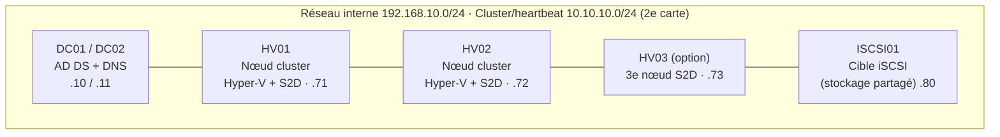

# Cours Active Directory & Windows Server - Partie 3
## Trajectoire 1-bis : Haute disponibilité, stockage et résilience on-prem
### Windows Server 2022

---

> **Prérequis** : Parties 1 et 2 terminées. On garde le domaine `corp.lab.local` (DC01/DC02, SRV01, la PKI). Cette partie ne parle plus d'*installer des rôles* mais de **concevoir une infra qui survit à une panne** : disque mort, nœud qui tombe, datacenter qui brûle, ransomware un dimanche soir.
>
> **Changement de posture** : jusqu'ici tu étais admin (« je sais faire tourner le service »). Ici tu deviens architecte d'infra (« je conçois pour que le service ne s'arrête pas, et je le prouve en tirant le câble »). La différence en entretien Google/SRE est exactement là : personne ne t'impressionne en installant un rôle ; on te juge sur ta gestion du **quorum**, ton choix de **témoin**, ton **RPO/RTO** et ta capacité à **tester le désastre** avant qu'il arrive.

---

## Table des matières (Partie 3)

- **Module 23** - Concepts de résilience : SPOF, RTO/RPO, HA vs DR vs FT
- **Module 24** - Failover Clustering (WSFC) : le socle de la HA
- **Module 25** - Stockage résilient : Storage Spaces, S2D, Storage Replica
- **Module 26** - Hyper-V en production : cluster, Live Migration, Replica, CAU
- **Module 27** - File Server hautement disponible : SOFS vs General Use
- **Module 28** - Services d'infra redondants : DHCP Failover, réseau
- **Module 29** - Projet final Partie 3 + examen

---

## Topologie étendue du lab (attention aux ressources)



> **Note d'ingénieur - contraintes de lab, à lire avant de commencer** :
>
> - **Édition** : Storage Spaces Direct (module 25) exige **Windows Server Datacenter**. Standard ne l'a pas. Le clustering de base et Hyper-V fonctionnent en Standard.
> - **Virtualisation imbriquée (nested)** : pour clusteriser Hyper-V dans des VM, active la nested virtualization sur ton hyperviseur (`Set-VMProcessor -ExposeVirtualizationExtensions $true` sous Hyper-V hôte ; option équivalente sous VMware/Proxmox).
> - **RAM** : compte 4-8 Go par nœud. Un lab HA à 2 nœuds + iSCSI + DC, c'est ~20 Go de RAM minimum. Fais tourner par module, snapshots à l'appui.
> - **Stockage partagé** : pas de vraie baie SAN ? On simule avec une **cible iSCSI** (rôle gratuit de Windows Server) ou on part sur **S2D** (stockage local mutualisé, pas besoin de SAN). Je couvre les deux.

---

# Module 23 - Concepts de résilience

## 23.1 Le vocabulaire qui sépare l'admin de l'architecte

Avant toute commande, ces notions doivent être limpides - ce sont elles qu'on te demande en entretien, pas la syntaxe.

| Terme | Définition | Question qu'il pose |
|---|---|---|
| **SPOF** (Single Point of Failure) | Composant unique dont la panne arrête tout | « Qu'est-ce qui, seul, casse le service ? » |
| **HA** (High Availability) | Le service redémarre vite ailleurs après une panne (courtes interruptions acceptées) | « Combien de temps d'arrêt ? » |
| **FT** (Fault Tolerance) | Zéro interruption, redondance en temps réel (plus cher) | « Puis-je tolérer *zéro* coupure ? » |
| **DR** (Disaster Recovery) | Reprise après sinistre majeur (site détruit) | « Et si tout le datacenter disparaît ? » |
| **Backup** | Copie restaurable dans le temps (≠ HA !) | « Puis-je revenir à hier / avant le ransomware ? » |
| **RTO** (Recovery Time Objective) | Durée max d'indisponibilité tolérée | « En combien de temps je remonte ? » |
| **RPO** (Recovery Point Objective) | Perte de données max tolérée (dans le temps) | « Combien de données je peux perdre ? » |
| **SLA** | Engagement de niveau de service (les « neuf ») | « Qu'ai-je promis au métier ? » |

## 23.2 Le piège n°1 : HA n'est PAS une sauvegarde

Grave-toi ça : un cluster réplique les données **instantanément, y compris les erreurs**. Si un utilisateur supprime un fichier ou qu'un ransomware chiffre un volume, ta HA réplique fidèlement la catastrophe sur tous les nœuds. **HA protège du matériel qui tombe. Backup protège du temps et des erreurs. DR protège du sinistre géographique.** Il te faut les trois. Un architecte qui confond HA et backup se fait chiffrer et découvre que ses trois répliques sont chiffrées elles aussi.

## 23.3 Les « neuf » de la disponibilité

| SLA | Indisponibilité/an | Réaliste avec |
|---|---|---|
| 99 % | ~3,65 jours | Un seul serveur bien géré |
| 99,9 % | ~8,76 heures | Redondance simple, sauvegardes |
| 99,99 % | ~52,6 minutes | Clustering + stockage résilient + procédures |
| 99,999 % | ~5,26 minutes | FT, multi-site, automatisation, astreinte |

> Chaque « neuf » coûte cher en argent et en complexité. Le rôle de l'architecte n'est pas de viser cinq neuf partout, mais de **mapper le SLA au besoin métier réel**. Un partage de photos de la cantine n'a pas le même SLA que la base de paie.

## 23.4 RPO/RTO en pratique : choisir la bonne techno

```
RPO = 0  (zéro perte)      → réplication synchrone (Storage Replica sync, cluster local)
RPO = quelques min          → réplication asynchrone (Hyper-V Replica, SR async)
RPO = quelques heures       → sauvegardes fréquentes
RTO = quelques secondes     → Failover Clustering (bascule automatique)
RTO = quelques minutes      → Hyper-V Replica (bascule manuelle/orchestrée)
RTO = quelques heures       → restauration de sauvegarde
```

Chaque module de cette partie répond à une case de ce tableau. Garde-le sous les yeux : quand tu choisis une techno, c'est **toujours** en fonction du couple RPO/RTO imposé par le métier, jamais « parce que c'est cool ».

## 23.5 Exercice pratique n°16
1. Liste tous les SPOF de ton lab actuel (Parties 1 et 2). Indice : combien de serveurs DHCP ? Combien de nœuds portent la PKI ? Où vit SYSVOL ?
2. Pour trois services (AD, partage de fichiers, PKI), écris le RPO et le RTO que tu jugerais raisonnables, et la techno qui y répond.
3. Rédige en 5 lignes pourquoi ta réplication DFS-R du module 18 n'est **pas** une sauvegarde.

---

# Module 24 - Failover Clustering (WSFC)

## 24.1 Ce qu'est un cluster de basculement

WSFC (Windows Server Failover Clustering) regroupe plusieurs serveurs (**nœuds**) qui surveillent mutuellement leur santé (**heartbeat**) et se partagent des **rôles en cluster** (une VM Hyper-V, un partage de fichiers, une instance SQL…). Si un nœud tombe, ses rôles **basculent automatiquement** vers un nœud survivant. C'est la brique de HA fondamentale - presque tout le reste de cette partie s'appuie dessus.

Un rôle en cluster est accessible via un **nom réseau + IP virtuels** qui « suivent » le rôle où qu'il s'exécute. Les clients ne savent pas quel nœud physique les sert.

## 24.2 Le quorum - LE concept à maîtriser absolument

Le quorum empêche le **split-brain** : la situation catastrophique où, après une coupure réseau, deux moitiés du cluster croient chacune être « la survivante » et modifient les données en parallèle → corruption. La règle : le cluster ne reste actif que si une **majorité de votes** est réunie.

Chaque nœud a 1 vote. Avec un **nombre pair** de nœuds, on ajoute un **témoin (witness)** pour départager :

| Type de témoin | Description | Quand |
|---|---|---|
| **Disk Witness** | Petit disque partagé | Cluster avec stockage partagé (SAN/iSCSI) |
| **File Share Witness (FSW)** | Un simple partage SMB sur un serveur tiers | Cas le plus courant, aucun stockage partagé requis |
| **Cloud Witness** | Un blob de stockage Azure | Multi-site / pas de tiers on-prem fiable (nécessite un compte Azure - la seule dépendance cloud « acceptable » en on-prem) |

Windows Server gère par défaut le **quorum dynamique** (ajuste les votes quand un nœud part proprement) et le **témoin dynamique** (donne ou retire le vote du témoin selon la parité). Ne désactive pas ça sans raison.

```
2 nœuds sans témoin  → un nœud tombe → 1 vote sur 2 = pas de majorité → cluster ARRÊTÉ (mauvais !)
2 nœuds + témoin     → 3 votes → un nœud tombe → 2/3 = majorité → cluster SURVIT (bon !)
```

> **Règle d'or n°1 du clustering** : un cluster à nombre pair de nœuds a **toujours** un témoin. Pas d'exception. C'est la question piège numéro un en entretien.

## 24.3 Prérequis et validation

Prérequis AD : le cluster crée un **CNO** (Cluster Name Object, un objet ordinateur dans AD). Prépare une OU dédiée et donne au compte qui crée le cluster le droit d'y créer des objets ordinateurs (ou pré-crée le CNO). Chaque rôle en cluster crée ensuite un **VCO** (Virtual Computer Object).

```powershell
# Sur HV01 et HV02 : installer la fonctionnalité
Install-WindowsFeature Failover-Clustering -IncludeManagementTools

# ÉTAPE OBLIGATOIRE avant tout : valider la configuration
Test-Cluster -Node HV01, HV02
# Génère un rapport HTML. En prod, on ne crée JAMAIS un cluster sans un Test-Cluster propre.
# (Quelques avertissements réseau sont normaux en lab ; les ERREURS, non.)
```

## 24.4 Créer le cluster

```powershell
# Créer le cluster avec un nom et une IP virtuels
New-Cluster -Name "CL-CORP" -Node HV01, HV02 `
    -StaticAddress 192.168.10.70 -NoStorage

# Vérifier
Get-Cluster | Format-List *
Get-ClusterNode
Get-ClusterNetwork | Select Name, Role, Address
```

## 24.5 Configurer le quorum (témoin de partage de fichiers)

```powershell
# Sur SRV01 : créer un partage témoin (le compte CNO CL-CORP$ doit y avoir Full Control)
New-Item -Path "D:\Witness-CL-CORP" -ItemType Directory
New-SmbShare -Name "Witness-CL-CORP" -Path "D:\Witness-CL-CORP" `
    -FullAccess "CORP\Administrator", "CORP\CL-CORP$"

# Sur un nœud : configurer le témoin
Set-ClusterQuorum -Cluster CL-CORP `
    -FileShareWitness "\\SRV01\Witness-CL-CORP"

Get-ClusterQuorum   # vérifier le mode et le témoin
```

## 24.6 Réseaux de cluster

Sépare les flux : un réseau de production (clients) et un réseau **heartbeat/cluster** dédié (le `10.10.10.0/24` de la topo). Ça évite qu'une saturation réseau ne soit interprétée comme une panne de nœud.

```powershell
# Nommer et affecter les rôles des réseaux
(Get-ClusterNetwork "Cluster Network 1").Name = "Production"
(Get-ClusterNetwork "Cluster Network 2").Name = "Heartbeat"
(Get-ClusterNetwork "Heartbeat").Role = "Cluster"        # trafic cluster uniquement
(Get-ClusterNetwork "Production").Role = "ClusterAndClient"
```

## 24.7 Maintenance sans coupure

```powershell
# Vider un nœud (déplace ses rôles ailleurs) avant de le patcher/redémarrer
Suspend-ClusterNode -Name HV01 -Drain
# ... maintenance ...
Resume-ClusterNode -Name HV01 -Failback Immediate

# Tester un basculement manuellement (à faire souvent !)
Move-ClusterGroup -Name "NomDuRole" -Node HV02
```

## 24.8 Cluster OS Rolling Upgrade

Mettre à niveau l'OS des nœuds (ex. 2019 → 2022) **sans arrêter le cluster** : on draine un nœud, on réinstalle, on le remet, un par un. Le cluster fonctionne en mode mixte temporaire, puis on élève le niveau fonctionnel :
```powershell
Update-ClusterFunctionalLevel
```

## 24.9 Exercice pratique n°17
1. Installe la fonctionnalité sur HV01/HV02, lance `Test-Cluster` et lis le rapport HTML.
2. Crée `CL-CORP` avec un FSW sur SRV01. Vérifie `Get-ClusterQuorum`.
3. Sépare les réseaux Production/Heartbeat.
4. **Le test qui compte** : arrête brutalement HV01 (coupe la VM), observe que le cluster survit grâce au témoin (`Get-ClusterNode`), rallume, vérifie le retour. Puis coupe le témoin *et* un nœud, et constate l'arrêt du cluster - comprends *pourquoi*.

---

# Module 25 - Stockage résilient

## 25.1 Trois approches, trois besoins

1. **Cible iSCSI** : simuler un stockage partagé « SAN-like » pour un cluster classique. Simple, pédagogique.
2. **Storage Spaces Direct (S2D)** : hyperconvergence - chaque nœud apporte ses disques locaux, mutualisés sur le réseau. Pas de SAN. La techno moderne.
3. **Storage Replica** : répliquer un volume entier entre deux serveurs/sites (bloc par bloc), pour le DR.

## 25.2 Stockage partagé simulé : cible iSCSI

Le rôle *iSCSI Target Server* transforme un Windows Server en baie de stockage réseau - parfait pour un lab (ou une prod modeste).

```powershell
# Sur ISCSI01 (192.168.10.80)
Install-WindowsFeature FS-iSCSITarget-Server -IncludeManagementTools

# Créer un disque virtuel iSCSI de 50 Go pour les données du cluster
New-IscsiVirtualDisk -Path "D:\iSCSI\clusterdata.vhdx" -SizeBytes 50GB

# Créer une cible et autoriser les deux nœuds (par IQN ou IP)
New-IscsiServerTarget -TargetName "clustertarget" `
    -InitiatorIds "IPAddress:192.168.10.71", "IPAddress:192.168.10.72"
Add-IscsiVirtualDiskTargetMapping -TargetName "clustertarget" -Path "D:\iSCSI\clusterdata.vhdx"

# Un petit disque de 1 Go séparé peut servir de Disk Witness
New-IscsiVirtualDisk -Path "D:\iSCSI\witness.vhdx" -SizeBytes 1GB
Add-IscsiVirtualDiskTargetMapping -TargetName "clustertarget" -Path "D:\iSCSI\witness.vhdx"
```

```powershell
# Sur HV01 et HV02 : se connecter à la cible
Start-Service msiscsi ; Set-Service msiscsi -StartupType Automatic
New-IscsiTargetPortal -TargetPortalAddress 192.168.10.80
Get-IscsiTarget | Connect-IscsiTarget -IsPersistent $true
# Puis initialiser/formater le disque UNIQUEMENT depuis un nœud, l'autre le verra en partagé
Get-Disk | Where-Object BusType -eq "iSCSI"
```

Ces disques deviennent des **Cluster Shared Volumes (CSV)** au module 26.

## 25.3 Storage Spaces Direct (S2D) - l'hyperconvergence

S2D mutualise les **disques locaux de chaque nœud** en un pool unique, accessible par tous via SMB3/RDMA (bus de stockage logiciel). Plus de SAN : le stockage et le calcul vivent sur les mêmes machines.

> **Honnêteté d'ingénieur** : S2D est puissant mais exigeant. En **production**, il faut du matériel certifié (programme *Windows Server Software-Defined* / *Azure Stack HCI*), idéalement du réseau **RDMA** (RoCE/iWARP) 25 GbE+, et une rigueur d'exploitation réelle - S2D a eu une réputation capricieuse sur du matériel non validé. En **lab virtualisé**, ça tourne très bien pour apprendre les concepts. Ne déploie jamais du S2D de prod sur du matériel « au hasard ».

Prérequis : **édition Datacenter**, minimum 2 nœuds (3+ recommandé), disques vierges non partitionnés.

```powershell
# Prérequis sur chaque nœud
Install-WindowsFeature Failover-Clustering, Hyper-V -IncludeManagementTools -Restart

# Valider spécifiquement pour S2D
Test-Cluster -Node HV01,HV02,HV03 -Include "Storage Spaces Direct","Inventory","Network","System Configuration"

# Créer le cluster (sans stockage partagé - S2D utilise les disques locaux)
New-Cluster -Name "CL-S2D" -Node HV01,HV02,HV03 -NoStorage -StaticAddress 192.168.10.75

# Activer S2D - crée automatiquement le pool et le cache
Enable-ClusterStorageSpacesDirect -CimSession CL-S2D

# Créer un volume résilient (CSV). Résilience selon le nombre de nœuds :
#   2 nœuds  → two-way mirror  (tolère 1 disque/nœud)
#   3+ nœuds → three-way mirror (tolère 2 pannes simultanées) ou parité
New-Volume -StoragePoolFriendlyName "S2D*" -FriendlyName "Data01" `
    -FileSystem CSVFS_ReFS -ResiliencySettingName Mirror -Size 100GB

# État de santé
Get-StoragePool ; Get-VirtualDisk ; Get-PhysicalDisk
Get-StorageSubSystem *cluster* | Get-StorageHealthReport
```

Notions S2D clés :

- **Cache** : les disques les plus rapides (NVMe/SSD) servent de cache aux disques capacité automatiquement.
- **ReFS** est le système de fichiers recommandé (intégrité, snapshots rapides, mirror-accelerated parity).
- **Mirror** = performance + résilience (coûte en capacité). **Parity** = capacité (coûte en perf). **Mirror-accelerated parity** = compromis.
- **Fault domains** : par défaut la résilience est par nœud (un nœud entier peut tomber).

## 25.4 Storage Replica (SR) - la réplication de volume pour le DR

SR réplique un volume **bloc par bloc** entre deux serveurs ou deux clusters, indépendamment du système de fichiers.

- **Synchrone** : RPO = **0** (aucune perte), mais exige une latence < ~5 ms (donc sites proches / métro). L'écriture n'est confirmée qu'une fois répliquée.
- **Asynchrone** : RPO de quelques secondes/minutes, tolère la distance/latence (DR géographique).

> **Piège d'édition** : historiquement, Storage Replica complet = **Datacenter**. Windows Server a introduit une variante limitée en **Standard** (une seule relation, un volume, taille plafonnée). Pour du SR sérieux, prévois Datacenter. Vérifie toujours l'édition avant de promettre du SR à ton métier.

```powershell
Install-WindowsFeature Storage-Replica, RSAT-Storage-Replica -Restart

# Tester l'aptitude d'un couple source/destination (topologie, latence, disques)
Test-SRTopology -SourceComputerName SRV01 -SourceVolumeName D: -SourceLogVolumeName L: `
    -DestinationComputerName SRV02 -DestinationVolumeName D: -DestinationLogVolumeName L: `
    -DurationInMinutes 10 -ResultPath C:\SR-Report

# Créer la relation de réplication (synchrone ici)
New-SRPartnership -SourceComputerName SRV01 -SourceRGName RG-Src -SourceVolumeName D: -SourceLogVolumeName L: `
    -DestinationComputerName SRV02 -DestinationRGName RG-Dst -DestinationVolumeName D: -DestinationLogVolumeName L: `
    -ReplicationMode Synchronous

Get-SRGroup ; Get-SRPartnership   # suivre l'état et le retard (log)
```

> Le **volume de log** dédié (rapide) est obligatoire et conditionne la performance. Ne le néglige pas : c'est là que le débit se joue.

## 25.5 Exercice pratique n°18
1. Monte ISCSI01, expose un disque data + un disque témoin, connecte HV01/HV02.
2. (Datacenter) Monte un cluster S2D à 3 nœuds, crée un volume `Mirror` ReFS, coupe un nœud et vérifie que le volume reste en ligne (`Get-VirtualDisk` = Healthy/Degraded mais accessible).
3. Configure une Storage Replica synchrone SRV01→SRV02, écris un fichier sur la source, bascule et vérifie qu'il est présent sur la destination.
4. Écris le RPO/RTO de chacune des trois approches.

---

# Module 26 - Hyper-V en production

## 26.1 Pourquoi ce module

Ton lab tourne déjà sur un hyperviseur. Ici on apprend à exploiter **Hyper-V sérieusement** : virtualiser en cluster pour que les VM survivent à la panne d'un hôte, les déplacer à chaud, les répliquer vers un autre site, et patcher les hôtes sans jamais couper les VM.

## 26.2 Cluster Hyper-V et CSV

Un cluster Hyper-V stocke les VM sur des **Cluster Shared Volumes (CSV)** : un volume que **tous les nœuds** montent simultanément (chemin `C:\ClusterStorage\VolumeX`). Ça permet à n'importe quel nœud d'exécuter n'importe quelle VM et de basculer instantanément.

```powershell
# Sur les nœuds : rôle Hyper-V (déjà là si S2D)
Install-WindowsFeature Hyper-V, Failover-Clustering -IncludeManagementTools -Restart

# Ajouter un disque du cluster comme CSV (cas iSCSI/SAN)
Get-ClusterAvailableDisk | Add-ClusterDisk
Add-ClusterSharedVolume -Name "Cluster Disk 1"
# → accessible sur tous les nœuds via C:\ClusterStorage\Volume1

# Créer une VM hautement disponible dessus
New-VM -Name "VM-APP01" -MemoryStartupBytes 2GB -Generation 2 `
    -Path "C:\ClusterStorage\Volume1" `
    -NewVHDPath "C:\ClusterStorage\Volume1\VM-APP01\disk.vhdx" -NewVHDSizeBytes 60GB
# La rendre "clusterisée" (rôle en cluster)
Add-ClusterVirtualMachineRole -VirtualMachine "VM-APP01"
```

Si un hôte tombe, la VM redémarre automatiquement sur un autre nœud (**RTO = temps de boot de la VM**, quelques dizaines de secondes). Ce n'est pas de la tolérance de panne (la VM redémarre), mais de la haute disponibilité.

## 26.3 Live Migration - déplacer une VM allumée sans coupure

```powershell
# Activer et configurer Live Migration
Enable-VMMigration
Set-VMHost -VirtualMachineMigrationAuthenticationType Kerberos `
    -MaximumVirtualMachineMigrations 2

# Pour la délégation Kerberos (migration entre hôtes) : configurer la délégation contrainte
# dans AD sur les comptes machine des hôtes (cifs + Microsoft Virtual System Migration Service)

# Déplacer une VM allumée d'un nœud à l'autre - ZÉRO coupure perceptible
Move-ClusterVirtualMachineRole -Name "VM-APP01" -Node HV02
# (Hyper-V hors cluster : Move-VM -Name VM-APP01 -DestinationHost HV02 ...)
```

Live Migration copie la mémoire de la VM à chaud puis bascule en un battement de cœur. C'est la magie qui te permet de **vider un hôte pour maintenance en pleine journée** sans que personne ne s'en aperçoive.

## 26.4 Hyper-V Replica - le DR sans cluster

Hyper-V Replica réplique **asynchronement** une VM vers un autre hôte/site (pas besoin de cluster ni de stockage partagé). C'est ton outil de **reprise après sinistre** : si le site principal disparaît, tu redémarres la VM sur le site de secours.

```powershell
# Sur l'hôte de réplication (destination) : autoriser la réception
Set-VMReplicationServer -ReplicationEnabled $true `
    -AllowedAuthenticationType Kerberos `
    -ReplicationAllowedFromAnyServer $true `
    -DefaultStorageLocation "D:\Replicas"

# Sur la source : activer la réplication d'une VM
Enable-VMReplication -VMName "VM-APP01" -ReplicaServerName "HV-DR" `
    -ReplicaServerPort 80 -AuthenticationType Kerberos `
    -ReplicationFrequencySec 300         # 30, 300 ou 900 s
Start-VMInitialReplication -VMName "VM-APP01"

# Basculement de test (ne coupe pas la prod) - À FAIRE RÉGULIÈREMENT
Start-VMFailover -VMName "VM-APP01" -AsTest
# Basculement réel (sinistre)
# Start-VMFailover -VMName "VM-APP01"  (côté réplica) puis Complete-VMFailover
```

Points de récupération : Hyper-V Replica peut garder plusieurs points de restauration (utile si la corruption s'est répliquée). RPO = la fréquence choisie (30 s à 15 min).

## 26.5 Cluster-Aware Updating (CAU)

CAU patche les nœuds d'un cluster **un par un, automatiquement** : il draine un nœud (Live Migration des VM ailleurs), le met à jour, redémarre, le remet, passe au suivant. Zéro coupure de service.

```powershell
Add-CauClusterRole -ClusterName CL-CORP -DaysOfWeek Sunday -WeeksInterval 2 `
    -MaxFailedNodes 1 -RequireAllNodesOnline
# Lancer une passe immédiate :
Invoke-CauRun -ClusterName CL-CORP -Force
Get-CauReport -ClusterName CL-CORP -Last
```

> C'est l'aboutissement de la HA : combiné à CAU, ton WSUS du module 20 patche l'infra **sans jamais l'arrêter**. Voilà à quoi ressemble une exploitation « sans interruption ».

## 26.6 Exercice pratique n°19
1. Transforme un disque partagé en CSV, crée `VM-APP01` dessus et rends-la hautement disponible.
2. Fais une **Live Migration** de VM-APP01 pendant qu'un ping tourne dessus : compte les pertes de paquets (idéalement 0-1).
3. Coupe brutalement le nœud qui l'héberge : chronomètre le RTO (temps avant que la VM soit re-disponible).
4. Configure Hyper-V Replica vers un 3e hôte et fais un basculement **de test**.
5. Configure CAU et lance une passe.

---

# Module 27 - File Server hautement disponible

## 27.1 Deux types de rôle File Server en cluster - ne pas se tromper

C'est une question d'examen classique. Le rôle *File Server* en cluster a **deux variantes** aux usages opposés :

| | **File Server for general use** | **Scale-Out File Server (SOFS)** |
|---|---|---|
| Mode | Actif/passif (un nœud sert à la fois) | **Actif/actif** (tous les nœuds servent) |
| Usage | Partages utilisateurs (bureautique, home dirs) | **Données applicatives** : VHDX Hyper-V, bases SQL |
| Supporte | SMB + NFS, DFS-R, FSRM, dédup, quotas | SMB uniquement, disponibilité continue |
| Bascule | Transparent Failover (courte pause) | Continue, sans interruption |

> **Le piège** : ne mets **jamais** des partages d'utilisateurs finaux (info workers) sur du SOFS - ce n'est pas fait pour ça et les perfs seront décevantes. SOFS = stockage pour *applications* (Hyper-V, SQL). Partages bureautiques = *General use*. Confondre les deux est l'erreur d'architecture n°1 sur ce sujet.

## 27.2 File Server for general use (partages utilisateurs HA)

```powershell
Install-WindowsFeature File-Services, FS-FileServer -IncludeManagementTools

# Ajouter le rôle "File Server" (general use) au cluster, sur un CSV/disque cluster
Add-ClusterFileServerRole -Name "FS-CORP" -Storage "Cluster Disk 1" -StaticAddress 192.168.10.90

# Créer un partage continûment disponible
New-SmbShare -Name "Partages" -Path "G:\Partages" -ContinuouslyAvailable $true `
    -FullAccess "CORP\Domain Admins" -ChangeAccess "CORP\G_Utilisateurs"
```

Ce partage `\\FS-CORP\Partages` reste accessible même si le nœud qui le sert redémarre : **SMB Transparent Failover** rejoue les handles sur le nœud survivant. Tu peux y remettre ton DFS-N/FSRM du module 18, mais désormais **hautement disponible**.

## 27.3 Scale-Out File Server (pour Hyper-V/SQL)

```powershell
Add-ClusterScaleOutFileServerRole -Name "SOFS-CORP"
# Les partages se créent sur des CSV, en disponibilité continue :
New-SmbShare -Name "VMs" -Path "C:\ClusterStorage\Volume1\Shares\VMs" -ContinuouslyAvailable $true `
    -FullAccess "CORP\HV01$","CORP\HV02$","CORP\Domain Admins"
# Les hôtes Hyper-V stockent alors leurs VHDX sur \\SOFS-CORP\VMs
```

## 27.4 Les technos SMB3 qui rendent tout ça possible

- **SMB Transparent Failover** : reprise des sessions sans erreur applicative.
- **SMB Scale-Out** : accès simultané multi-nœuds (SOFS).
- **SMB Multichannel** : agrège plusieurs cartes réseau (débit + résilience) automatiquement.
- **SMB Direct (RDMA)** : accès mémoire distant, latence quasi nulle, décharge le CPU - la base des perfs S2D/SOFS.
- **SMB Encryption** : `Set-SmbShare -EncryptData $true` - chiffre le flux sans IPsec.

## 27.5 Exercice pratique n°20
1. Crée un rôle *File Server general use* `FS-CORP` sur un disque cluster, avec un partage continûment disponible.
2. Ouvre un gros fichier depuis un client, bascule le rôle (`Move-ClusterGroup`) et vérifie que le fichier reste accessible.
3. Crée un SOFS et explique par écrit pourquoi tu n'y mettrais pas les home directories des utilisateurs.
4. Active SMB Encryption sur un partage et vérifie avec `Get-SmbShare | Select Name, EncryptData`.

---

# Module 28 - Services d'infra redondants

## 28.1 DHCP en haute disponibilité

Le DHCP est un SPOF silencieux : s'il tombe, les baux expirent et le réseau meurt progressivement. Windows Server offre le **DHCP Failover** (bien supérieur au vieux split-scope).

Deux modes :

- **Hot Standby** : un serveur actif, un en secours. Idéal site principal/secours.
- **Load Balancing** : les deux servent (répartition 50/50 par défaut). Idéal même site.

```powershell
# Sur les deux serveurs DHCP : installer + autoriser dans AD
Install-WindowsFeature DHCP -IncludeManagementTools
Add-DhcpServerInDC -DnsName "srv-dhcp1.corp.lab.local" -IPAddress 192.168.10.5

# Créer une étendue sur le serveur 1
Add-DhcpServerv4Scope -Name "LAN" -StartRange 192.168.10.100 -EndRange 192.168.10.200 `
    -SubnetMask 255.255.255.0
Set-DhcpServerv4OptionValue -ScopeId 192.168.10.0 -Router 192.168.10.1 -DnsServer 192.168.10.10,192.168.10.11

# Configurer le failover entre les deux serveurs (Load Balancing)
Add-DhcpServerv4Failover -Name "LAN-Failover" -ScopeId 192.168.10.0 `
    -PartnerServer "srv-dhcp2.corp.lab.local" -LoadBalancePercent 50 `
    -SharedSecret "UnSecretDHCP!" -AutoStateTransition $true

Get-DhcpServerv4Failover   # vérifier l'état de synchronisation
```

## 28.2 Récapitulatif : où en est ta résilience d'infra ?

| Service | Techno HA | RPO | RTO |
|---|---|---|---|
| AD DS | Multi-DC (déjà fait, Partie 1) | ~0 (réplication) | quasi 0 |
| DNS | AD-integrated multi-DC | ~0 | quasi 0 |
| DHCP | DHCP Failover | ~0 | quasi 0 |
| Fichiers utilisateurs | Cluster File Server general use | ~0 | secondes |
| Données applicatives | SOFS + S2D | ~0 | continu |
| VM | Cluster Hyper-V + CSV | ~0 | temps de boot |
| DR VM (autre site) | Hyper-V Replica | 30 s–15 min | minutes |
| DR volume | Storage Replica async | secondes | minutes |
| Retour dans le temps | Sauvegarde (module 13) | heures | heures |

Un architecte lit ce tableau et voit immédiatement les trous. C'est exactement le livrable qu'on attend de toi.

## 28.3 Exercice pratique n°21
1. Monte deux serveurs DHCP en Load Balancing 50/50, vérifie la synchro des baux.
2. Coupe le serveur 1, demande un bail depuis un client, prouve que le serveur 2 répond.
3. Complète le tableau 28.2 avec l'état **réel** de ton lab et identifie ce qu'il te reste à couvrir.

---

# Module 29 - Projet final Partie 3 + examen

## 29.1 Projet fil rouge : « CORP résiliente »

**Objectif** : transformer l'infra `corp.lab.local` (Parties 1+2) en une infra qui **survit à la panne d'un nœud, d'un disque et d'un site**, et le **prouver par des tests de bascule documentés**.

Checklist de livraison :

- [ ] Cluster WSFC à 2+ nœuds validé (`Test-Cluster` propre), avec **témoin** correct et quorum dynamique compris.
- [ ] Réseaux Production/Heartbeat séparés.
- [ ] Stockage résilient : soit iSCSI + CSV, soit **S2D** (Datacenter) avec volume miroir ReFS survivant à la perte d'un nœud.
- [ ] Cluster **Hyper-V** : au moins une VM HA, Live Migration testée (0 perte), RTO de bascule mesuré.
- [ ] **Hyper-V Replica** vers un hôte de DR, avec un basculement **de test** réussi.
- [ ] **CAU** configuré : patch du cluster sans interruption.
- [ ] File Server HA (**general use**) avec partage continûment disponible, DFS-N/FSRM du module 18 repositionnés dessus.
- [ ] **DHCP Failover** opérationnel.
- [ ] Tableau RPO/RTO (28.2) rempli avec l'état réel + un **runbook de bascule** (qui fait quoi, dans quel ordre, en cas de panne).
- [ ] Rappel transverse : HA ≠ backup. La sauvegarde du module 13 tourne toujours, idéalement **immuable/hors-ligne** (anti-ransomware).

## 29.2 Questions type examen / entretien (niveau ingénieur)

1. Pourquoi un cluster à 2 nœuds a-t-il **impérativement** un témoin ? Décris le split-brain.
2. Quorum dynamique et témoin dynamique : que font-ils, pourquoi ne pas les désactiver ?
3. Disk Witness vs File Share Witness vs Cloud Witness : lequel dans quel contexte ?
4. Différence entre HA, FT, DR et backup. Donne un scénario où chacun sauve la mise et un où il est inutile.
5. Un utilisateur supprime un dossier sur ton cluster S2D three-way mirror. Tes 3 copies le protègent-elles ? Justifie.
6. SOFS vs File Server general use : lequel pour les home directories ? Pour les VHDX Hyper-V ? Pourquoi ?
7. Storage Replica synchrone vs asynchrone : quel RPO chacun, quelle contrainte de latence ?
8. Explique comment CAU + Live Migration permettent de patcher un cluster Hyper-V sans coupure.
9. Pourquoi ne déploie-t-on jamais du S2D de production sur du matériel non certifié ?
10. Dresse le tableau RPO/RTO de l'infra CORP et défends tes choix devant un DSI qui trouve « qu'un seul serveur suffisait ».

## 29.3 Le mot de la fin - et ce qui reste

Tu as maintenant couvert le cœur d'AD (Partie 1), l'écosystème de services (Partie 2) et la résilience (Partie 3). C'est un socle on-prem **solide et complet** - le genre qui te fait tenir une salle serveurs sans transpirer.

Ce qui reste en on-prem est du **raffinement** plus que du fondamental : administration Server Core + JEA (Just Enough Administration), contrôle applicatif (AppLocker/WDAC), baselines de sécurité (Security Compliance Toolkit / CIS), et le PRA formalisé. C'est l'**Option B** que je t'avais esquissée (« exploitation SRE-grade ») - le complément naturel de cette Partie 3 : la HA te dit *comment ça reste debout*, l'exploitation SRE te dit *comment tu la tiens sans te faire pirater*.

Et le jour où tu voudras franchir le pas, l'hybride (Entra ID) reste la marche qui a le plus de valeur sur le marché. Mais rien ne presse : un ingénieur qui maîtrise vraiment le datacenter aura toujours de l'avance sur celui qui ne sait que cliquer dans un portail.

---

## Annexe - Aide-mémoire Partie 3

```
# Clustering
Test-Cluster -Node A,B                        Valider AVANT de créer (obligatoire)
New-Cluster / Add-ClusterNode                 Créer / étendre
Get-ClusterQuorum / Set-ClusterQuorum         Quorum et témoin
Get-ClusterNode / Get-ClusterGroup            État nœuds et rôles
Move-ClusterGroup / Suspend-ClusterNode       Bascule / drainage
Update-ClusterFunctionalLevel                 Après rolling upgrade

# Stockage
New-IscsiVirtualDisk / New-IscsiServerTarget  Cible iSCSI
Enable-ClusterStorageSpacesDirect             Activer S2D (Datacenter)
New-Volume -ResiliencySettingName Mirror      Volume résilient
Test-SRTopology / New-SRPartnership           Storage Replica

# Hyper-V
Add-ClusterSharedVolume                       Créer un CSV
Add-ClusterVirtualMachineRole                 VM hautement dispo
Move-ClusterVirtualMachineRole                Live Migration
Enable-VMReplication / Start-VMFailover       Hyper-V Replica
Add-CauClusterRole / Invoke-CauRun            Patch sans coupure

# File / DHCP
Add-ClusterFileServerRole                     File server general use
Add-ClusterScaleOutFileServerRole             SOFS
New-SmbShare -ContinuouslyAvailable $true     Partage HA
Add-DhcpServerv4Failover                      DHCP en HA
```

*Fin de la Partie 3. La règle qui résume tout : ne dis jamais « c'est hautement disponible » avant d'avoir **tiré le câble** et vérifié que ça a tenu. Un basculement non testé est un basculement qui ne marche pas.*
