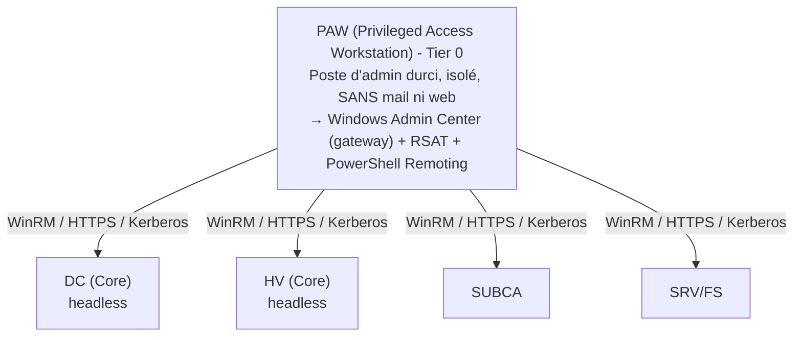

# Cours Active Directory & Windows Server - Partie 4
## Trajectoire 1-ter : Exploitation « SRE-grade » d'un parc Windows
### Windows Server 2022

---

> **Prérequis** : Parties 1 à 3. On garde `corp.lab.local` et toute l'infra construite (DC, PKI, cluster HA). Cette partie ne rajoute quasiment pas de rôles - elle change la **façon de tenir** l'infra.
>
> **Changement de posture** : la Partie 3 t'a appris *comment l'infra reste debout* (HA). Ici tu apprends *comment tu la tiens sans te faire pirater et sans t'épuiser* - la discipline d'exploitation. C'est le passage de l'architecte au **SRE** : on ne mesure plus « est-ce que ça marche ? » mais « quel est mon SLO, mon budget d'erreur, mon niveau de toil, et est-ce que ma surface d'attaque est réduite au strict nécessaire ? ».
>
> **Le fil rouge de cette partie** : **le moindre privilège, partout, mesuré et prouvé.** Moins de GUI (Server Core), moins de comptes admin (JEA), moins de binaires autorisés (AppLocker/WDAC), moins de secrets exposés (Credential Guard), moins de travail manuel (automatisation du toil), et une capacité à **restaurer et à mesurer** ce qu'on a promis (PRA + SLO).

---

## Table des matières (Partie 4)

- **Module 30** - Server Core et administration headless
- **Module 31** - PowerShell Remoting et JEA (moindre privilège au niveau commande)
- **Module 32** - Contrôle applicatif : AppLocker et WDAC
- **Module 33** - Durcissement système : Credential Guard, ASR, baselines, CIS
- **Module 34** - Sauvegarde immuable et PRA (plan de reprise)
- **Module 35** - Pratiques SRE appliquées à un parc Windows
- **Module 36** - Projet final Partie 4 + examen

---

## Posture d'administration cible


Endpoints JEA : le helpdesk exécute des commandes précises, jamais un shell admin complet.

> **Principe directeur** : en production sérieuse, tu ne te connectes plus en RDP sur chaque serveur avec un compte Domain Admin. Tu administres **à distance, depuis un poste durci, avec le privilège minimal nécessaire à chaque tâche**. Le reste de cette partie construit exactement ça.

---

# Module 30 - Server Core et administration headless

## 30.1 Pourquoi Server Core est la norme de prod

Server Core = Windows Server **sans interface graphique** (pas d'explorateur, pas de navigateur, pas de MMC locale). On garde une console, `cmd`, PowerShell et `sconfig`. Avantages, du point de vue SRE/sécu :

- **Surface d'attaque réduite** : pas de navigateur, pas de composants GUI = moins de CVE exploitables.
- **Moins de patches** = moins de redémarrages = plus de disponibilité (rappel : chaque « neuf » compte, Partie 3).
- **Empreinte plus faible** : RAM/disque, densité de VM supérieure.
- **Force la discipline** : tu administres à distance et par script, donc c'est reproductible et auditable.

Microsoft recommande Server Core pour les rôles d'infrastructure : DC, Hyper-V, serveurs de fichiers, DNS, DHCP.

> **Honnêteté d'ingénieur** : certains produits tiers (vieux agents, certaines applis métier) exigent encore la Desktop Experience. Vérifie la compatibilité avant de tout passer en Core. Et sache que l'option **« Server with Desktop Experience → Server Core » n'est plus réversible** depuis 2016 : on choisit à l'installation.

## 30.2 Configuration de base avec sconfig

Sur un Server Core fraîchement installé, `sconfig` (menu texte) couvre l'essentiel : nom, domaine, IP, mises à jour, activation de la gestion à distance. Mais un SRE fait tout en PowerShell (reproductible) :

```powershell
# Config initiale d'un Core (identique aux modules précédents, mais headless)
Rename-Computer -NewName "DC03" -Restart
New-NetIPAddress -InterfaceAlias "Ethernet" -IPAddress 192.168.10.12 -PrefixLength 24 -DefaultGateway 192.168.10.1
Set-DnsClientServerAddress -InterfaceAlias "Ethernet" -ServerAddresses 192.168.10.10,192.168.10.11
Add-Computer -DomainName "corp.lab.local" -Credential CORP\Administrator -Restart
```

## 30.3 App Compatibility FOD

Si tu as besoin ponctuellement de quelques outils graphiques (mmc, eventvwr, perfmon) sur un Core sans revenir à la Desktop Experience complète :
```powershell
# Ajoute une poignée d'outils GUI de diagnostic (Features on Demand)
Add-WindowsCapability -Online -Name "ServerCore.AppCompatibility~~~~0.0.1.0"
```
À utiliser avec parcimonie - ça réintroduit un peu de surface d'attaque.

## 30.4 Windows Admin Center (WAC)

WAC est une console **web** moderne, installée en mode *gateway* sur un serveur/poste de gestion, qui pilote tout le parc (y compris les Core headless) : gestion des rôles, PowerShell intégré, événements, clusters, mises à jour, certificats. C'est le remplaçant moderne du couple Server Manager + MMC.

```powershell
# Sur le poste/serveur de gestion (PAW) : installer WAC en gateway
# (téléchargé depuis Microsoft ; installation silencieuse possible)
msiexec /i WindowsAdminCenter.msi /qn SME_PORT=443 SSL_CERTIFICATE_OPTION=generate
# Accès : https://<serveur-de-gestion>/  →  "Add" les serveurs à gérer
```

> Sécurise WAC : certificat émis par ta PKI (module 16), accès restreint aux admins, et considère-le comme un actif **Tier 0** (il pilote tes DC).

## 30.5 Exercice pratique n°22
1. Installe un DC ou un serveur membre en **Server Core**, configure-le entièrement en PowerShell (aucune GUI).
2. Ajoute-le au domaine, promeus-le DC ou joins-le, sans jamais ouvrir de MMC locale.
3. Installe Windows Admin Center sur un poste de gestion et administre le Core headless depuis le navigateur.
4. Compare le nombre de mises à jour proposées entre un Core et un serveur Desktop Experience.

---

# Module 31 - PowerShell Remoting et JEA

## 31.1 Le socle : PowerShell Remoting (WinRM)

Toute l'administration headless repose sur **WinRM** (Windows Remote Management) : ports 5985 (HTTP) / 5986 (HTTPS), authentification Kerberos par défaut dans le domaine.

```powershell
# Activer le remoting (déjà actif par défaut sur Windows Server récent)
Enable-PSRemoting -Force

# Session interactive distante
Enter-PSSession -ComputerName DC03 -Credential CORP\adm-t0-jdupont

# Exécuter une commande sur plusieurs machines en parallèle (fan-out)
Invoke-Command -ComputerName HV01,HV02,SRV01 -ScriptBlock {
    Get-Service NTDS,DNS,W32Time | Where-Object Status -ne 'Running'
}

# Sessions persistantes réutilisables
$s = New-PSSession -ComputerName DC01,DC02
Invoke-Command -Session $s -ScriptBlock { Get-ADReplicationFailure -Scope Server }
```

> **Piège du double-hop** : depuis une session distante, tu ne peux pas rebondir vers une 3e machine (les identifiants Kerberos ne se propagent pas). **N'utilise pas CredSSP** pour contourner (il expose les identifiants en clair sur la cible - cadeau pour un attaquant). La bonne solution est la **délégation Kerberos basée sur les ressources (RBCD)**, configurée côté cible, précise et révocable.

## 31.2 JEA - Just Enough Administration : le moindre privilège au niveau commande

Voici le module qui fait de toi un ingénieur sécurité et pas seulement un ops. **Problème** : ton helpdesk doit redémarrer un service ou débloquer un compte, mais lui donner un compte admin, c'est lui donner les clés du royaume. **JEA** crée un *endpoint* PowerShell contraint où l'utilisateur ne peut exécuter **qu'une liste blanche de commandes précises**, en s'exécutant sous une identité privilégiée temporaire (virtual account ou gMSA) - sans jamais détenir ce privilège lui-même.

Deux fichiers définissent un endpoint JEA :

**1. Role Capability (`.psrc`)** - *ce qui est permis* :
```powershell
New-PSRoleCapabilityFile -Path "C:\JEA\Roles\Helpdesk.psrc"
```
```powershell
@{
    # L'utilisateur ne pourra QUE ces cmdlets, avec des paramètres restreints
    VisibleCmdlets = @(
        'Get-Service',
        @{ Name = 'Restart-Service'; Parameters = @{ Name = 'Name'; ValidateSet = 'Spooler','W32Time' } },
        'Unlock-ADAccount',
        @{ Name = 'Get-ADUser'; Parameters = @{ Name = 'Identity' } }
    )
    VisibleExternalCommands = @('C:\Windows\System32\whoami.exe')
}
```

**2. Session Configuration (`.pssc`)** - *qui, sous quelle identité, avec quel journal* :
```powershell
New-PSSessionConfigurationFile -Path "C:\JEA\Helpdesk.pssc"
```
```powershell
@{
    SessionType         = 'RestrictedRemoteServer'   # runspace verrouillé, NoLanguage
    RunAsVirtualAccount = $true                      # s'exécute en admin local temporaire
    TranscriptDirectory = 'C:\JEA\Transcripts'       # TOUT est journalisé
    RoleDefinitions     = @{
        'CORP\G_Helpdesk' = @{ RoleCapabilities = 'Helpdesk' }
    }
}
```

```powershell
# Enregistrer l'endpoint
Register-PSSessionConfiguration -Name "JEA-Helpdesk" -Path "C:\JEA\Helpdesk.pssc" -Force

# Côté helpdesk : se connecter à l'endpoint contraint
Enter-PSSession -ComputerName SRV01 -ConfigurationName "JEA-Helpdesk" -Credential CORP\helpdesk1
# → l'utilisateur ne voit QUE les commandes autorisées ; tout est transcrit
```

Ce que JEA t'apporte, du point de vue SRE/sécu :

- **Moindre privilège réel** : le helpdesk n'a aucun droit admin permanent.
- **Auditabilité totale** : chaque commande est transcrite (précieux pour les postmortems).
- **Réduction de la surface** : pas de shell arbitraire, pas de langage complet (`NoLanguage`).
- **Complément parfait du tiering** (Partie 1, module 12) : on cloisonne *qui* peut s'authentifier *où*, et JEA cloisonne *ce qu'on peut y faire*.

## 31.3 Exercice pratique n°23
1. Établis une session distante vers un Core, exécute un `Invoke-Command` en fan-out sur 3 serveurs.
2. Reproduis le problème du double-hop, puis résous-le proprement avec RBCD (pas CredSSP).
3. Crée un endpoint JEA « Helpdesk » qui autorise uniquement `Unlock-ADAccount` et `Restart-Service` (Spooler). Connecte-toi avec un compte non-admin et prouve que `Get-Process` ou `Stop-Computer` sont **refusés**.
4. Ouvre le transcript et vérifie que ton action a été journalisée.

---

# Module 32 - Contrôle applicatif : AppLocker et WDAC

## 32.1 Le principe de l'allowlisting

La majorité des défenses (antivirus) fonctionnent en **blocklist** : on bloque ce qu'on connaît de malveillant. Le contrôle applicatif inverse la logique en **allowlist** : **seuls les binaires explicitement autorisés s'exécutent, tout le reste est bloqué par défaut.** C'est l'une des mesures les plus efficaces contre les malwares, ransomwares et outils d'attaque (LOLBins, binaires téléchargés).

Deux technos Microsoft, complémentaires :

| | **AppLocker** | **WDAC** (Windows Defender Application Control) |
|---|---|---|
| Niveau | Mode utilisateur, par GPO | Noyau, politique système |
| Robustesse | Contournable par un attaquant admin | Beaucoup plus difficile à contourner |
| Granularité | exe, dll, scripts, MSI, apps packagées | Fichiers, pilotes, avec confiance matérielle possible |
| Facilité | Plus simple à déployer/maintenir | Puissant mais **opérationnellement lourd** |
| Déploiement | GPO | GPO / Intune / MDM, XML |

> **Recommandation d'ingénieur** : commence par **AppLocker en mode Audit** pour cartographier ce qui tourne réellement, sans rien casser. WDAC est l'objectif « fort » mais il demande une vraie maturité (gestion des mises à jour applicatives, managed installer, supplemental policies) - ne le déploie en enforce qu'après une longue phase d'audit, sinon tu bloques ta prod un lundi matin.

## 32.2 AppLocker - mise en œuvre progressive

```powershell
# Prérequis : le service Application Identity doit tourner
Set-Service AppIDSvc -StartupType Automatic ; Start-Service AppIDSvc
```

Via GPO (`gpmc.msc` → Computer → Policies → Windows Settings → Security Settings → Application Control Policies → AppLocker) :

1. **Générer les règles par défaut** (autorise Windows + Program Files signés) - clic droit → *Create Default Rules*. **Ne saute jamais cette étape**, sinon tu bloques l'OS lui-même.
2. Créer des règles automatiquement à partir d'un poste de référence (*Automatically Generate Rules*), en privilégiant les règles par **éditeur** (signature) > **chemin** > **hash**.
3. **Mode Audit d'abord** : *Enforcement* → *Audit only*. Laisse tourner des semaines, analyse les événements `8003/8004` (ce qui *aurait* été bloqué).
4. Bascule en **Enforce** une fois la liste blanche stabilisée.

```powershell
# Analyser ce qui a été audité/bloqué
Get-AppLockerFileInformation -EventLog -LogPath "Microsoft-Windows-AppLocker/EXE and DLL" -EventType Audited |
    Group-Object Publisher | Sort-Object Count -Descending

# Tester une politique contre un fichier
Test-AppLockerPolicy -XmlPolicy .\policy.xml -Path "C:\Temp\suspect.exe" -User Everyone
```

## 32.3 WDAC - le contrôle fort

```powershell
# Générer une politique de base à partir d'un poste de référence "propre"
New-CIPolicy -FilePath C:\WDAC\base.xml -Level Publisher -UserPEs -Fallback Hash
# Compiler en binaire
ConvertFrom-CIPolicy -XmlFilePath C:\WDAC\base.xml -BinaryFilePath C:\WDAC\base.cip
# Déployer en AUDIT d'abord (option 3 = Audit Mode dans le XML), analyser les events 3076,
# puis retirer l'option d'audit pour passer en enforce, et déployer par GPO/Intune.
```
Concepts WDAC à connaître : **managed installer** (approuver ce qui vient d'un déployeur de confiance type SCCM/Intune), **ISG** (Intelligent Security Graph, réputation cloud), **supplemental policies** (extensions modulaires), et l'ancrage matériel via **HVCI** (voir module 33).

## 32.4 Exercice pratique n°24
1. Active AppLocker en mode **Audit**, génère les règles par défaut + des règles éditeur depuis SRV01.
2. Télécharge un binaire portable inoffensif (ex. un outil sysinternals), observe l'événement d'audit qui indique qu'il *aurait* été bloqué.
3. Passe en **Enforce** et prouve que le binaire non autorisé ne s'exécute plus, tandis que les apps Windows fonctionnent.
4. Génère une politique WDAC en mode audit et compare la robustesse conceptuelle avec AppLocker.

---

# Module 33 - Durcissement système avancé

## 33.1 Credential Guard - tuer le pass-the-hash

Rappel des attaques du module 12 (Partie 1) : Mimikatz vole les secrets (hash NTLM, tickets Kerberos) dans la mémoire de **LSASS**. **Credential Guard** utilise la **sécurité basée sur la virtualisation (VBS)** pour isoler ces secrets dans un conteneur protégé par l'hyperviseur, **inaccessible même à un attaquant admin** de l'OS. C'est la contre-mesure structurelle au pass-the-hash / pass-the-ticket.

Prérequis : UEFI + Secure Boot, VBS/HVCI, idéalement TPM 2.0. Sur Windows Server 2022 / Windows 11, souvent activable par défaut sur matériel compatible.

```powershell
# Vérifier l'état (DeviceGuard)
Get-CimInstance -ClassName Win32_DeviceGuard -Namespace root\Microsoft\Windows\DeviceGuard |
    Select-Object SecurityServicesConfigured, SecurityServicesRunning
# SecurityServicesRunning contenant "1" = Credential Guard actif

# Activation via GPO :
# Computer > Policies > Admin Templates > System > Device Guard >
#   "Turn On Virtualization Based Security" = Enabled
#   Credential Guard = Enabled with UEFI lock
```

> **Nuance** : Credential Guard protège les identifiants **dérivés** (hash/tickets), pas les mots de passe tapés en clair ni les identifiants d'applications hors LSA. Il se combine avec Protected Users, le tiering et LAPS - aucune mesure n'est suffisante seule. La défense est en couches.

## 33.2 Attack Surface Reduction (ASR)

Les règles ASR de Microsoft Defender bloquent des comportements typiques d'attaque, indépendamment du malware précis :

```powershell
# Exemples de règles ASR (identifiées par GUID) - commencer en mode Audit (2)
# "Block credential stealing from LSASS" :
Add-MpPreference -AttackSurfaceReductionRules_Ids 9e6c4e1f-7d60-472f-ba1a-a39ef669e4b2 `
    -AttackSurfaceReductionRules_Actions AuditMode
# "Block Office apps from creating child processes", "Block executable from email", etc.
# Passer en Enabled (1) après validation.
Get-MpPreference | Select-Object -ExpandProperty AttackSurfaceReductionRules_Ids
```

Autres leviers Defender : **Controlled Folder Access** (anti-ransomware, protège des dossiers contre l'écriture non autorisée), **Exploit Protection** (DEP, ASLR, CFG forcés), **Network Protection**.

## 33.3 Baselines de sécurité : ne réinvente pas la roue

Personne ne durcit Windows à la main réglage par réglage. On applique des **baselines** éprouvées :

- **Microsoft Security Compliance Toolkit (SCT)** : baselines officielles Microsoft, livrées en **backups de GPO** prêts à importer, avec :
  - **Policy Analyzer** : compare ta config actuelle à la baseline et repère les écarts.
  - **LGPO.exe** : applique/exporte des politiques locales (utile hors domaine ou sur des serveurs isolés).

- **CIS Benchmarks** : standard indépendant (Center for Internet Security), très détaillé, avec des niveaux (L1 = raisonnable, L2 = strict). Scanné par **CIS-CAT**. Souvent exigé en audit/conformité.
- **DISA STIG** : équivalent gouvernemental/défense US, encore plus strict.

```powershell
# Workflow SCT : importer la baseline Windows Server 2022 (backup GPO) dans GPMC,
# la lier à une OU pilote, puis auditer les écarts avec Policy Analyzer avant généralisation.
```

> **Méthode SRE** : applique une baseline sur une **OU pilote**, mesure l'impact fonctionnel, documente les exceptions justifiées (jamais d'exception non documentée), puis généralise. Une baseline appliquée aveuglément casse des applis ; une baseline non appliquée laisse la porte ouverte. Le juste milieu se pilote.

## 33.4 Réduction des protocoles et surfaces legacy (récap)

Consolide ce qui a été vu, en checklist de durcissement d'un serveur :

- SMBv1 **désactivé**, signature SMB requise, SMB Encryption sur les partages sensibles.
- LLMNR / NBT-NS **désactivés** (anti-poisoning Responder).
- LDAP signing + channel binding sur les DC (Partie 1).
- NTLM restreint/audité, Kerberos AES only, comptes sensibles dans **Protected Users**.
- TLS 1.0/1.1 désactivés, cipher suites modernes.
- PowerShell : **Script Block Logging** + **Module Logging** + **Transcription** activés (traçabilité, détection).
- RDP : NLA obligatoire, certificat de ta PKI, restreint aux comptes du bon tier.

## 33.5 Exercice pratique n°25
1. Vérifie et active Credential Guard (si ton matériel/nested le permet) ; prouve que LSASS est protégé.
2. Active 3 règles ASR en mode Audit, provoque un déclenchement contrôlé, lis l'événement.
3. Télécharge le SCT, lance **Policy Analyzer** contre un de tes serveurs et produis la liste des écarts vs la baseline Microsoft.
4. Active Script Block Logging et retrouve dans le journal une commande PowerShell que tu viens d'exécuter.

---

# Module 34 - Sauvegarde immuable et PRA

## 34.1 Au-delà du System State

La Partie 1 (module 13) t'a montré la sauvegarde de l'état système d'un DC, et la Partie 3 la HA. Ici on formalise une **stratégie de sauvegarde et un plan de reprise** dignes d'une prod - parce que, rappel de la Partie 3 : **la HA ne te sauve pas d'un ransomware ni d'une erreur humaine.**

## 34.2 La règle 3-2-1 (et sa version moderne)

```
3  copies des données
2  types de supports différents
1  copie hors site

Version moderne 3-2-1-1-0 :
+1  copie hors-ligne ou IMMUABLE (air-gap / WORM)
 0  erreur : sauvegardes VÉRIFIÉES par test de restauration
```

Le « 1 immuable » et le « 0 erreur » sont les ajouts de l'ère ransomware. Une sauvegarde que tu n'as jamais restaurée n'est pas une sauvegarde : c'est une **hypothèse**.

## 34.3 Immutabilité : la vraie défense anti-ransomware

Les ransomwares modernes cherchent et chiffrent **aussi les sauvegardes** avant de déclencher. Contre-mesures :

- **Immutabilité / WORM** (Write Once Read Many) : des sauvegardes que même un admin ne peut ni modifier ni supprimer avant une échéance.
- **Air-gap** : copie physiquement/logiquement déconnectée (bande hors ligne, dépôt isolé, compte de sauvegarde séparé du domaine).
- **Comptes de sauvegarde hors du domaine de prod** : si le domaine est compromis, l'attaquant ne doit pas atteindre le référentiel de sauvegarde avec des identifiants AD.

> **Principe SRE/sécu** : le référentiel de sauvegarde est un actif à **isoler du domaine** qu'il protège. Un backup joint au domaine et administrable avec un compte Domain Admin est un backup que le ransomware chiffrera avec le reste.

## 34.4 Sauvegarde d'un DC - rappel et bonnes pratiques

```powershell
Install-WindowsFeature Windows-Server-Backup
# System State (contient NTDS.dit, SYSVOL, registre)
wbadmin start systemstatebackup -backuptarget:E: -quiet
wbadmin get versions
```
Contraintes AD spécifiques (rappel critique) :

- Ne restaure **jamais** une sauvegarde plus ancienne que le **tombstone lifetime** (180 j) → objets fantômes (lingering).
- Sauvegarde régulièrement **plusieurs DC**, pas un seul.
- Pour la suppression accidentelle d'objets : **corbeille AD** (Partie 1) avant `ntdsutil`.
- Documente et teste la restauration DSRM / autoritaire.

## 34.5 Le PRA : un plan, pas un espoir

Un Plan de Reprise d'Activité formalise le retour au service après sinistre. Contenu minimal :

1. **Périmètre et priorités** : quels services d'abord (AD/DNS/DHCP en premier - tout en dépend), lesquels ensuite.
2. **RPO/RTO cibles par service** (le tableau de la Partie 3, module 28).
3. **Runbooks** : procédures pas-à-pas, exécutables par quelqu'un d'autre que toi, sous stress, à 3h du matin. Un runbook qui suppose des connaissances implicites est un runbook inutile.
4. **Ordre de reconstruction** : DC → DNS/DHCP → PKI → stockage/cluster → applis.
5. **Coordonnées, escalade, dépendances externes.**
6. **Preuves de test** : dates et résultats des derniers exercices de reprise (DR drills).

## 34.6 Tester le désastre (DR drills)

C'est le cœur de la discipline. On **provoque** régulièrement des scénarios contrôlés :

- Restauration d'un DC dans un environnement isolé (bac à sable réseau).
- Basculement Hyper-V Replica réel (pas seulement de test).
- Restauration d'un fichier depuis le dépôt immuable et vérification d'intégrité.
- Chronométrage : le RTO réel correspond-il au RTO promis ? Sinon, on ajuste le plan ou l'infra.

> **Règle d'or** : un plan de reprise non testé dans les 6 derniers mois est présumé cassé. Les exercices révèlent les hypothèses fausses (« ah, le compte de restauration avait expiré », « la doc pointait vers un serveur démantelé »).

## 34.7 Exercice pratique n°26
1. Écris la stratégie 3-2-1-1-0 concrète de ton lab : quelles copies, quels supports, quoi d'immuable/hors-ligne.
2. Sauvegarde le System State de DC01 vers un dépôt **non joint au domaine**, avec un compte dédié.
3. Rédige un **runbook** de reconstruction complète de `corp.lab.local` après perte totale, dans l'ordre correct.
4. Fais un **DR drill** : restaure un DC (ou un fichier) dans un réseau isolé, chronomètre, compare au RTO cible, note les écarts.

---

# Module 35 - Pratiques SRE appliquées à un parc Windows

## 35.1 Pourquoi ce module change tout

Tout ce qui précède, c'est de l'ingénierie système solide. Ce module y ajoute la **discipline SRE** de Google : on arrête de piloter à l'instinct (« ça a l'air d'aller ») pour piloter par la **mesure** et par des **objectifs explicites**. C'est ce qui distingue un parc « tenu » d'un parc « exploité professionnellement ».

## 35.2 SLI, SLO, SLA, budget d'erreur

- **SLI (Service Level Indicator)** : une **mesure** de la santé du service. Ex. : % d'authentifications Kerberos réussies, disponibilité des DC, latence d'ouverture de session, % de réplications AD réussies.
- **SLO (Service Level Objective)** : l'**objectif** interne sur un SLI. Ex. : « 99,9 % des authentifications aboutissent sur une fenêtre de 30 jours ».
- **SLA (Service Level Agreement)** : l'**engagement contractuel** envers le métier (avec conséquences). Le SLO est toujours **plus strict** que le SLA (marge de sécurité).
- **Budget d'erreur (error budget)** : `100 % − SLO`. Avec un SLO de 99,9 %, tu as droit à **0,1 % d'indisponibilité** (~43 min/mois). Ce budget est une **ressource** : tant qu'il en reste, on peut prendre des risques (déploiements, changements) ; quand il est épuisé, on **gèle les changements** et on stabilise. C'est ce qui arbitre objectivement le conflit éternel « vélocité vs stabilité ».

Exemple pour ton lab :
```
Service : Ouverture de session AD
SLI     : % de logons réussis en < 5 s
SLO     : 99,9 % / 30 jours
SLA     : 99,5 % (ce qu'on promet au métier)
Budget  : 0,1 %  → ~43 min/mois d'écart toléré avant gel des changements
```

## 35.3 Les quatre signaux d'or (monitoring)

Google surveille tout service via quatre signaux - transposés à un parc Windows :

| Signal | Sur un parc Windows |
|---|---|
| **Latence** | Temps d'ouverture de session, temps de réponse LDAP, latence disque des DC |
| **Trafic** | Authentifications/s, requêtes DNS/s, IOPS du stockage cluster |
| **Erreurs** | Échecs de logon (4625), échecs de réplication, services arrêtés, DFS-R backlog |
| **Saturation** | CPU/RAM des DC, espace disque NTDS/SYSVOL, pression mémoire des hôtes Hyper-V |

Instrumentation native → collecteur → visualisation :
```powershell
# Événements clés vers un collecteur WEF (rappel Partie 2, module 21)
# + compteurs de perf exportables :
Get-Counter -Counter "\NTDS\LDAP Searches/sec","\NTDS\DRA Inbound Bytes Total/sec"
# En prod : brancher sur Prometheus (windows_exporter) / Grafana, ou Sentinel/ELK.
```

## 35.4 Alerter sur les symptômes, pas sur les causes

Erreur classique : alerter sur « CPU à 90 % ». Et alors ? Si le service répond, ce n'est pas un incident. **Alerte sur ce que l'utilisateur ressent** (le symptôme : « les logons échouent », « le SLO d'auth est menacé »), pas sur chaque cause possible. Sinon tu noies l'astreinte sous des alertes non actionnables - c'est la **fatigue d'alerte**, et elle tue la capacité de réaction.

Règle : toute alerte doit être **actionnable** (il y a quelque chose à faire) et **urgente** (ça ne peut pas attendre demain). Le reste va dans un tableau de bord, pas dans un bip à 3h du matin.

## 35.5 Le toil : l'ennemi à éliminer

Le **toil**, c'est le travail manuel, répétitif, automatisable, sans valeur durable, qui grandit avec la taille du parc : réinitialiser des mots de passe à la main, créer des comptes un par un, vérifier des services par RDP, appliquer des patches manuellement. La doctrine SRE : **plafonner le toil (~50 % max)** et investir le reste en **automatisation** qui le fait disparaître.

Sur ton parc Windows, tu as déjà les briques :

- Création de comptes → script CSV (Partie 1).
- Vérif de santé → script planifié en fan-out (Parties 1 et 2).
- Patch → CAU (Partie 3).
- Admin déléguée → JEA (module 31) plutôt que des interventions manuelles.
- Renouvellement de certifs → auto-enrollment (Partie 2).

> **Test du toil** : si tu fais une tâche manuellement pour la 2e fois, elle est candidate à l'automatisation. Si tu la fais pour la 3e, tu as déjà pris du retard.

## 35.6 Postmortems sans blâme (blameless)

Après un incident, on rédige un **postmortem** : chronologie, impact (budget d'erreur consommé), cause racine, ce qui a bien/mal fonctionné, et surtout des **actions correctives assignées**. Règle cardinale : **sans blâme**. On cherche la **faille systémique** (« pourquoi le système a permis cette erreur »), pas le coupable. Une culture qui punit l'erreur produit des gens qui la cachent - et des incidents qui se répètent. Une culture blameless produit de l'apprentissage.

## 35.7 Astreinte et réponse à incident

- **Rôles clairs** pendant l'incident : commandant d'incident, communication, opérations.
- **Runbooks** (module 34) : la réponse ne doit pas dépendre du héros qui « sait ».
- **Escalade définie**, communication régulière au métier.
- Le débriefing alimente le postmortem, qui alimente les actions, qui réduisent le toil et le risque. La boucle vertueuse.

## 35.8 Exercice pratique n°27
1. Définis un **SLI/SLO** pour « ouverture de session AD » et calcule le budget d'erreur mensuel associé.
2. Construis un tableau de bord (même simple, PowerShell → HTML/CSV) couvrant les **4 signaux d'or** pour tes DC.
3. Identifie **3 tâches de toil** dans ton exploitation actuelle et écris le script qui en supprime une.
4. Rédige un **postmortem blameless** fictif d'une panne (ex. « les GPO ne s'appliquent plus 2h ») : chronologie, cause racine, actions correctives - sans nommer de coupable.

---

# Module 36 - Projet final Partie 4 + examen

## 36.1 Projet fil rouge : « CORP exploitée comme du code »

**Objectif** : ne plus seulement faire *tourner* `corp.lab.local`, mais l'**exploiter avec la discipline d'un SRE** : privilège minimal, surface réduite, mesurée, restaurable, et documentée.

Checklist de livraison :

- [ ] Au moins un rôle d'infra en **Server Core** headless, administré à distance (WAC + Remoting), sans MMC locale.
- [ ] Administration **sans compte admin permanent** pour les tâches courantes : endpoint **JEA** Helpdesk fonctionnel, tout transcrit.
- [ ] Double-hop résolu par **RBCD** (jamais CredSSP).
- [ ] **AppLocker** en Enforce (après phase d'audit) sur une OU pilote ; politique **WDAC** au moins en audit.
- [ ] **Credential Guard** actif (si matériel le permet), **ASR** en Enforce sur les règles clés, baseline **SCT/CIS** appliquée sur une OU pilote avec écarts documentés.
- [ ] **PowerShell logging** (script block + transcription) actif et remonté au collecteur.
- [ ] Stratégie de sauvegarde **3-2-1-1-0** avec un dépôt **immuable/hors-domaine**, et un **DR drill** réalisé et chronométré.
- [ ] **Runbook** de reconstruction complète du domaine.
- [ ] **SLI/SLO + budget d'erreur** définis pour l'auth AD ; tableau de bord des **4 signaux d'or** ; alertes **actionnables** uniquement.
- [ ] Inventaire du **toil** avec au moins une tâche automatisée ; modèle de **postmortem blameless** prêt.

## 36.2 Questions type examen / entretien (niveau ingénieur SRE)

1. Pourquoi Server Core en prod ? Cite 3 bénéfices concrets et une limite.
2. Explique JEA : quel problème résout-il que le tiering seul ne résout pas ?
3. Pourquoi CredSSP est-il dangereux pour le double-hop ? Quelle est la bonne solution ?
4. AppLocker vs WDAC : lequel pour démarrer, lequel comme cible « forte », et pourquoi commencer en mode audit ?
5. Que protège exactement Credential Guard, et que ne protège-t-il PAS ?
6. Différencie SLI, SLO, SLA. Pourquoi le SLO est-il plus strict que le SLA ?
7. Qu'est-ce qu'un budget d'erreur et comment arbitre-t-il « vélocité vs stabilité » ?
8. Cite les 4 signaux d'or et un SLI concret pour chacun sur un parc AD.
9. Pourquoi alerter sur les symptômes et pas les causes ? Qu'est-ce que la fatigue d'alerte ?
10. Qu'est-ce que le toil, quel est son plafond recommandé, et pourquoi un postmortem est-il « blameless » ?

## 36.3 Bilan du parcours on-prem complet

Tu as désormais couvert, de bout en bout :

- **Partie 1** - le cœur d'AD DS (identité, GPO, réplication, sécurité de base).
- **Partie 2** - l'écosystème de services (PKI, ADFS, fichiers, RADIUS, MàJ, observabilité).
- **Partie 3** - la résilience (clustering, stockage, Hyper-V, DR).
- **Partie 4** - l'exploitation SRE-grade (moindre privilège, durcissement, PRA, SLO).

C'est un socle on-prem **complet et cohérent** : conception, sécurité, résilience **et** discipline d'exploitation. Le genre de profil qui tient une salle serveurs de production et qui parle le même langage qu'un SRE.

## 36.4 Les deux seules directions qui restent

Il n'y a plus de « fondamental » on-prem à ajouter - ce serait du raffinement (produits tiers, cas particuliers matériels). Les vraies marches suivantes sont un **changement de dimension** :

- **Hybride / cloud (Trajectoire 2)** : Entra ID, Entra Connect (synchroniser ce `corp.lab.local` vers un tenant), Conditional Access, PIM, Intune. C'est ce qui a le plus de valeur sur le marché, et ton ADFS/WSUS y trouvent leurs successeurs.
- **Tout-en-code (Trajectoire 3)** : reconstruire **l'intégralité** de ce parcours (Parties 1 à 4) en **Terraform + DSC/Ansible**, versionner GPO/PKI/baselines dans **Git** avec revue de PR et tests **Pester**, pipeline **CI/CD** d'infra, logs vers **SIEM**, et audit offensif (**BloodHound / PingCastle / Certipy**). C'est là que « SRE-grade » devient « platform engineering ».

Mon conseil final, avec la casquette d'ingénieur : tu as maintenant le **socle qui donne du sens** aux deux. Fais la **Trajectoire 3 (as-code)** si tu veux industrialiser et te positionner « platform/DevSecOps », ou la **Trajectoire 2 (hybride)** si tu veux suivre le marché de l'emploi. Les deux se construisent sur exactement ce que tu viens d'apprendre.

---

## Annexe - Aide-mémoire Partie 4

```
# Server Core / Remoting
sconfig                                       Config texte de base
Enable-PSRemoting -Force                      Activer WinRM
Enter-PSSession / Invoke-Command              Admin distante
Add-WindowsCapability ...AppCompatibility     Outils GUI minimaux sur Core

# JEA
New-PSRoleCapabilityFile (.psrc)              Ce qui est permis
New-PSSessionConfigurationFile (.pssc)        Qui, quelle identité, quel log
Register-PSSessionConfiguration               Publier l'endpoint contraint

# Contrôle applicatif
Get-AppLockerFileInformation -EventLog        Analyser l'audit AppLocker
Test-AppLockerPolicy                          Tester une politique
New-CIPolicy / ConvertFrom-CIPolicy           Politique WDAC

# Durcissement
Get-CimInstance Win32_DeviceGuard             État Credential Guard/VBS
Add-MpPreference -AttackSurfaceReductionRules Règles ASR
# SCT : Policy Analyzer + LGPO.exe            Baselines Microsoft
# CIS-CAT                                     Benchmark CIS

# Sauvegarde / PRA
wbadmin start systemstatebackup               État système d'un DC
# 3-2-1-1-0 : immuable/hors-domaine + testé

# SRE
# SLI/SLO/SLA + budget d'erreur (100% - SLO)
# 4 signaux d'or : latence, trafic, erreurs, saturation
# Alerter sur les symptômes ; plafonner le toil ; postmortems blameless
Get-Counter "\NTDS\LDAP Searches/sec"         Compteurs de perf AD
```

*Fin de la Partie 4 - et du parcours on-prem. La ligne qui résume toute cette partie : on n'exploite pas ce qu'on ne mesure pas, on ne sécurise pas ce qu'on n'a pas réduit au minimum, et on ne fait pas confiance à une restauration qu'on n'a pas testée. Le reste n'est que de l'espoir déguisé en production.*
