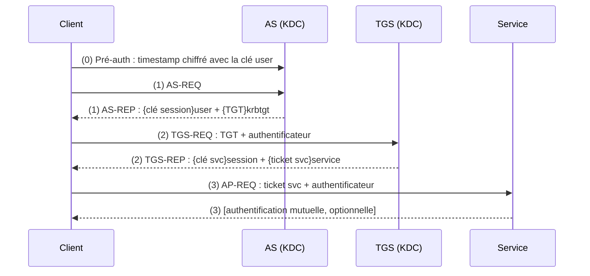
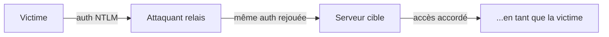
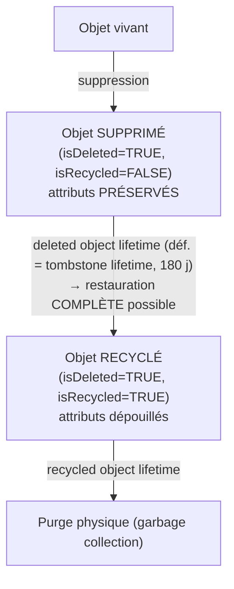

# Cours Active Directory & Windows Server - Partie 5
## Fondements théoriques & internals : « sous le capot »
### Windows Server 2022

---

> **Prérequis** : Parties 1 à 4. Aucune installation ici - **que du protocole, de la crypto et des structures de données.** On a passé quatre parties à *faire* ; on redescend maintenant au niveau où on comprend *pourquoi ça marche*, et surtout *pourquoi les attaques marchent*.
>
> **Posture** : jusqu'ici tu configurais Kerberos, les GPO, la PKI, la réplication sans jamais ouvrir le capot. Cette partie est le capot. C'est le passage de l'ingénieur qui sait *que* ça marche à celui qui sait *comment* - le seul qui peut vraiment diagnostiquer un incident tordu ou anticiper une classe d'attaque.
>
> **Fil conducteur - l'offensif comme preuve de compréhension** : chaque brique théorique éclaire une attaque réelle. Golden Ticket = tu as compris `krbtgt`. Kerberoasting = tu as compris le TGS. DCSync = tu as compris la réplication. Shadow Credentials = tu as compris PKINIT. Je ne traite jamais ces attaques comme des recettes, mais comme la **démonstration que le protocole est compris**. C'est l'état d'esprit purple team, et c'est ce qu'on attend d'un ingénieur sécu.

---

## Structure de la partie (6 blocs, 16 modules)

- **Bloc A - Le socle** : 37 Crypto · 38 LSA/SSPI/logon
- **Bloc B - Authentification** : 39 Kerberos + FAST · 40 Délégation · 41 NTLM
- **Bloc C - Autorisation** : 42 SID/jetons/ACL · 43 Claims & DAC
- **Bloc D - Internals de l'annuaire** : 44 LDAP/schéma · 45 NTDS.dit/ESE · 46 Cycle de vie · 47 Réplication
- **Bloc E - Localisation, PKI, frontières** : 48 DC Locator · 49 GPO internals · 50 PKI/X.509/PKINIT · 51 Approbations
- **Bloc F - Synthèse** : 52 Du Ctrl+Alt+Del à l'accès fichier

> Traite un bloc par session. L'ordre est délibéré : chaque module arme le suivant. Ne saute pas le Bloc A - sans la crypto et le modèle LSA, tout le reste reste magique.

---

# BLOC A - LE SOCLE

---

# Module 37 - Cryptographie appliquée à l'identité

## 37.1 Pourquoi commencer par là

Kerberos, NTLM, PKINIT, la réplication chiffrée, LDAPS : tout repose sur trois primitives cryptographiques. Si tu ne les distingues pas nettement, ces protocoles resteront des incantations et tu ne comprendras jamais *pourquoi* un hash NT se casse hors-ligne mais pas une clé AES salée. Ce module est court mais non négociable.

## 37.2 Les trois primitives

**1. Chiffrement symétrique** - une **même clé** chiffre et déchiffre. Rapide. C'est le cœur de Kerberos : tickets et sessions sont chiffrés symétriquement.

- Algorithmes : **AES** (128/256, le standard actuel), **RC4-HMAC** (legacy, à éliminer), **DES** (mort).
- Propriété clé : celui qui a la clé peut tout lire *et* forger. D'où la criticité des clés de service et de `krbtgt`.

**2. Chiffrement asymétrique** - une **paire** de clés : publique (partageable) et privée (secrète). Ce qui est chiffré avec l'une se déchiffre avec l'autre. Lent, donc réservé à établir la confiance / échanger une clé symétrique.

- Algorithmes : **RSA** (basé sur la factorisation), **ECC** (courbes elliptiques, mêmes garanties avec des clés plus courtes).
- Usage AD : PKI, PKINIT, LDAPS (handshake TLS), signature de la CA.

**3. Fonction de hachage** - transforme une entrée en empreinte de taille fixe, **à sens unique** (irréversible) et résistante aux collisions.

- Algorithmes : **SHA-256/384** (sain), **MD5/MD4/SHA-1** (cassés/faibles).

## 37.3 Le point qui explique pass-the-hash : le hash NT

Le fameux « hash NT » d'un compte AD, c'est simplement :
```
NT hash = MD4( UTF-16LE( mot_de_passe ) )
```
Trois observations qui déterminent une décennie d'attaques :

1. **Aucun sel.** Deux utilisateurs avec le même mot de passe ont le même hash NT → tables précalculées (rainbow tables), et un hash volé sur une machine sert partout.
2. **MD4, rapide.** Des milliards d'essais/seconde sur GPU → brute-force efficace des mots de passe faibles.
3. **Le hash *est* le secret d'authentification en NTLM.** On n'a pas besoin du mot de passe en clair : présenter le hash suffit. **C'est ça, le pass-the-hash** (module 41), et c'est structurel, pas un bug.

## 37.4 La dérivation de clé Kerberos : pourquoi AES résiste là où RC4 tombe

Kerberos n'utilise pas le hash NT tel quel pour AES. Il **dérive** une clé longue durée depuis le mot de passe via une fonction lente et **salée** :
```
Clé AES Kerberos = PBKDF2( mot_de_passe, sel = REALM + nom_utilisateur, itérations = 4096 )
```
- Le **sel** (realm + username) rend chaque clé unique même à mot de passe identique → adieu les tables précalculées.
- Les **4096 itérations** rendent chaque essai coûteux → brute-force hors-ligne bien plus lent.

À l'inverse, l'etype **RC4-HMAC utilise directement le hash NT, sans sel** - c'est pourquoi un attaquant qui « kerberoaste » un compte **force le service à renvoyer un ticket RC4** : il sait qu'un ticket RC4 se casse hors-ligne infiniment plus vite qu'un ticket AES. *Retiens ça : c'est exactement pourquoi on force AES-only sur les comptes de service (rappel Partie 1/2).*

## 37.5 Signature vs chiffrement (ne pas confondre)

- **Chiffrer** = garantir la **confidentialité** (personne ne lit).
- **Signer** = garantir **authenticité + intégrité** (ça vient bien de X et n'a pas été altéré), *sans* cacher le contenu.

Dans le PAC (module 39), le KDC **signe** tes appartenances de groupe : le service peut vérifier qu'elles n'ont pas été trafiquées. Comprendre cette distinction, c'est comprendre pourquoi un PAC forgé doit reproduire une signature valide - et donc pourquoi il faut la clé `krbtgt`.

## 37.6 Exercice de compréhension n°28
1. Explique en trois phrases pourquoi deux comptes au même mot de passe ont le même hash NT mais des clés Kerberos AES différentes.
2. Un attaquant a le choix de demander un ticket de service en RC4 ou en AES256. Lequel choisit-il pour du Kerberoasting, et pourquoi ?
3. Le PAC est-il chiffré, signé, ou les deux ? Qu'apporte chaque opération ?

---

# Module 38 - LSA, SSPI et le modèle de logon

## 38.1 Le module qu'on saute toujours à tort

On enseigne Kerberos comme s'il flottait dans le vide. Faux : **Kerberos n'est qu'un fournisseur parmi d'autres, à l'intérieur d'une architecture d'authentification Windows.** Sans comprendre cette architecture, tu ne peux pas expliquer *pourquoi* une connexion « retombe » sur NTLM, *où* vivent les secrets que vole Mimikatz, ni *pourquoi* le tiering de la Partie 4 existe. C'est le vrai point d'entrée.

## 38.2 LSA et LSASS

La **LSA** (Local Security Authority) est le sous-système de sécurité de Windows. Elle s'exécute dans le processus **`lsass.exe`**. Ses rôles :

- Authentifier les logons (locaux et réseau).
- Générer et détenir les **jetons d'accès** (module 42).
- **Mettre en cache en mémoire les secrets d'authentification** (hash NT, tickets Kerberos, clés de session) pour permettre le SSO - c'est-à-dire ne pas redemander le mot de passe à chaque accès réseau.

Ce dernier point est capital : **LSASS garde des secrets réutilisables en mémoire.** Un attaquant qui obtient les privilèges pour lire cette mémoire (Mimikatz, `sekurlsa`) récupère hash et tickets → pass-the-hash / pass-the-ticket. **C'est la raison d'être de Credential Guard** (Partie 4) : isoler ces secrets dans un conteneur virtualisé hors de portée de LSASS.

## 38.3 SSPI et les SSP : l'aiguillage

**SSPI** (Security Support Provider Interface) est l'API par laquelle *toute* application demande de l'authentification à Windows (c'est l'implémentation Microsoft de GSSAPI). Derrière SSPI, plusieurs **SSP** (Security Support Providers), chacun un protocole :

| SSP | Rôle |
|---|---|
| **Kerberos** | Authentification par tickets (le défaut en domaine) |
| **NTLM** (MSV1_0) | Challenge/réponse, secours et hors-domaine |
| **Negotiate** (SPNEGO) | **L'arbitre** : choisit Kerberos si possible, sinon retombe sur NTLM |
| **Schannel** | TLS/SSL (LDAPS, HTTPS, RDP) - authentification par certificat |
| **CredSSP** | Délègue les identifiants (RDP, PowerShell) - **dangereux**, expose les creds sur la cible |
| **Digest** | HTTP Digest (legacy) |

Le mécanisme clé est **Negotiate/SPNEGO** : quand un client SMB, LDAP ou HTTP s'authentifie, il ne « choisit » pas Kerberos à la main. Il passe par Negotiate qui **tente Kerberos** (le client a-t-il un SPN cible résoluble, un DC joignable, une horloge synchrone ?) et **retombe sur NTLM** si l'une de ces conditions manque.

> Ceci explique une foule d'observations de terrain : accès par **adresse IP** au lieu du nom → pas de SPN → NTLM ; **DC injoignable** → NTLM ; **horloge décalée > 5 min** → Kerberos échoue → NTLM. Quand tu vois du NTLM là où tu attends du Kerberos, tu sais désormais où regarder.

## 38.4 Winlogon et les credential providers

La chaîne du logon interactif :

1. **SAS** (Secure Attention Sequence) : le Ctrl+Alt+Suppr, qui garantit que tu parles au vrai Windows et pas à un faux écran de logon.
2. **Winlogon** orchestre la session.
3. **LogonUI** affiche l'interface, via des **credential providers** (mot de passe, PIN, carte à puce, biométrie - ils ont remplacé l'ancien GINA).
4. Les identifiants sont remis à **LSA**, qui appelle le bon package d'authentification.

## 38.5 Les types de logon (LogonType) - la théorie derrière le tiering

Chaque authentification a un **type**, visible dans l'événement `4624`. Les connaître, c'est comprendre *quels secrets restent exposés où* :

| Type | Nom | Exposition |
|---|---|---|
| **2** | Interactive (clavier local) | Secrets réutilisables mis en cache dans LSASS |
| **3** | Network (SMB, LDAP…) | **Pas** de secret réutilisable laissé sur la cible (sauf délégation) |
| **4** | Batch (tâches planifiées) | Identifiants stockés |
| **5** | Service | Identifiants stockés |
| **7** | Unlock | Comme interactif |
| **8** | NetworkCleartext | Mot de passe en clair (ex. IIS basic auth) |
| **9** | NewCredentials (`runas /netonly`) | Nouveaux creds pour le réseau uniquement |
| **10** | RemoteInteractive (**RDP**) | **Secrets réutilisables en mémoire de la cible** |
| **11** | CachedInteractive | Logon via creds en cache (DC injoignable) |

**Le point qui fonde le tiering** : un logon **interactif (2)** ou **RDP (10)** laisse des secrets réutilisables dans LSASS de la machine cible. Donc si un Domain Admin ouvre une session RDP sur un poste utilisateur compromis, son secret y devient volable. À l'inverse, un logon **réseau (3)** ne laisse rien. *Voilà pourquoi la règle d'or de la Partie 4 est : un compte de tier supérieur ne fait jamais de logon interactif/RDP sur un tier inférieur.* Ce n'est pas une superstition, c'est une conséquence directe du LogonType.

## 38.6 Les identifiants en cache (Domain Cached Credentials)

Pour qu'un portable puisse ouvrir une session **sans DC joignable** (en déplacement), Windows met en cache une forme dérivée des identifiants : **MSCache v2 / DCC2**. Points théoriques :

- Ce n'est **pas** le hash NT, mais un dérivé **PBKDF2** (salé, itéré) → **non rejouable** en pass-the-hash, et lent à casser hors-ligne (mais crackable si mot de passe faible).
- Le nombre d'identités mises en cache est réglable par GPO (souvent réduit sur les postes sensibles ; 0 = aucun cache, mais alors plus de logon hors-ligne).
- Stockés dans la ruche registre `SECURITY` - extractibles avec les privilèges SYSTEM.

## 38.7 Exercice de compréhension n°29
1. Une application accède à un partage par `\\192.168.10.20\data` et l'authentification passe en NTLM alors que le domaine est sain. Donne la cause la plus probable au niveau SSPI.
2. Explique, en te basant sur les LogonType, pourquoi un `Invoke-Command` (logon réseau, type 3) est plus sûr qu'un RDP (type 10) pour administrer un serveur douteux.
3. Pourquoi MSCache v2 ne permet-il pas de pass-the-hash, contrairement au hash NT ?
4. Où Credential Guard place-t-il les secrets, et pourquoi cela neutralise-t-il Mimikatz `sekurlsa::logonpasswords` ?

---

# BLOC B - AUTHENTIFICATION

---

# Module 39 - Kerberos de bout en bout

## 39.1 Le théâtre à trois acteurs

Kerberos (« le chien à trois têtes ») repose sur un tiers de confiance qui médie entre client et service, pour qu'ils n'aient **jamais à échanger de secret directement**.

- **Le client** (utilisateur ou machine).
- **Le KDC** (Key Distribution Center), hébergé sur chaque DC, en deux services logiques :
  - **AS** (Authentication Service) : authentifie et délivre le **TGT**.
  - **TGS** (Ticket-Granting Service) : délivre les **tickets de service**.

- **Le service** cible (partage, base SQL, site web…), identifié par un **SPN** (Service Principal Name).

Idée maîtresse : un ticket est un **laissez-passer chiffré avec la clé du destinataire**, contenant une **clé de session** partagée. Comme seul le destinataire prévu peut le déchiffrer, il n'a pas besoin d'appeler qui que ce soit pour vérifier - d'où la scalabilité de Kerberos.

## 39.2 Le déroulé complet, message par message

**Étape 0 - Pré-authentification.**
Le client chiffre un **horodatage** avec sa **clé longue durée** (dérivée du mot de passe, module 37) et l'envoie. Le KDC déchiffre : si l'heure est cohérente, c'est la preuve que le client connaît son secret, *sans* que le mot de passe transite.
> Si la pré-auth est **désactivée** sur un compte, le KDC renvoie directement du matériel chiffré avec la clé de l'utilisateur → **AS-REP roasting** (craquable hors-ligne). D'où : ne jamais désactiver la pré-auth.

**Étape 1 - AS-REQ / AS-REP (obtenir le TGT).**
Le client demande un TGT à l'AS. L'AS répond avec :

- Une **clé de session TGS** (chiffrée avec la clé du client → lui seul la lit).
- Le **TGT** lui-même, **chiffré avec la clé de `krbtgt`** → le client ne peut pas le lire ni le modifier ; il le stockera et le représentera tel quel. Le TGT contient l'identité du client, la clé de session, la durée de vie, et le **PAC** (39.4).

**Étape 2 - TGS-REQ / TGS-REP (obtenir un ticket de service).**
Pour joindre le service `SPN=cifs/SRV01`, le client renvoie son TGT + un **authentificateur** (horodatage chiffré avec la clé de session TGS, anti-rejeu). Le TGS déchiffre le TGT (il a la clé `krbtgt`), vérifie, et renvoie :

- Une **clé de session de service**.
- Le **ticket de service**, **chiffré avec la clé du compte du service** (le hash/clé AES du compte qui porte le SPN). Il contient une copie du PAC.

**Étape 3 - AP-REQ (présentation au service).**
Le client présente le ticket de service + un nouvel authentificateur au service. Le service **déchiffre le ticket avec sa propre clé** (il n'appelle pas le DC !), lit l'identité et le PAC, valide l'authentificateur, et accorde l'accès. Optionnellement, authentification **mutuelle** : le service prouve son identité en retour.



## 39.3 krbtgt : la clé de voûte (et la Golden Ticket)

**Tout TGT est chiffré avec la clé du compte `krbtgt`.** Conséquence vertigineuse : quiconque possède le hash/clé de `krbtgt` peut **forger un TGT arbitraire** - pour n'importe quel utilisateur, avec n'importe quels groupes, valable jusqu'à 10 ans. C'est le **Golden Ticket**. Le KDC l'acceptera puisqu'il est correctement chiffré avec *sa propre* clé.
> C'est pourquoi, après une compromission suspectée, on **réinitialise `krbtgt` deux fois** (espacées de la durée de vie max d'un ticket) : le double reset invalide les TGT forgés. Et pourquoi `krbtgt` est un secret **Tier 0** absolu.

## 39.4 Le PAC : le joyau caché

Le **PAC** (Privileged Attribute Certificate) est une structure **à l'intérieur** du ticket qui transporte l'**autorisation** : les SID de l'utilisateur, ses **groupes**, ses privilèges, des infos de logon. Sans PAC, Kerberos prouverait *qui tu es* mais pas *à quels groupes tu appartiens* - or c'est l'appartenance aux groupes qui décide des accès (module 42).

- Le PAC est **signé par le KDC** (rappel : signer ≠ chiffrer, module 37) pour empêcher un service de falsifier tes groupes.
- **Silver Ticket** : si un attaquant a la clé d'un **compte de service**, il forge un *ticket de service* (pas un TGT) avec un PAC bidon → accès à *ce* service uniquement, **sans jamais parler au DC** (donc très discret). Comprendre le PAC, c'est comprendre pourquoi Golden (TGT, tout le domaine) et Silver (ticket de service, un service) diffèrent.
- La **validation du PAC** (le service redemande au KDC de vérifier la signature) et les correctifs récents de *PAC hardening* referment des failles historiques (ex. sAMAccountName spoofing).

## 39.5 Anti-rejeu, horloge, durées de vie

- **Authentificateur** : horodatage chiffré avec la clé de session, à usage quasi-unique → un ticket capté ne peut être rejoué (l'horodatage sera périmé).
- **Tolérance d'horloge** : par défaut **5 minutes** (`MaxClockSkew`). Au-delà, l'authentificateur est jugé rejoué/invalide → **Kerberos casse**. *Voilà la raison profonde pour laquelle le temps est sacré en AD (Partie 1) et pourquoi le PDC Emulator sert de référence temporelle.*
- **Durée de vie** : TGT ~10h, renouvelable jusqu'à ~7 jours. Limiter la durée réduit la fenêtre d'abus d'un ticket volé.

## 39.6 etypes, sel, kvno et FAST - le bloc anti-cassage

**Types de chiffrement (etypes)**, négociés entre client et KDC :

- **AES256-CTS-HMAC-SHA1 (18)** et **AES128 (17)** : sains, clés **salées** (module 37).
- **RC4-HMAC (23)** : utilise le hash NT **sans sel** → cassable hors-ligne → à **désactiver**.
- **DES** : mort.

**Salting** : la clé AES est salée avec `REALM+username` → deux comptes au même mot de passe ont des clés différentes. RC4 non → précalculable. **kvno** (Key Version Number) : versionne la clé d'un compte, pour que les tickets restent déchiffrables juste après un changement de mot de passe.

**FAST / Kerberos Armoring** (« Flexible Authentication Secure Tunneling ») : la contre-mesure théorique à l'AS-REP roasting et au cassage de pré-auth. La machine utilise **son propre TGT** pour créer un **tunnel blindé** qui protège l'échange de pré-auth de l'utilisateur → l'attaquant ne peut plus capter de matériel craquable hors-ligne. FAST permet aussi l'**identité composée** (utilisateur + machine), socle du contrôle d'accès dynamique (module 43). Se déploie via GPO (« Kerberos client support for claims/armoring »).

## 39.7 Panorama des attaques Kerberos (chacune = un concept maîtrisé)

| Attaque | Concept sous-jacent | Défense théorique |
|---|---|---|
| **Golden Ticket** | Clé `krbtgt` chiffre tout TGT | Protéger/rotationner `krbtgt`, Tier 0 |
| **Silver Ticket** | Ticket de service chiffré par la clé du service | gMSA, AES-only, PAC validation |
| **Kerberoasting** | Le TGS renvoie un ticket chiffré avec la clé du compte de service | Mots de passe longs, gMSA, AES-only |
| **AS-REP roasting** | Pré-auth désactivée → matériel craquable | Ne jamais désactiver la pré-auth, FAST |
| **Overpass-the-hash** | Le hash NT dérive la clé Kerberos | Credential Guard, AES-only |
| **Pass-the-ticket** | Tickets réutilisables en mémoire LSASS | Credential Guard, durées de vie courtes |

## 39.8 Exercice de compréhension n°30
1. Avec `klist`, liste tes tickets. Identifie le TGT (`krbtgt/...`) et un ticket de service, et dis avec quelle clé chacun est chiffré.
2. Explique pourquoi un service déchiffre un ticket **sans jamais contacter le DC**, et ce que cela implique pour le Silver Ticket.
3. Un décalage d'horloge de 8 minutes casse Kerberos : relie ça précisément à l'authentificateur.
4. Pourquoi le double reset de `krbtgt` neutralise-t-il un Golden Ticket, et pourquoi faut-il l'espacer ?

---

# Module 40 - Délégation Kerberos

## 40.1 Le problème : agir « au nom de »

Cas réel : tu te connectes à un serveur web (front-end) qui doit ensuite interroger une base SQL (back-end) **en ton nom**, avec *tes* droits. Le front-end doit donc obtenir un ticket vers SQL **au nom de l'utilisateur**. C'est la délégation. Elle est puissante et, mal configurée, catastrophique - d'où l'importance d'en comprendre la mécanique exacte.

## 40.2 Les trois modèles

**1. Délégation non contrainte (unconstrained)** - la plus ancienne, la plus dangereuse.
Le service reçoit une **copie du TGT de l'utilisateur** (transféré) et la garde en mémoire → il peut se faire passer pour l'utilisateur vers **n'importe quel service**. Si un attaquant compromet un serveur configuré en délégation non contrainte, il moissonne les TGT de tous ceux qui s'y connectent - y compris, avec une astuce (coercition d'authentification), le TGT d'un **DC**. **À bannir.**

**2. Délégation contrainte (constrained, KCD)** - introduit une limite.
L'attribut `msDS-AllowedToDelegateTo` du service liste **explicitement les SPN cibles** vers lesquels il peut déléguer. Repose sur l'extension **S4U2Proxy**. Mieux, mais le contrôle est posé **sur le compte qui délègue**, ce qui pose des soucis d'administration et d'escalade (si on peut écrire cet attribut).

**3. Délégation contrainte basée sur les ressources (RBCD)** - le modèle moderne.
Le contrôle est **inversé** : c'est la **ressource cible** (le back-end) qui déclare *qui a le droit d'agir en son nom*, via `msDS-AllowedToActOnBehalfOfOtherIdentity`. Avantages : le propriétaire de la ressource maîtrise sa propre confiance, c'est granulaire et révocable localement. **C'est la réponse recommandée** - notamment pour le double-hop PowerShell de la Partie 4.

## 40.3 S4U2Self et S4U2Proxy : la mécanique

Deux extensions Kerberos « Service-for-User » rendent tout ça possible :

- **S4U2Self** : permet à un service d'obtenir un **ticket de service vers lui-même, au nom d'un utilisateur, sans le mot de passe de cet utilisateur** (« transition de protocole » - utile quand l'utilisateur s'est authentifié autrement, ex. par certificat côté web). Le service fabrique ainsi une identité utilisateur exploitable.
- **S4U2Proxy** : à partir de ce ticket, le service en demande un **vers le back-end**, au nom de l'utilisateur. C'est l'extension utilisée par la délégation contrainte et le RBCD.

> **Pourquoi c'est un terrain d'attaque** : la chaîne S4U + un droit d'écriture sur `msDS-AllowedToActOnBehalfOfOtherIdentity` d'une machine (souvent obtenu via une autre faille) permet des escalades documentées vers SYSTEM sur la cible. Comprendre S4U, c'est comprendre pourquoi le **droit d'écrire cet attribut** est aussi sensible qu'un droit admin.

## 40.4 Exercice de compréhension n°31
1. Trouve les comptes en délégation non contrainte : `Get-ADComputer -Filter {TrustedForDelegation -eq $true}`. Explique le risque pour chacun.
2. Décris précisément la différence de *où* est posé le contrôle entre KCD et RBCD, et pourquoi RBCD est plus sain.
3. Explique, étape par étape (S4U2Self puis S4U2Proxy), comment un front-end web authentifié par certificat obtient un ticket SQL au nom de l'utilisateur.

---

# Module 41 - NTLM

## 41.1 L'ancêtre qu'on n'arrive pas à tuer

NTLM précède Kerberos et survit comme **mécanisme de secours** (hors-domaine, par IP, DC injoignable, appli legacy). Il est structurellement plus faible - le comprendre, c'est comprendre pourquoi Negotiate le fuit dès qu'il peut, et pourquoi tant d'attaques LAN reposent dessus.

## 41.2 Le challenge/réponse

Pas de tiers de confiance : le serveur défie directement le client.
```
1. Client → Serveur : NEGOTIATE (je veux m'authentifier en NTLM)
2. Serveur → Client : CHALLENGE (un nonce aléatoire)
3. Client → Serveur : RESPONSE (le nonce transformé via une clé dérivée du hash NT)
4. Serveur valide (localement s'il connaît le hash, ou en relayant au DC via Netlogon)
```
Le mot de passe ne transite jamais ; le hash NT non plus **directement** - mais il est la clé de la réponse.

## 41.3 NTLMv1 vs NTLMv2, et le « Net-NTLM »

- **NTLMv1** : basé sur DES, **cassé**, à désactiver.
- **NTLMv2** : HMAC-MD5, inclut horodatage + infos de cible → plus robuste, mais toujours vulnérable par nature (voir relais).
- Distinction cruciale : le **Net-NTLM hash** (la *réponse* challenge/réponse capturée sur le fil) **n'est pas** le hash NT. On peut tenter de le **casser** hors-ligne (si mot de passe faible) ou le **relayer**, mais on **ne peut pas** le rejouer en pass-the-hash. Le **hash NT** (au repos, dans SAM/LSASS), lui, est pass-the-hash-able. Confondre les deux est l'erreur classique.

## 41.4 Le péché originel : le relais NTLM

NTLM **ne lie pas** l'authentification au canal ni au serveur cible (pas de preuve mutuelle du *destinataire*). Donc un attaquant en position d'intercepteur peut **relayer** : capter le challenge/réponse d'une victime et le **rejouer vers un autre serveur** pour s'authentifier *en tant que la victime*.

Souvent amorcé par du **poisoning** (LLMNR/NBT-NS, module non traité mais rappelé Partie 1) qui force la victime à s'authentifier vers l'attaquant. C'est le moteur de nombreuses compromissions internes, dont **ESC8** (relais vers l'endpoint HTTP d'une CA, Partie 2).

**Défenses théoriques** (toutes visent à lier l'auth au canal/serveur) :

- **Signature SMB** et **signature LDAP** : intègrent l'authentification, un relais est détecté.
- **Channel Binding / EPA** (Extended Protection for Authentication) : lie l'auth au canal TLS.
- **Désactiver LLMNR/NBT-NS** : coupe l'amorçage.
- **Réduire/auditer NTLM** puis migrer vers Kerberos, qui ne souffre pas de ça (authentification mutuelle + tickets liés au SPN).

## 41.5 Exercice de compréhension n°32
1. Explique pourquoi le relais NTLM fonctionne alors que Kerberos y résiste (pense au SPN et à l'auth mutuelle).
2. Distingue Net-NTLM hash et hash NT : lequel est relayable, lequel est pass-the-hash-able, pourquoi.
3. Pour chaque défense (signature SMB, EPA, désactivation LLMNR), dis quelle étape de l'attaque elle casse.

---

# BLOC C - AUTORISATION

---

# Module 42 - SID, jetons d'accès, ACL et access check

## 42.1 De « qui es-tu » à « as-tu le droit »

L'authentification (Bloc B) répond à *qui es-tu*. L'**autorisation** répond à *as-tu le droit de faire ceci sur cela*. Elle repose sur trois objets : le **SID** (identité), le **jeton d'accès** (ton sac de droits au moment T), et le **security descriptor** (les règles sur la ressource). L'access check les confronte.

## 42.2 Anatomie d'un SID

Un **SID** (Security Identifier) identifie de façon unique et immuable un principal de sécurité. Format :
```
S - 1 - 5 - 21-3623811015-3361044348-30300820 - 1013
│   │   │   └──────── identifiant de domaine ────────┘   └ RID
│   │   └ autorité émettrice (5 = NT Authority)
│   └ révision
└ littéral "S"
```
- Le **domaine** partage le même préfixe pour tous ses principaux.
- Le **RID** (Relative Identifier) distingue chaque objet ; il est distribué par le **RID Master** (Partie 1). Les RID sont **monotones et non réutilisés** - d'où l'importance de ne pas dupliquer un DC (USN/RID rollback, module 47).

**SID bien connus** (à reconnaître d'un coup d'œil) :

| SID / RID | Principal |
|---|---|
| `S-1-1-0` | Everyone |
| `S-1-5-18` | SYSTEM (LocalSystem) |
| `S-1-5-32-544` | Administrators (local) |
| RID `500` | Administrateur intégré |
| RID `502` | **krbtgt** |
| RID `512` | Domain Admins |
| RID `519` | Enterprise Admins |
| RID `520` | Group Policy Creator Owners |

## 42.3 Le jeton d'accès

À la fin d'un logon, la **LSA** (module 38) construit un **jeton d'accès** attaché à chaque processus de l'utilisateur. Il contient :

- Le **SID de l'utilisateur** et **tous les SID de groupes** (résolus récursivement - l'expansion des groupes se fait *à l'ouverture de session*, d'où : changer les groupes d'un utilisateur ne prend effet qu'au **prochain logon**).
- Les **privilèges** (SeBackupPrivilege, SeDebugPrivilege…) - distincts des permissions sur objet.
- Le **niveau d'intégrité** (42.6).
- Le contenu du **PAC** (module 39) alimente ce jeton lors d'un logon réseau Kerberos.

**sidHistory** : attribut qui permet à un principal de « porter » des SID d'anciens domaines (migrations). Ajoute ces SID au jeton → utile en migration, **abusé** en attaque (injecter le SID de Domain Admins dans sidHistory = privilèges sans être membre du groupe). C'est ce que le **SID filtering** (module 51) neutralise entre forêts.

## 42.4 Security descriptor et ACE

Chaque objet sécurisable (fichier, clé de registre, objet AD, service…) porte un **security descriptor** :

- **Owner** (propriétaire - peut toujours modifier la DACL, notion clé pour les escalades).
- **DACL** (Discretionary ACL) : la liste des **ACE** qui accordent/refusent l'accès.
- **SACL** (System ACL) : ce qui est **audité**.

Une **ACE** (Access Control Entry) = { type (Allow/Deny), SID visé, **masque d'accès** (les droits : lecture, écriture, suppression, *WriteDACL*, *WriteOwner*…), flags d'héritage }.

> **Pourquoi les ACL sur objets AD sont un terrain d'escalade** : des droits comme **WriteDACL**, **WriteOwner**, **GenericAll**, ou **WriteProperty** sur `member` d'un groupe permettent à un utilisateur peu privilégié de *se donner lui-même* des droits ou de s'ajouter à un groupe admin. C'est exactement ce que **BloodHound** cartographie (les « chemins » d'attaque = enchaînements d'ACE exploitables). Comprendre l'ACE, c'est lire BloodHound.

## 42.5 L'access check : la décision, étape par étape

Quand un processus (avec son jeton) demande un accès (masque souhaité) à un objet :

1. Si le demandeur est **propriétaire**, certains droits (READ_CONTROL, WRITE_DAC) sont implicites.
2. Windows parcourt la **DACL dans l'ordre canonique** : **ACE Deny explicites d'abord**, puis **Allow explicites**, puis héritées.
3. Un **Deny** correspondant au jeton pour un droit demandé → **refus immédiat**.
4. Les **Allow** accumulent les droits accordés jusqu'à couvrir le masque demandé.
5. Si à la fin le masque n'est pas entièrement couvert → **refus**.

> L'**ordre canonique** (Deny avant Allow) est ce qui fait qu'un Deny « gagne ». Une DACL désordonnée (ACE ajoutées par programme) peut produire des décisions contre-intuitives - d'où l'importance de laisser les outils normaliser l'ordre.

## 42.6 Niveaux d'intégrité et types de jeton

- **MIC** (Mandatory Integrity Control) : chaque processus a un **niveau d'intégrité** (Low, Medium, High, System). Un processus Low ne peut pas écrire dans un objet High, *même si* la DACL l'autoriserait. C'est un contrôle **orthogonal** à la DACL (le bac à sable des navigateurs repose là-dessus).
- **UAC & jeton scindé** : un admin reçoit **deux jetons** - un **filtré** (Medium, usage courant) et un **complet** (High, après élévation). D'où « Exécuter en tant qu'administrateur ».
- **Jeton primaire vs d'emprunt (impersonation)** : un processus a un jeton *primaire* ; un service qui agit *au nom d'un client* utilise un jeton d'**impersonation** (obtenu via le logon réseau / la délégation). C'est le lien concret entre le Bloc B (délégation) et l'autorisation.

## 42.7 Exercice de compréhension n°33
1. Sur un partage, lis la DACL avec `(Get-Acl \\SRV01\Compta).Access` et identifie une ACE Allow, son SID et son masque.
2. Explique pourquoi ajouter un utilisateur à un groupe n'a d'effet qu'au prochain logon (pense à l'expansion dans le jeton).
3. Un utilisateur a **WriteDACL** sur un groupe « Domain Admins ». Décris le chemin d'escalade. Pourquoi BloodHound le signalerait-il ?
4. Pourquoi un processus Low ne peut-il pas écrire dans un fichier même si la DACL l'y autorise ?

---

# Module 43 - Claims, Dynamic Access Control et conditional ACEs

## 43.1 Au-delà des groupes

Le modèle « SID + groupes » (module 42) est binaire et statique. Le **Dynamic Access Control** (DAC, Windows Server 2012) ajoute une autorisation **basée sur des attributs** - des **claims** (revendications) - évaluée dynamiquement. Objectif : exprimer des règles comme « accès si *Department = Finance* **et** *appareil géré* **et** *fichier classé Confidentiel* » sans multiplier les groupes.

## 43.2 Les briques

- **User claims** : attributs de l'utilisateur transportés dans le jeton (ex. `Department`, `Country`), issus d'AD.
- **Device claims** : attributs de la **machine** - nécessitent l'**identité composée** (utilisateur + appareil), donc **Kerberos armoring / FAST** (module 39). C'est le lien direct : pas de device claims sans FAST.
- **Resource properties** : étiquettes sur les fichiers (ex. `Impact = High`), via la classification FSRM (Partie 2).
- **Central Access Rules / Policies (CAR/CAP)** : des règles centralisées, distribuées par GPO, qui s'appliquent aux ressources - l'autorisation devient **pilotée centralement**, plus seulement par des ACL locales.

## 43.3 Les conditional ACEs

Techniquement, DAC s'appuie sur des **ACE conditionnelles** : une ACE classique (module 42) **augmentée d'une expression booléenne** sur les claims. Exemple conceptuel :
```
Allow  Modify  si  (User.Department == "Finance")  AND  (Device.Managed == True)
```
L'access check (module 42) évalue en plus la condition. Si elle est fausse, l'ACE ne s'applique pas.

> **Cadrage d'ingénieur** : DAC est élégant mais peu déployé - complexité opérationnelle, dépendance à une classification rigoureuse, et le cloud (étiquettes de sensibilité, Conditional Access d'Entra) couvre désormais des besoins voisins. À **comprendre** pour les concepts (identité composée, autorisation par attributs) plus qu'à déployer par défaut. Je te le dis franchement pour que tu n'y investisses pas un temps disproportionné.

## 43.4 Exercice de compréhension n°34
1. Pourquoi les device claims exigent-ils FAST/Kerberos armoring ? Relie à l'identité composée du module 39.
2. Écris en pseudo-condition une ACE « lecture seule si le fichier est classé Public OU si l'utilisateur est du service RH ».
3. Cite un scénario où DAC évite une explosion combinatoire de groupes AGDLP (rappel Partie 1).

---

# BLOC D - INTERNALS DE L'ANNUAIRE

---

# Module 44 - LDAP et le modèle de données

## 44.1 AD est une base LDAP

Sous les consoles graphiques, AD est un annuaire **LDAP** (Lightweight Directory Access Protocol). Tout objet - utilisateur, groupe, GPO, ordinateur - n'est **qu'un ensemble d'attributs typés**, adressable par un **DN** (Distinguished Name). Comprendre LDAP, c'est cesser de voir AD comme des « fenêtres » et le voir comme ce qu'il est : une base hiérarchique interrogeable.

## 44.2 Les opérations LDAP

Le protocole tient en quelques opérations :

| Opération | Rôle |
|---|---|
| **bind** | S'authentifier (simple = mdp ; SASL = Kerberos/GSSAPI) |
| **search** | Interroger (l'opération reine) |
| **add / modify / delete** | Écrire |
| **modifyDN** | Renommer/déplacer |
| **compare** | Tester une valeur d'attribut |
| **unbind** | Fermer |

Un **search** se paramètre par : **base DN** (où chercher), **scope** (`base` = l'objet seul, `onelevel` = enfants directs, `subtree` = tout le sous-arbre), **filtre**, et **liste d'attributs** à renvoyer. Le filtre est en notation préfixée :
```
(&(objectClass=user)(department=IT)(!(userAccountControl:1.2.840.113556.1.4.803:=2)))
   ET   classe user   ET  dept IT     ET NON (bit "compte désactivé")
```
Ce dernier motif (`...803:=2`) est un **matching rule OID** pour tester un bit précis - exactement ce que font tes filtres PowerShell avancés de la Partie 1.

**Contrôles LDAP** : extensions attachées à une requête, ex. **paged results** (résultats paginés - AD plafonne à 1000 objets par page côté serveur, d'où la pagination obligatoire sur les grosses requêtes).

## 44.3 Sur le fil : ASN.1 / BER (le minimum)

LDAP encode ses messages en **ASN.1** (langage de description de structures) sérialisé en **BER** (Basic Encoding Rules) : chaque champ = un triplet **Type-Longueur-Valeur (TLV)**. Tu n'as pas besoin de décoder du BER à la main - retiens seulement que c'est un format **binaire structuré et typé** (pas du texte), que LDAPS l'enveloppe dans TLS, et que c'est pourquoi un `Wireshark` sur du LDAP non chiffré montre des champs lisibles alors que LDAPS ne montre que du TLS. *Une page de culture, pas un module - on ne réimplémente pas un parseur BER.*

## 44.4 Le schéma : la grammaire des objets

Le **schéma** définit *tout ce qui peut exister* dans la forêt. Il est unique et répliqué à toute la forêt (Partie 1).

- **classSchema** : les classes d'objets. Hiérarchie à trois natures :
  - **abstraites** (ex. `top`) : briques de base non instanciables.
  - **structurelles** (ex. `user`, `group`) : les objets réels.
  - **auxiliaires** (ex. `securityPrincipal`) : greffent des attributs à d'autres classes.

- **attributeSchema** : les attributs, chacun avec une **syntaxe** (chaîne, entier, DN, SID, horodatage…) et un **OID** unique mondial.
- **objectClass** d'un objet liste ses classes → détermine ses attributs possibles. `objectCategory` sert d'index rapide pour les requêtes.

> **Conséquence pratique** : étendre le schéma (ce que fait l'installation d'Exchange, de LAPS, de la PKI) est **irréversible et répliqué partout** → opération Tier 0, testée, planifiée. On ne « bidouille » jamais le schéma.

## 44.5 Naming contexts et référents

La base est partitionnée en **naming contexts (NC)** (rappel Partie 1) :

- **Schema NC**, **Configuration NC** → forêt entière.
- **Domain NC** → le domaine.
- **Application partitions** (ex. `DomainDnsZones`) → périmètre choisi.

Quand une requête sort du périmètre d'un DC, celui-ci renvoie un **référent** (referral) : « je n'ai pas, demande là-bas ». Le **catalogue global** (port 3268) existe précisément pour éviter des référents incessants en offrant une vue partielle de toute la forêt.

## 44.6 Exercice de compréhension n°35
1. Écris un filtre LDAP « tous les groupes dont le nom commence par G_ et qui ont au moins un membre ».
2. Pourquoi une requête ramenant 5000 objets **doit** utiliser le contrôle *paged results* ?
3. Explique la différence entre classe structurelle et auxiliaire, avec un exemple.
4. Pourquoi le catalogue global réduit-il les référents ? Quel port l'expose ?

---

# Module 45 - NTDS.dit et le moteur ESE

## 45.1 Ce qu'est vraiment `ntds.dit`

La base AD, `C:\Windows\NTDS\ntds.dit`, est une base **ESE** (Extensible Storage Engine, alias *Jet Blue*) - le même moteur transactionnel que celui d'Exchange. Ce n'est pas un fichier « plat » : c'est une base indexée, transactionnelle (ACID), avec journaux. Comprendre sa structure explique la réplication, la restauration et… DCSync.

## 45.2 Les tables internes

`ntds.dit` contient principalement :

- **Data Table** : **tous les objets** (utilisateurs, groupes, etc.), une ligne par objet, une colonne par attribut. Chaque objet a un **DNT** (Distinguished Name Tag, un identifiant interne entier) et un **PDNT** (celui de son parent) → l'arborescence est reconstituée par ces liens parent/enfant, pas stockée comme des chemins.
- **Link Table** : les **attributs liés** (linked attributes), typiquement `member` / `memberOf`. Le **forward link** (`member`, stocké) et le **back link** (`memberOf`, **calculé** à la volée) forment une paire. *D'où : `memberOf` n'est pas écrit, il est dérivé - c'est pourquoi certaines appartenances (groupe primaire, groupes distants) n'y apparaissent pas.*
- **SD Table** : les **security descriptors** (module 42), **mono-instanciés** (single-instance store) - un même descripteur partagé par des milliers d'objets n'est stocké qu'une fois, référencé. Économie majeure.

## 45.3 Transactions et journaux

ESE est transactionnel : toute écriture passe d'abord par les **journaux** (`edb.log`, en écriture séquentielle rapide), puis est appliquée à la base ; un **checkpoint** (`edb.chk`) marque jusqu'où la base est à jour. En cas de crash, ESE **rejoue** les journaux pour retrouver un état cohérent. AD utilise le **circular logging** (les vieux journaux sont recyclés).

> **Conséquence pour la restauration** : on ne copie pas `ntds.dit` « à chaud » comme un simple fichier - il faut passer par VSS / Windows Server Backup qui capture un état transactionnellement cohérent. Et une defrag hors-ligne (`ntdsutil`, Partie 1) se fait en DSRM, base démontée.

## 45.4 Le lien avec DCSync

DCSync n'« ouvre » pas `ntds.dit` : il **demande la réplication** des secrets via le protocole **MS-DRSR** (`DRSGetNCChanges`), comme le ferait un DC. Mais comprendre que les **hashes** (attributs `unicodePwd`, `supplementalCredentials`) vivent dans la Data Table, protégés par le chiffrement PEK, éclaire *ce que* l'attaquant exfiltre et *pourquoi* le droit « Replicating Directory Changes All » est aussi critique qu'un accès physique à la base (module 47).

## 45.5 Exercice de compréhension n°36
1. Pourquoi `memberOf` n'apparaît-il pas toujours complet (pense forward/back link et groupe primaire) ?
2. Explique l'intérêt du single-instance store des security descriptors.
3. Pourquoi ne peut-on pas simplement copier `ntds.dit` à chaud pour le sauvegarder ?
4. DCSync lit-il le fichier `ntds.dit` directement ? Sinon, que fait-il ?

---

# Module 46 - Cycle de vie des objets

## 46.1 Un objet supprimé ne disparaît pas tout de suite

Dans un annuaire **répliqué multi-maîtres** (module 47), on ne peut pas « effacer » un objet instantanément : sinon, comment prévenir les autres DC de le supprimer aussi ? La suppression doit **se répliquer**. D'où un cycle de vie en plusieurs états, piloté par des durées de vie.

## 46.2 Sans corbeille : l'état « tombstone »

Historiquement, supprimer un objet le transforme en **tombstone** (pierre tombale) :

- `isDeleted = TRUE`, objet déplacé dans le conteneur **Deleted Objects**.
- **La plupart des attributs sont dépouillés** (dont les appartenances de groupe) → un objet restauré depuis un tombstone revient **amputé** (il faut recréer ses groupes).
- Le tombstone se **réplique** (les autres DC apprennent la suppression), puis persiste pendant le **tombstone lifetime** (**180 jours** par défaut sur les forêts modernes), avant d'être **physiquement purgé** par le ramasse-miettes.

## 46.3 Avec la corbeille AD : l'état « recycled »

La **corbeille AD** (Recycle Bin, activée Partie 1) ajoute un état intermédiaire et **préserve les attributs** :

La différence décisive : **tant que l'objet est en état « supprimé » (pas encore « recyclé »), la restauration est intégrale** - y compris les appartenances de groupe, car les **liens sont préservés**. C'est pourquoi la corbeille AD est tellement supérieure à la restauration autoritaire (Partie 3) pour une suppression accidentelle.

## 46.4 Le ramasse-miettes (garbage collection)

Toutes les **12 heures**, chaque DC exécute une passe de *garbage collection* : purge des objets dont la durée de vie est écoulée, puis defrag en ligne. C'est un processus **local** à chaque DC (pas répliqué).

> **Règle absolue rappelée** : ne jamais restaurer une sauvegarde **plus vieille que le tombstone lifetime**. Les objets supprimés depuis auront été purgés partout ; les réintroduire crée des **objets fantômes (lingering)** que les autres DC refusent - incohérence (module 47).

## 46.5 Exercice de compréhension n°37
1. Décris les trois états d'un objet supprimé avec la corbeille activée, et à quel moment la restauration cesse d'être complète.
2. Pourquoi un objet restauré depuis un tombstone (sans corbeille) perd-il ses groupes, mais pas depuis l'état « supprimé » (avec corbeille) ?
3. Que se passe-t-il si tu restaures une sauvegarde de DC vieille de 200 jours (tombstone = 180) ?

---

# Module 47 - Réplication multi-maîtres

## 47.1 Le problème fondamental

Plusieurs DC acceptent des écritures **en parallèle** (multi-maîtres, sauf FSMO). Il faut donc : propager les changements, **savoir qui a déjà vu quoi** (sans tout renvoyer sans cesse), **éviter les boucles**, et **résoudre les conflits** quand deux DC modifient le même attribut. AD résout ça avec un mécanisme élégant qu'il faut comprendre pour diagnostiquer la réplication et saisir DCSync et l'USN rollback.

## 47.2 USN : l'horloge locale des changements

Chaque DC tient un compteur monotone, l'**USN** (Update Sequence Number). **Chaque écriture locale incrémente l'USN** et est estampillée avec. L'USN est **local** à chaque DC (l'USN 5000 de DC01 n'a rien à voir avec l'USN 5000 de DC02).

## 47.3 Suivi de convergence : high watermark et up-to-dateness vector

- **High watermark table** : pour chaque partenaire, un DC retient « le plus haut USN que j'ai reçu de toi » → il ne redemande que les changements **au-delà**.
- **Up-to-dateness vector (UTDV)** : un vecteur qui dit, pour **chaque DC de la partition** (identifié par son **Invocation ID**), « j'ai vu tous ses changements jusqu'à l'USN N ». C'est la mémoire globale de convergence.

**Invocation ID** : identifiant de l'**instance de base de données** d'un DC (≠ le GUID du DC lui-même). Il **change lors d'une restauration propre** - pilier de l'anti-rollback (47.6).

## 47.4 Propagation dampening : tuer les boucles

Grâce à l'UTDV, quand DC01 envoie un changement à DC02, DC02 le propage à DC03 **seulement si** l'UTDV de DC03 indique qu'il ne l'a pas déjà. Dans une topologie en anneau/maillée, un changement **ne tourne pas indéfiniment** : chaque DC filtre ce qui est déjà connu. C'est le **propagation dampening**.

## 47.5 Résolution de conflits au niveau attribut

La réplication est **par attribut**, pas par objet. Si le même attribut est modifié « simultanément » sur deux DC, on départage dans cet ordre :

1. **Version number** de l'attribut (le plus élevé gagne - chaque modif l'incrémente).
2. Si égalité : **horodatage** de la modification.
3. Si encore égalité : **GUID du DC** (arbitraire mais déterministe).

Cas particuliers : deux objets créés avec le même DN sur deux DC → l'un est renommé (conflit `CNF:`). Objet ajouté sous un parent supprimé ailleurs → déplacé dans **LostAndFound**.

## 47.6 USN rollback : pourquoi les snapshots de DC sont dangereux

Scénario catastrophe : tu restaures un DC via un **snapshot de VM** « à l'ancienne » (sans mécanisme de génération). Le DC revient à un USN **passé**, mais **réutilise** ensuite des USN déjà émis pour de **nouveaux** changements. Les partenaires, dont l'UTDV dit « j'ai déjà vu cet USN de ce DC », **ignorent** silencieusement ces nouveaux changements → **divergence permanente et invisible**. C'est l'**USN rollback**.

- Protection historique : l'**Invocation ID change** lors d'une restauration *supportée* (Windows Server Backup) → les partenaires voient une « nouvelle instance » et resynchronisent proprement.
- Protection moderne : le **VM-GenerationID** - les hyperviseurs récents exposent un compteur que Windows lit ; s'il change (rollback de snapshot détecté), AD réinitialise l'Invocation ID automatiquement. *C'est pourquoi on peut aujourd'hui snapshoter un DC sur un hyperviseur compatible - mais il faut le savoir et ne pas s'y fier aveuglément.*

## 47.7 KCC et topologie

Le **KCC** (Knowledge Consistency Checker) calcule automatiquement la topologie de réplication (les objets **connection**), en anneau bidirectionnel intra-site avec des raccourcis pour ne jamais dépasser ~3 sauts. En inter-sites, l'**ISTG** (Inter-Site Topology Generator) d'un site désigne les **bridgeheads** et bâtit les connexions selon le coût des **site links** (Partie 1). Tu peux figer des connexions manuelles, mais on laisse en général le KCC faire.

## 47.8 Le lien avec DCSync (synthèse d'attaque)

DCSync se fait **passer pour un DC** et appelle `DRSGetNCChanges` (le RPC de réplication, MS-DRSR) pour demander les secrets d'un compte - exactement le mécanisme légitime de ce module. Il ne lui faut que le droit étendu **« Replicating Directory Changes / …All »**, normalement réservé aux DC et aux admins. **Défense** : auditer/restreindre ce droit (événements `4662`), et considérer que quiconque l'a *est* de facto un DC. Comprendre la réplication, c'est comprendre pourquoi DCSync est si puissant et si discret (aucun code sur le DC, juste une requête « normale »).

## 47.9 Exercice de compréhension n°38
1. Avec `repadmin /showutdvec DC01 <DN partition>`, lis l'up-to-dateness vector et explique ce qu'il représente.
2. Explique le propagation dampening dans une topologie à 3 DC en anneau.
3. Deux admins modifient la description du même objet sur deux DC dans la même minute : qui gagne, selon quelle règle ?
4. Pourquoi un rollback de snapshot de DC sans VM-GenerationID provoque-t-il une divergence *invisible* ? Qu'est-ce qui l'empêche aujourd'hui ?

---
# BLOC E - LOCALISATION, PKI, FRONTIÈRES

---

# Module 48 - Le DC Locator

## 48.1 La question invisible : « à quel DC je parle ? »

Avant toute authentification, le client doit **trouver un contrôleur de domaine** - idéalement le plus proche. Ce processus, le **DC Locator** (API `DsGetDcName`, service **Netlogon**), est invisible mais explique une classe entière de problèmes : lenteurs d'ouverture de session, client qui s'authentifie à l'autre bout du WAN, GPO lentes.

## 48.2 Le déroulé

1. Le client interroge le **DNS** pour des enregistrements **SRV** décrivant les services du domaine, sous la zone spéciale **`_msdcs.<forêt>`** :
   ```
   _ldap._tcp.dc._msdcs.corp.lab.local        → les DC
   _kerberos._tcp.dc._msdcs.corp.lab.local    → les KDC
   _ldap._tcp.<site>._sites.dc._msdcs...       → les DC d'un site donné
   _gc._tcp._msdcs...                          → les catalogues globaux
   ```
   Les enregistrements **par site** (`_sites`) sont la clé de la proximité.

2. Le DNS renvoie une **liste** de DC candidats.
3. Le client envoie un **CLDAP ping** (LDAP *connectionless*, sur UDP) à des candidats : un petit `search` qui demande « qui es-tu, quel site sers-tu, es-tu vivant ? ». Le **premier qui répond utilement** et couvre le bon site est retenu.
4. Netlogon met en cache le DC trouvé (`nltest /dsgetdc:` pour l'inspecter).

## 48.3 Le rôle des sites et subnets (la cause racine d'un grand classique)

Le client sait à quel **site** il appartient car son **adresse IP** correspond à un **subnet déclaré** et rattaché à un site (Partie 1). À partir de là, il privilégie les DC de **son** site.
> **Le classique** : un subnet **non déclaré** → le client ne connaît pas son site → le DC répond « aucun site pour toi » → le client choisit un DC **au hasard**, potentiellement à travers le WAN → lenteurs d'authentification et de GPO. La correction n'est pas « mystérieuse » : **déclarer le subnet** et le lier au bon site. `nltest /dsgetsite` sur le client révèle le site détecté (ou son absence).

**Automatic Site Coverage** : si un site n'a **aucun DC**, un DC d'un autre site (au coût de lien le plus faible) s'enregistre pour « couvrir » ce site - pour que ses clients trouvent quand même quelqu'un.

## 48.4 Exercice de compréhension n°39
1. Sur un client, `nltest /dsgetdc:corp.lab.local` : identifie le DC choisi et le site. Puis `nltest /dsgetsite`.
2. Explique le rôle du CLDAP ping par rapport au DNS SRV (pourquoi les deux ?).
3. Un utilisateur en agence se plaint de logons lents ; `nltest` montre un DC du siège. Quelle est la cause racine la plus probable et la correction ?

---

# Module 49 - Traitement des GPO (internals)

## 49.1 Ce qui se passe *vraiment* quand une GPO s'applique

La Partie 1 t'a appris à *créer* des GPO. Ici : la mécanique interne. Une GPO a **deux moitiés physiques** (rappel) : le **GPC** (objet dans AD, sous `CN=Policies,CN=System`) et le **GPT** (fichiers dans SYSVOL). Le moteur GP côté client orchestre, mais **ce sont les CSE qui font le travail**.

## 49.2 Les Client-Side Extensions (CSE)

Chaque *type* de paramètre a son **CSE** : un module côté client qui sait appliquer *sa* catégorie. Registre/Administrative Templates, Sécurité, Installation de logiciels, Redirection de dossiers, Scripts, Préférences GP… chacun a son CSE (identifié par un GUID). Le moteur GP lit la liste des GPO applicables, puis **invoque chaque CSE concerné**.

## 49.3 Versioning : appliquer seulement ce qui a changé

- Le GPC (dans AD) et le GPT (`GPT.ini` dans SYSVOL) portent chacun un **numéro de version**. Ils **doivent concorder** - un écart = réplication AD/DFSR désynchronisée (un symptôme de panne).
- Par défaut, un CSE **ne réapplique pas** une GPO dont la version n'a **pas changé** depuis le dernier passage (optimisation). D'où l'option « **Process even if the GPOs have not changed** » quand on veut forcer la réapplication (ex. contre le tatouage / dérive locale).
- L'attribut `gPCMachineExtensionNames` liste quels CSE une GPO concerne → le client sait lesquels invoquer sans tout parcourir.

## 49.4 Policies vs Preferences : le tatouage

- **True policies** (clés de registre sous `...\Policies\...`) : **non tatouantes** - si la GPO cesse de s'appliquer, le réglage **disparaît** (l'espace `Policies` est réservé et nettoyé). C'est le comportement « propre ».
- **Group Policy Preferences** et certains vieux réglages : peuvent **tatouer** - la valeur **persiste** même si la GPO ne s'applique plus (à moins de cocher « Remove when no longer applied »). *Comprendre ça évite des heures de perplexité du type « j'ai délié la GPO mais le réglage est toujours là ».*

## 49.5 Le calcul du RSoP : LSDOU, filtres, loopback

Le **Resultant Set of Policy** est calculé ainsi (rappel enrichi de la Partie 1) :

1. Ordre **LSDOU** : Local → Site → Domain → OU (parent → enfant). **Le dernier appliqué gagne.**
2. **Block Inheritance** (sur une OU) coupe l'héritage du dessus…
3. …sauf les liens **Enforced**, qui traversent tout et gagnent en dernier.
4. **Security filtering** : le client n'applique une GPO que s'il a **Read + Apply Group Policy** (c'est une ACL sur le GPC - donc évaluée comme au module 42).
5. **WMI filtering** : la GPO ne s'applique que si la requête WMI est vraie (coûteux).
6. **Loopback** (Merge/Replace) : fait appliquer les paramètres **User** en fonction de l'**ordinateur** (kiosques, RDS) - Replace ignore les GPO user normales, Merge les combine.

Chronologie : moitié **Computer** au démarrage, moitié **User** à l'ouverture de session, puis **rafraîchissement** périodique (~90 min + aléa), avec **détection de lien lent** (certaines CSE, comme l'installation de logiciels, s'abstiennent sur lien lent).

## 49.6 Exercice de compréhension n°40
1. `gpresult /h rsop.html` : repère quelles GPO sont appliquées, filtrées, refusées, et par quel mécanisme.
2. Explique pourquoi comparer la version GPC (AD) et GPT (SYSVOL) est un bon test de santé de réplication.
3. Tu délies une GPO de Préférences et un réglage persiste : explique le tatouage et la parade.
4. Décris comment le security filtering est, techniquement, une évaluation d'ACL (lien module 42).

---

# Module 50 - PKI, X.509, PKINIT et mapping certificat→identité

## 50.1 De la PKI (Partie 2) à l'authentification par certificat

On a *déployé* une PKI en Partie 2. Ici : la structure d'un certificat, la validation, et surtout **comment un certificat devient une identité Kerberos** (PKINIT) - le chaînon qui relie tes deux mondes, et la racine des attaques *Shadow Credentials*.

## 50.2 Anatomie d'un certificat X.509

Un certificat **X.509** lie une **clé publique** à une **identité**, le tout **signé** par une CA. Champs essentiels :

- **Subject** (à qui) / **Issuer** (quelle CA).
- **Validity** (pas avant / pas après).
- **Public key**.
- **Extensions** décisives :
  - **Key Usage (KU)** / **Extended Key Usage (EKU)** : à quoi sert le certif (ex. *Client Authentication*, *Smart Card Logon*, *Server Authentication*). L'EKU **Client Authentication** est ce qui autorise l'auth réseau - d'où sa centralité dans les attaques ESC (Partie 2).
  - **Subject Alternative Name (SAN)** : noms/UPN alternatifs - **le point sensible d'ESC1** (SAN arbitraire = usurpation).
  - **AKI/SKI** (identifiants de clés), **CDP** (où trouver la CRL), **AIA** (où trouver le certif de la CA).

- **Signature** de la CA sur tout le reste.

## 50.3 Validation de chaîne

Pour faire confiance à un certificat, le validateur :

1. **Construit la chaîne** jusqu'à une **racine de confiance** (Trusted Root).
2. Vérifie **chaque signature** de la chaîne, la **période de validité**, les **contraintes** (Basic Constraints : est-ce bien une CA ? Name Constraints, path length).
3. Contrôle la **révocation** : **CRL** (liste téléchargée périodiquement via le CDP) ou **OCSP** (interrogation en temps réel, une réponse par certificat). CRL = simple mais latence/volume ; OCSP = frais mais réactif.
4. Vérifie que l'**EKU** correspond à l'usage demandé.

## 50.4 PKINIT : Kerberos avec un certificat au lieu d'un mot de passe

**PKINIT** est l'extension de pré-authentification (module 39, étape 0) où le client **prouve son identité avec sa clé privée** au lieu d'un secret dérivé du mot de passe :

- Le client **signe** les données de pré-auth avec sa **clé privée** ; le KDC valide avec le **certificat** (et la chaîne). C'est le mécanisme de la **carte à puce** et de **Windows Hello for Business** (Key Trust).
- En retour, le KDC peut fournir la clé nécessaire à la suite Kerberos. À partir de là, le client a un **TGT normal** - donc un certificat valide = un TGT = une identité complète.

## 50.5 Le maillon critique : le mapping certificat → compte AD

Un certificat doit être **relié à un compte** AD. Deux façons :

- **Implicite** : via l'**UPN** présent dans le SAN du certificat → AD trouve le compte au même UPN.
- **Explicite** : via l'attribut **`altSecurityIdentities`** du compte, qui référence le certificat (par émetteur+sujet, ou par clé).

**Le problème de sécurité (KB5014754, 2022)** : les mappings **faibles** (par simple UPN/email, ou par sujet) sont **usurpables** - si un attaquant obtient un certificat portant l'UPN d'une victime (cf. ESC1, ou un SAN mal contrôlé), il **devient** la victime via PKINIT. Microsoft a donc introduit le **mapping fort** : une extension liant le certificat au **SID** du compte (`szOID_NTDS_CA_SECURITY_EXT`), non usurpable, avec un calendrier d'**enforcement** (les DC refusent à terme les mappings faibles). *Comprendre ça, c'est comprendre pourquoi tant d'attaques PKI de 2021-2022 fonctionnaient : le lien cert→identité était trop laxiste.*

## 50.6 Shadow Credentials (l'attaque qui prouve la compréhension)

L'attribut **`msDS-KeyCredentialLink`** stocke des **clés publiques** utilisables pour l'authentification par clé (le mécanisme *Key Trust* de Windows Hello). Si un attaquant peut **écrire** cet attribut sur un compte cible (droit obtenu via une ACL faible, module 42), il y **ajoute sa propre clé** → il peut alors s'authentifier en **PKINIT** comme ce compte et obtenir un TGT. C'est **Shadow Credentials**.

- Défense : restreindre l'écriture de `msDS-KeyCredentialLink`, surveiller ses modifications, appliquer le mapping fort.
- Ce que ça prouve : tu as relié **ACL (42) + PKINIT (50) + TGT (39)** en une seule chaîne. C'est exactement le raisonnement attendu d'un ingénieur sécurité.

## 50.7 Exercice de compréhension n°41
1. `certutil -verify -urlfetch moncert.cer` : identifie la chaîne, le CDP/AIA et le résultat de révocation.
2. Explique la différence entre mapping implicite (UPN dans SAN) et fort (SID), et pourquoi le faible est usurpable.
3. Décris la chaîne complète Shadow Credentials en reliant module 42, 50 et 39.
4. Pourquoi un EKU *Client Authentication* + un SAN mal contrôlé est-il si dangereux (relie à ESC1) ?

---

# Module 51 - Approbations inter-domaines et inter-forêts

## 51.1 Authentifier au-delà de sa frontière

Quand un utilisateur du domaine A accède à une ressource du domaine B, comment B fait-il confiance à une identité qu'il n'a pas authentifiée ? Réponse : les **approbations (trusts)**, qui reposent sur un **secret partagé** entre domaines et sur des **tickets de référence** Kerberos.

## 51.2 La clé d'approbation et les tickets de référence

Établir une approbation crée, de chaque côté, un **compte d'approbation** partageant une **clé de trust** (un secret commun aux deux domaines). Le parcours Kerberos inter-domaines :

1. L'utilisateur de A a un TGT de A.
2. Pour une ressource de B, il demande à son KDC (A) un **ticket de référence** (referral) - un TGT inter-royaume **chiffré avec la clé d'approbation** A↔B.
3. Il présente ce referral au KDC de **B**, qui le déchiffre (il a la clé d'approbation), constate qu'A l'a authentifié, et délivre un **ticket de service** pour la ressource de B.
4. Dans une **forêt**, le chemin peut traverser **plusieurs domaines** (transitivité) : on suit l'arborescence des approbations parent-enfant, de referral en referral, jusqu'au domaine cible.

## 51.3 SID filtering : la vraie frontière de sécurité

Ici se joue **pourquoi la forêt, et non le domaine, est la limite de sécurité**. Rappel (module 42) : le jeton porte les SID de l'utilisateur **et** son `sidHistory`. Sans protection, un administrateur du domaine A pourrait injecter dans un jeton le **SID de « Enterprise Admins »** (ou de Domain Admins de B) via sidHistory, et se voir accorder ces droits en B.

Le **SID filtering** (quarantaine) est la contre-mesure : lorsqu'une authentification franchit une approbation, B **filtre / rejette les SID qui n'appartiennent pas au domaine d'origine A** (notamment ceux d'autres domaines et les SID à privilèges). Ainsi une identité de A ne peut pas « emporter » des SID forgés de B.

- **Entre forêts** (external / forest trust) : SID filtering **activé par défaut** → isolation. C'est ce qui fait de la **forêt** une frontière de sécurité.
- **Au sein d'une même forêt** : SID filtering **désactivé** entre domaines (les domaines d'une forêt se font pleinement confiance) → un attaquant Domain Admin d'un domaine peut, par des techniques connues, atteindre les autres. **Conclusion : le domaine n'est PAS une frontière de sécurité ; la forêt l'est.** (Rappel martelé depuis la Partie 1 - tu en as maintenant la preuve cryptographique.)
- **Selective Authentication** : durcissement supplémentaire d'un trust où l'on doit *explicitement* autoriser chaque identité étrangère à s'authentifier sur chaque ressource.

## 51.4 Exercice de compréhension n°42
1. Décris le trajet d'un ticket de référence pour un accès A→B, et où intervient la clé d'approbation.
2. Explique précisément pourquoi le SID filtering fait de la forêt (et pas du domaine) la limite de sécurité.
3. Pourquoi une attaque sidHistory est-elle bloquée entre forêts mais pas forcément entre domaines d'une même forêt ?

---
# BLOC F - SYNTHÈSE

---

# Module 52 - Du Ctrl+Alt+Del à l'accès fichier

## 52.1 Le module qui recolle tout

Tu as disséqué chaque pièce. Ce module les fait tourner ensemble dans **une seule histoire** : un utilisateur s'assied, ouvre une session, puis ouvre un fichier sur un serveur. Chaque flèche ci-dessous réactive un module précédent - c'est ton examen de compréhension global.

## 52.2 Acte 1 - Le logon interactif

```
1. Ctrl+Alt+Suppr (SAS) → garantit le vrai écran de logon                  [M38]
2. Winlogon → LogonUI → credential provider (mdp / PIN / carte)            [M38]
3. Identifiants remis à LSA (lsass.exe)                                     [M38]
4. LSA appelle SSPI → Negotiate choisit Kerberos                           [M38]
5. Pré-authentification : timestamp chiffré avec la clé longue durée
   dérivée du mot de passe (PBKDF2 salé, AES)                              [M37, M39]
   - ou, si carte à puce/WHfB : PKINIT, preuve par clé privée              [M50]

6. AS-REQ/AS-REP → TGT chiffré avec la clé krbtgt + clé de session         [M39]
   Le TGT embarque le PAC (SID + groupes, signé par le KDC)                [M39, M42]

7. LSA construit le JETON d'accès : SID user + SID groupes (expansés)
   + privilèges + niveau d'intégrité                                       [M42]

8. Session ouverte. Secrets réutilisables mis en cache dans LSASS
   (sauf isolation par Credential Guard)                                   [M38]
```
> Au passage, le client a dû **trouver un DC** (DC Locator : SRV DNS + CLDAP ping, selon son site) **[M48]**, et **les GPO** se sont appliquées (moitié Computer au boot, moitié User ici, via les CSE, selon LSDOU) **[M49]**.

## 52.3 Acte 2 - L'accès réseau au fichier

```
9.  L'utilisateur ouvre \\SRV01\Compta\bilan.xlsx
10. SMB → SSPI → Negotiate → Kerberos (SPN = cifs/SRV01)                    [M38, M39]
    (si pas de SPN résoluble / DC injoignable / horloge décalée → NTLM)    [M38, M41]

11. TGS-REQ (TGT + authentificateur) → TGS-REP :
    ticket de service chiffré avec la CLÉ DU COMPTE de SRV01               [M39]

12. AP-REQ : le client présente le ticket + authentificateur à SRV01       [M39]
13. SRV01 déchiffre le ticket avec SA PROPRE clé (sans appeler le DC),
    lit le PAC → connaît l'utilisateur et ses groupes                       [M39, M42]

14. SRV01 crée un jeton d'IMPERSONATION représentant l'utilisateur         [M42]
```

## 52.4 Acte 3 - La décision d'accès

```
15. ACCESS CHECK : le jeton (SID + groupes) est confronté à la DACL
    du fichier bilan.xlsx                                                   [M42]

16. Parcours canonique : Deny explicites → Allow explicites → héritées
17. Vérif du niveau d'intégrité (MIC) en complément de la DACL             [M42]
18. (Si DAC configuré) évaluation des ACE conditionnelles / claims          [M43]
19. Masque demandé couvert par les Allow, aucun Deny → ACCÈS ACCORDÉ
    Sinon → ACCÈS REFUSÉ
```

En une phrase : **l'authentification (Blocs A/B) construit une identité prouvée et un jeton ; l'autorisation (Bloc C) confronte ce jeton aux règles de la ressource ; l'annuaire (Bloc D) et sa localisation/frontières (Bloc E) fournissent et propagent tout le matériel nécessaire.**

## 52.5 La même histoire, vue par l'attaquant

Le chemin défensif *est* la carte offensive. Chaque étape a son abus :

| Étape | Abus correspondant |
|---|---|
| 5 (pré-auth) | AS-REP roasting (si désactivée), FAST comme parade |
| 6 (TGT / krbtgt) | **Golden Ticket** |
| 8 (secrets en LSASS) | **Pass-the-hash / pass-the-ticket** (parade : Credential Guard) |
| 11 (ticket de service) | **Kerberoasting** / **Silver Ticket** |
| 5+50 (PKINIT / mapping) | **Shadow Credentials**, ESC1 (mapping faible) |
| 13 (PAC) | PAC spoofing (corrigé par le PAC hardening) |
| 15 (access check / ACL) | Abus **WriteDACL/GenericAll** (chemins BloodHound) |
| réplication (M47) | **DCSync** |
| trust/sidHistory (M42/M51) | Injection de SID (bloquée inter-forêts par SID filtering) |

> **La leçon d'ingénieur sécurité** : tu ne mémorises pas une liste d'attaques, tu **lis un protocole et tu en déduis ses abus**. C'est exactement l'inverse du « script kiddie » qui lance des outils sans comprendre. Un ingénieur qui tient ce raisonnement anticipe les attaques de demain, pas seulement celles d'hier.

## 52.6 Exercice de synthèse final n°43
1. Reconstitue de mémoire, sans regarder, les 19 étapes du Ctrl+Alt+Del à l'accès fichier, en annotant chaque étape du numéro de module.
2. Pour 5 attaques de ton choix dans le tableau 52.5, cite l'étape légitime abusée **et** la contre-mesure vue dans les Parties 1-4.
3. On te dit « le domaine est ma frontière de sécurité ». Réfute en une page en t'appuyant sur les modules 42, 47 et 51.
4. Un client s'authentifie en NTLM au lieu de Kerberos pour accéder à un serveur. Déroule l'arbre de diagnostic complet en citant les modules (SSPI, SPN, DC Locator, horloge).

---

## Conclusion générale du parcours (Parties 1 à 5)

Tu as parcouru l'intégralité de l'univers Active Directory / Windows Server on-premise :

- **Partie 1** - le cœur d'AD DS (identité, GPO, réplication, sécurité de base).
- **Partie 2** - l'écosystème de services (PKI, ADFS, fichiers, RADIUS, MàJ, observabilité).
- **Partie 3** - la résilience (clustering, stockage, Hyper-V, DR).
- **Partie 4** - l'exploitation SRE-grade (moindre privilège, durcissement, PRA, SLO).
- **Partie 5** - les fondements théoriques (crypto, protocoles, internals, et la lecture offensive).

La Partie 5 est le liant : elle transforme une compétence opérationnelle (« je sais faire ») en une compréhension d'ingénieur (« je sais pourquoi, et j'en déduis les failles »). C'est la différence entre exécuter et concevoir, entre subir un incident et le disséquer.

**Ce qu'il te reste**, si tu veux franchir une dimension (les deux se construisent sur exactement ce socle) :

- **Trajectoire 2 - hybride/cloud** : Entra ID, Entra Connect, Conditional Access, PIM, Intune. Tu verras que SAML/OIDC (M39, ADFS) et l'autorisation par claims (M43) s'y retrouvent, transposés.
- **Trajectoire 3 - tout-en-code (DevSecOps, 100 % on-prem possible)** : Terraform/DSC/Ansible, GPO/PKI dans Git, CI/CD, tests Pester, SIEM, et purple teaming (BloodHound/PingCastle/Certipy) - où toute la lecture offensive de la Partie 5 devient de l'audit automatisé.

---

## Annexe - Carte mentale des connexions (théorie ↔ pratique ↔ attaque)

| Module | Mécanisme | Conséquence / attaque-défense |
|---|---|---|
| **CRYPTO (37)** | hash NT sans sel | pass-the-hash |
| | clé AES salée/PBKDF2 | résiste au roasting |
| | signer ≠ chiffrer | PAC signé |
| **LSA/SSPI (38)** | Negotiate Kerb/NTLM | repli NTLM diagnostiqué |
| | LogonType 2/10 vs 3 | TIERING (P4) |
| | secrets en LSASS | Credential Guard (P4) |
| **KERBEROS (39)** | krbtgt chiffre le TGT | Golden Ticket |
| | ticket svc = clé service | Silver / Kerberoasting |
| | PAC = groupes | base de l'autorisation |
| | FAST/etypes/sel | AES-only (P1/P2) |
| **DÉLÉGATION (40)** | non contrainte | vol de TGT (DC) |
| | RBCD / S4U | double-hop propre (P4) |
| **NTLM (41)** | pas de liaison canal | relais / ESC8 (P2) |
| **SID/JETON/ACL (42)** | sidHistory | injection de SID |
| | jeton = groupes @logon | relog après changement |
| | WriteDACL/GenericAll | chemins BloodHound |
| **CLAIMS/DAC (43)** | identité composée | dépend de FAST (39) |
| **LDAP/SCHÉMA (44)** | objet = attributs typés | requêtes efficaces (P1) |
| **NTDS/ESE (45)** | Data/Link/SD tables | ce que DCSync exfiltre |
| **CYCLE DE VIE (46)** | supprimé vs recyclé | corbeille AD (P1) |
| **RÉPLICATION (47)** | USN/UTDV/InvocationID | DCSync ; anti-rollback |
| **DC LOCATOR (48)** | SRV + CLDAP + site | subnet déclaré (P1) |
| **GPO INTERNALS (49)** | CSE + versioning | santé réplication SYSVOL |
| **PKI/PKINIT (50)** | mapping faible/fort | Shadow Credentials, ESC1 |
| **TRUSTS (51)** | SID filtering | forêt = limite de sécu |
| **SYNTHÈSE (52)** | Ctrl+Alt+Del → accès fichier | = tous les modules |

*Fin de la Partie 5 - et du parcours théorique. La ligne qui résume toute cette partie : on ne sécurise bien que ce qu'on comprend au niveau protocole. Un défenseur qui lit un protocole y voit ses abus avant l'attaquant ; celui qui ne connaît que les boutons attend d'être surpris. Tu es désormais du bon côté de cette ligne.*
