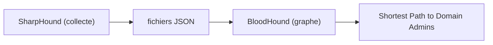
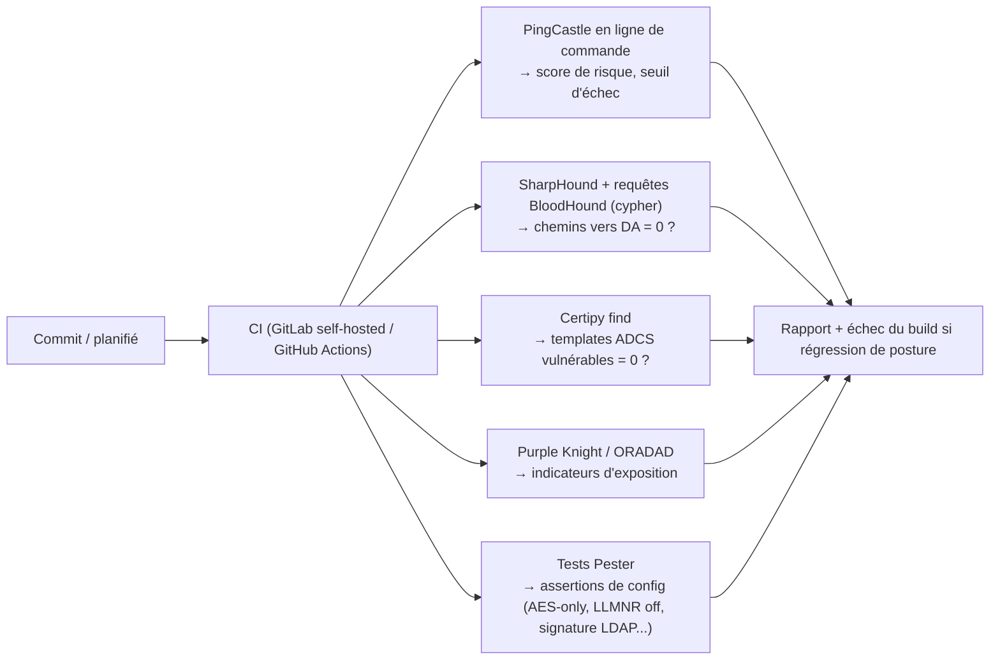

# Cours Active Directory & Windows Server - Partie 6
## Purple Team AD : attaquer son lab pour le défendre
### Windows Server 2022

---

> **AVERTISSEMENT - À LIRE AVANT TOUT LE RESTE.**
> Cette partie enseigne l'offensive Active Directory dans un cadre **strictement professionnel, éthique et légal**. Tout ce qui suit se pratique **uniquement** sur ton propre lab (`corp.lab.local`) ou sur des environnements conçus pour l'entraînement ([module 53](#module-53-cadre-methodologie-et-lab)). Lancer ces techniques sur un système que tu ne possèdes pas, **sans autorisation écrite et périmètre défini, est un délit pénal** (en France : art. 323-1 et suivants du Code pénal ; équivalents partout). Un professionnel refuse une mission sans mandat signé - ce n'est pas une formalité, c'est le premier réflexe du métier.
>
> **Posture de toute la partie** : on n'attaque pas pour casser, on attaque pour **savoir détecter et corriger**. C'est du **purple team**. Chaque technique offensive est systématiquement suivie de sa **détection** (événements, artefacts, règles) et de sa **remédiation** (renvoyée aux Parties 1-4). Un red teamer incapable d'expliquer la remédiation ne vaut rien ; un ops qui ne connaît pas l'offensive se fait surprendre. Cette partie fait de toi les deux.

---

> **Prérequis** : Parties 1 à 5. La Partie 5 (théorie/internals) est le socle indispensable - ici on *exploite* ce qu'on y a compris. Chaque module renvoie explicitement à la théorie (« [M39](05-theorie.md#module-39-kerberos-de-bout-en-bout) = Kerberos ») et à la défense déjà vue (« P4 = Credential Guard »).

## Structure de la partie (9 modules, 53 → 61)

- **53** - Cadre légal, méthodologie (MITRE ATT&CK) & montage du lab offensif
- **54** - Reconnaissance & énumération
- **55** - Accès initial
- **56** - Escalade de privilèges
- **57** - Mouvement latéral
- **58** - Domination du domaine
- **59** - Persistance
- **60** - Le pivot Blue Team : détection & remédiation transverses
- **61** - Industrialisation (audit as code) + projet final

---

# Module 53 - Cadre, méthodologie et lab

## 53.1 Le cadre légal et déontologique (la vraie première compétence)

Avant la moindre commande, un pentester professionnel a :

- **Un mandat écrit** (contrat, lettre d'engagement) qui l'autorise nommément.
- **Un périmètre (scope)** défini : quelles IP/domaines, quelles techniques autorisées (ex. déni de service souvent **interdit**), quelles plages horaires.
- **Des règles d'engagement (ROE)** : qui contacter en cas d'incident, comment stopper, quoi ne pas toucher (données personnelles, systèmes vitaux).
- **Une clause de confidentialité** et un plan de remise de rapport.
- **Sa propre journalisation** : un pro loggue *ses* actions (horodatage, commande, cible) - pour prouver qu'il est resté dans le scope, et pour aider la Blue Team à corréler.

> Grave-toi ceci : **le scope écrit est ta seule protection juridique.** « Je testais pour aider » n'est pas une défense recevable. Le métier commence par le papier, pas par le clavier.

## 53.2 La kill chain AD (MITRE ATT&CK)

On structure toute intrusion selon une **chaîne** - c'est le langage commun red/blue et la colonne vertébrale de cette partie :

```mermaid
flowchart LR
    A["Reconnaissance"] --> B["Accès initial"] --> C["Exécution"] --> D["Persistance"]
    D --> E["Escalade de privilèges"] --> F["Contournement des défenses"]
    F --> G["Accès aux identifiants"] --> H["Découverte"] --> I["Mouvement latéral"]
    I --> J["Collecte"] --> K["Domination du domaine"] --> L["Exfiltration / Impact"]
```



MITRE **ATT&CK** formalise chaque étape en *tactiques* (le « pourquoi ») et *techniques* (le « comment », ex. `T1558.003` = Kerberoasting). L'intérêt pour toi : chaque technique ATT&CK a une page listant **détections et mitigations** - c'est exactement le pont purple. On y renverra.

## 53.3 Le lab offensif - où s'entraîner *légalement*

Tu vas monter **deux** environnements et les comparer :

1. **`corp.lab.local` durci** (tes Parties 1-4) : la cible « bien administrée ». Objectif : constater que ton durcissement **casse** ou **détecte** les attaques.
2. **Un lab volontairement vulnérable** : pour voir les attaques *réussir* et comprendre les mauvaises configs. Les références gratuites et faites pour ça :
   - **GOAD** (Game of Active Directory) - la référence, une forêt multi-domaines truffée de failles réalistes.
   - **vulnerable-AD** (scripts qui « dégradent » un AD de lab).
   - **DetectionLab** - orienté détection/SOC.
   - **HackTheBox / TryHackMe** (parcours AD), et **certifications** pour structurer : **CRTP** (meilleur point d'entrée AD), puis **CRTO**, **PNPT**, **OSCP**.

**Poste d'attaquant** :
```
Kali Linux (ou Commando VM côté Windows), sur le même réseau isolé que le lab.
Boîte à outils standard (toute publique, documentée, enseignée partout) :
  - Reconnaissance : BloodHound/SharpHound, PingCastle, ldapdomaindump, adPEAS
  - Kerberos      : Rubeus, Impacket (GetUserSPNs, getTGT, ...)
  - Exécution/lat.: Impacket (psexec/wmiexec/secretsdump), NetExec (ex-CrackMapExec)
  - Capture/relais: Responder, ntlmrelayx (Impacket)
  - ADCS          : Certipy
  - Cassage       : Hashcat, John
  - Post-expl.    : mimikatz (sur le lab uniquement)
```

> **Règle d'isolation du lab** : réseau **Internal/Host-Only**, aucune route vers Internet ni vers ton réseau réel, snapshots avant chaque module. On ne « teste » jamais Responder ou ntlmrelayx sur un réseau partagé - même à la maison, tu empoisonnerais le LAN de tout le monde.

## 53.4 Exercice n°44
1. Rédige un **mandat de test fictif** pour `corp.lab.local` : scope, techniques autorisées/interdites, ROE, contact d'urgence. C'est un livrable de pro, pas un gadget.
2. Monte GOAD (ou vulnerable-AD) en réseau isolé, à côté de ton `corp.lab.local` durci.
3. Prépare ton poste d'attaquant, vérifie l'isolation réseau (aucun ping vers l'extérieur), prends un snapshot.
4. Ouvre la matrice MITRE ATT&CK « Enterprise » et repère les tactiques *Credential Access* et *Lateral Movement* - tu y reviendras à chaque module.

---

# Module 54 - Reconnaissance & énumération

## 54.1 Objectif et théorie mobilisée

Avant d'attaquer, on **cartographie** : utilisateurs, groupes, machines, SPN, délégations, ACL, trusts. Tout ça est **lisible dans LDAP** ([M44](05-theorie.md#module-44-ldap-et-le-modele-de-donnees)) par n'importe quel compte authentifié - parfois même sans authentification. C'est le rappel brutal que **AD est fait pour être interrogé**, y compris par l'attaquant une fois qu'il a le moindre pied dans la porte.

## 54.2 Énumération LDAP

Avec un simple compte de domaine (même sans privilège), on extrait énormément :
```bash
# Vue d'ensemble (illustratif, sur ton lab)
ldapdomaindump -u 'CORP\jdupont' -p 'MotDePasse' ldap://192.168.10.10
# Comptes avec SPN (cibles de Kerberoasting), comptes AS-REP-ables, délégations, etc.
```
*Théorie : filtres et attributs LDAP ([M44](05-theorie.md#module-44-ldap-et-le-modele-de-donnees)), userAccountControl et ses bits ([M44](05-theorie.md#module-44-ldap-et-le-modele-de-donnees)/[M42](05-theorie.md#module-42-sid-jetons-dacces-acl-et-access-check)).*

## 54.3 BloodHound - la cartographie des chemins d'attaque

**BloodHound** est l'outil qui a changé le jeu : il collecte (via **SharpHound**) tous les objets et surtout **toutes les relations** (appartenances, sessions, ACL, délégations, admin locaux), puis calcule des **chemins d'attaque** dans un graphe. La requête emblématique : *« quel est le chemin le plus court entre un utilisateur lambda et Domain Admins ? »*.



Ce que BloodHound révèle mappe **directement** la théorie de la Partie 5 :

- Les arêtes `MemberOf` → [M42](05-theorie.md#module-42-sid-jetons-dacces-acl-et-access-check) (jetons/groupes).
- Les arêtes `GenericAll`, `WriteDACL`, `WriteOwner`, `ForceChangePassword` → abus d'ACL ([M42](05-theorie.md#module-42-sid-jetons-dacces-acl-et-access-check)).
- `AllowedToDelegate`, `AllowedToAct` → délégation ([M40](05-theorie.md#module-40-delegation-kerberos)).
- `HasSession` → secrets en mémoire à récolter ([M38](05-theorie.md#module-38-lsa-sspi-et-le-modele-de-logon)).

## 54.4 PingCastle - le scoring défensif

**PingCastle** produit un **rapport de posture** (score de risque, anomalies, comptes dangereux, trusts). Côté purple, c'est ton *baseline* : tu le lances sur `corp.lab.local` durci **et** sur GOAD, et tu compares les scores. C'est aussi l'outil que tu industrialiseras au [module 61](#module-61-industrialisation-audit-as-code-projet-final).

## 54.5 🛡️ Détection & remédiation (le pivot blue)

- **Détection** : la collecte SharpHound génère un **volume anormal de requêtes LDAP** et de connexions vers de nombreuses machines en peu de temps. Surveille les **requêtes LDAP massives** (via les Directory Service events et le trafic), pose des **honeytokens** (comptes/objets leurres jamais utilisés légitimement - toute interaction = alerte).
- **Remédiation** : réduire la surface d'énumération (durcir les ACL par défaut, limiter les sessions admin exposées - rappel tiering P4), désactiver les comptes/attributs inutiles, et surtout **corriger les chemins que BloodHound révèle** (c'est l'usage défensif n°1 de l'outil).

## 54.6 Exercice n°45
1. Lance SharpHound sur GOAD, importe dans BloodHound, trouve le « Shortest Path to Domain Admins ». Identifie chaque type d'arête et relie-le à son module de la P5.
2. Refais-le sur `corp.lab.local` durci : le chemin est-il plus court ou plus long ? Pourquoi ?
3. Lance PingCastle sur les deux et compare les scores. Liste les 5 premières remédiations recommandées.
4. Pose un honeytoken (compte leurre avec SPN) et vérifie qu'une énumération le fait « remonter ».

---

# Module 55 - Accès initial

## 55.1 Objectif et théorie mobilisée

Obtenir un **premier jeu d'identifiants valides**. Les trois voies classiques en interne reposent toutes sur la théorie NTLM/Kerberos ([M41](05-theorie.md#module-41-ntlm)/[M39](05-theorie.md#module-39-kerberos-de-bout-en-bout)) et la faiblesse des mots de passe ([M37](05-theorie.md#module-37-cryptographie-appliquee-a-lidentite)).

## 55.2 Password spraying

Plutôt que de bombarder un compte (qui se verrouille), on **essaie un seul mot de passe probable** (`Automne2025!`, `Bienvenue1`) **contre tous les comptes**. Ça respecte la politique de verrouillage tout en misant sur la faiblesse humaine.
```bash
# Illustratif, sur ton lab - respecte le lockout threshold pour ne pas verrouiller
nxc smb 192.168.10.10 -u utilisateurs.txt -p 'Automne2025!' --continue-on-success
```

**🛡️ Détection** : rafale d'événements **4625** (échec de logon) répartis sur **beaucoup de comptes** depuis une même source, en un temps court. **4771** (échec de pré-auth Kerberos) côté DC. **Remédiation** : politique de mots de passe robuste + **bannissement des mots de passe courants** (Azure AD Password Protection on-prem ou équivalent), **MFA**, verrouillage intelligent, alerte SIEM sur le motif « 1 mdp × N comptes ».

## 55.3 LLMNR / NBT-NS poisoning (Responder)

Quand la résolution DNS échoue, les clients Windows crient sur le réseau via **LLMNR/NBT-NS** « qui est \\SRVX ? ». Un attaquant (**Responder**) répond « c'est moi » et capture le **Net-NTLMv2** de la victime → à casser hors-ligne, ou à **relayer** ([M57](#module-57-mouvement-lateral)).
*Théorie : NTLM et absence de liaison au canal ([M41](05-theorie.md#module-41-ntlm)).*

**🛡️ Détection** : trafic LLMNR/NBT-NS anormal, authentifications vers des hôtes inexistants. **Remédiation (rappel P1)** : **désactiver LLMNR et NBT-NS par GPO** - c'est la parade structurelle, elle coupe l'amorçage de tout le reste. Signature SMB pour empêcher le relais qui suit.

## 55.4 Exercice n°46
1. Sur le lab vulnérable, fais un password spraying maîtrisé (sous le seuil de verrouillage) et récupère un compte. Puis retrouve **tes** événements 4625/4771 côté DC.
2. Lance Responder sur le réseau **isolé** du lab, capture un Net-NTLMv2, tente un cassage Hashcat sur un mdp faible.
3. Applique la GPO qui désactive LLMNR/NBT-NS sur `corp.lab.local` et prouve que Responder ne capte plus rien.
4. Écris la règle de détection (pseudo-Sigma) du motif password spraying.

---

# Module 56 - Escalade de privilèges

## 56.1 Le cœur offensif d'AD

Avec un compte lambda, comment devenir admin ? Presque toujours en **abusant d'une mauvaise configuration** - pas d'un exploit mémoire. C'est pourquoi ce module est le plus riche, et le plus rentable défensivement.

## 56.2 Kerberoasting (T1558.003)

**Principe ([M39](05-theorie.md#module-39-kerberos-de-bout-en-bout))** : tout utilisateur authentifié peut demander un **ticket de service** pour n'importe quel SPN. Ce ticket est **chiffré avec la clé du compte de service** → si ce compte a un mot de passe faible, on casse le ticket **hors-ligne** et on obtient le mot de passe. L'attaquant **force le chiffrement RC4** ([M37](05-theorie.md#module-37-cryptographie-appliquee-a-lidentite) : hash NT sans sel, cassable vite).
```bash
# Illustratif : demander les tickets des comptes à SPN
GetUserSPNs.py corp.lab.local/jdupont -request   # Impacket
hashcat -m 13100 tickets.txt wordlist.txt          # cassage hors-ligne
```

**🛡️ Détection** : événements **4769** (demande de ticket de service) en **volume anormal**, surtout avec **type de chiffrement RC4 (0x17)** demandé explicitement - un client sain utilise AES. **Remédiation** : **gMSA** (mdp de 240 caractères, incassable - rappel P1/P2), mots de passe de service longs et aléatoires, **AES-only** sur les comptes de service, honeypot SPN (compte leurre à SPN → toute demande = alerte).

## 56.3 AS-REP roasting (T1558.004)

**Principe ([M39](05-theorie.md#module-39-kerberos-de-bout-en-bout))** : un compte avec **pré-authentification désactivée** livre, sur simple demande, un AS-REP chiffré avec sa clé → cassable hors-ligne.
```bash
GetNPUsers.py corp.lab.local/ -usersfile users.txt -no-pass   # Impacket
```
**🛡️ Détection** : **4768** avec pre-auth non requise. **Remédiation** : **ne jamais désactiver la pré-auth** (auditer `DONT_REQ_PREAUTH`), **FAST/armoring** ([M39](05-theorie.md#module-39-kerberos-de-bout-en-bout)).

## 56.4 Abus d'ACL (T1222 / T1098)

**Principe ([M42](05-theorie.md#module-42-sid-jetons-dacces-acl-et-access-check))** : des droits comme **GenericAll**, **WriteDACL**, **WriteOwner**, **ForceChangePassword**, ou **WriteProperty sur `member`** permettent à un utilisateur de se donner des droits ou de s'ajouter à un groupe privilégié. BloodHound ([M54](#module-54-reconnaissance-enumeration)) les a déjà cartographiés.
```
Ex. : jdupont a "ForceChangePassword" sur admin_svc
   → réinitialiser le mdp d'admin_svc → prendre son identité
Ex. : jdupont a "WriteDACL" sur le groupe "Domain Admins"
   → s'accorder GenericAll → s'ajouter au groupe
```
**🛡️ Détection** : **4662** (opération sur objet AD), **4738/4728** (modifs de compte/ajout à groupe), **5136** (modif d'objet annuaire). **Remédiation** : auditer et **corriger les ACL aberrantes** (c'est l'usage n°1 de BloodHound côté défense), principe du moindre privilège (P1), délégation propre.

## 56.5 Abus de délégation (T1558.003 / T1550)

**Principe ([M40](05-theorie.md#module-40-delegation-kerberos))** : délégation **non contrainte** (vol de TGT des visiteurs, y compris DC via coercition), ou droit d'écrire **`msDS-AllowedToActOnBehalfOfOtherIdentity`** (RBCD) → chaîne S4U → usurpation.
**🛡️ Détection** : modifs de `msDS-AllowedToAct...`, comptes `TrustedForDelegation`. **Remédiation** : proscrire la délégation non contrainte, **RBCD granulaire** (P4), mettre les comptes sensibles dans **Protected Users** (interdit leur délégation).

## 56.6 ADCS - ESC1 à ESC8 (Certipy)

**Principe ([M50](05-theorie.md#module-50-pki-x509-pkinit-et-mapping-certificatidentite) + P2)** : une **PKI mal configurée** offre des escalades directes vers Domain Admin. Rappel des vedettes : **ESC1** (template laissant fournir un SAN arbitraire + Client Auth → certif « au nom de » DA), **ESC8** (relais NTLM vers l'endpoint web de la CA → certif de DC → DCSync).
```bash
certipy find -u jdupont@corp.lab.local -p '...' -dc-ip 192.168.10.10   # trouver les templates vulnérables
```
**🛡️ Détection** : émissions de certificats anormales (audit CA, event **4886/4887**), auth par certif inhabituelles. **Remédiation (P2, [M50](05-theorie.md#module-50-pki-x509-pkinit-et-mapping-certificatidentite))** : corriger les templates (pas de SAN libre + Client Auth pour tous), retirer le flag **ESC6**, EPA/HTTPS sur le web enrollment (ESC8), **mapping fort** SID (KB5014754), auditer avec Certipy/PSPKI.

## 56.7 Shadow Credentials (T1556)

**Principe ([M50](05-theorie.md#module-50-pki-x509-pkinit-et-mapping-certificatidentite))** : droit d'écrire **`msDS-KeyCredentialLink`** sur une cible → y ajouter sa propre clé → s'authentifier en **PKINIT** comme la cible → TGT. Relie ACL ([M42](05-theorie.md#module-42-sid-jetons-dacces-acl-et-access-check)) + PKINIT ([M50](05-theorie.md#module-50-pki-x509-pkinit-et-mapping-certificatidentite)) + TGT ([M39](05-theorie.md#module-39-kerberos-de-bout-en-bout)).
**🛡️ Détection** : modifications de `msDS-KeyCredentialLink` (**5136**). **Remédiation** : restreindre l'écriture de cet attribut, mapping fort, surveiller.

## 56.8 Exercice n°47
1. Sur GOAD : réussis un Kerberoasting, casse un mdp de service faible. Puis, sur `corp.lab.local`, remplace le compte par un **gMSA** et prouve que le cassage est impossible.
2. Retrouve **tes** événements 4769 avec etype RC4 côté DC, et écris la règle de détection.
3. Avec Certipy, trouve un template vulnérable sur le lab, comprends l'ESC correspondant, puis corrige-le et re-scanne.
4. Reproduis un abus d'ACL repéré par BloodHound, puis corrige l'ACL et vérifie que le chemin disparaît du graphe.

---

# Module 57 - Mouvement latéral

## 57.1 Objectif et théorie mobilisée

Une fois un jeu d'identifiants (ou un hash, ou un ticket) obtenu, on **rebondit** de machine en machine pour se rapprocher des actifs Tier 0. Tout repose sur ce qu'on a compris au [module 38](05-theorie.md#module-38-lsa-sspi-et-le-modele-de-logon) : **LSASS conserve des secrets réutilisables**, et NTLM/Kerberos permettent de les rejouer.

## 57.2 Pass-the-Hash (T1550.002)

**Principe ([M37](05-theorie.md#module-37-cryptographie-appliquee-a-lidentite)/[M41](05-theorie.md#module-41-ntlm))** : le **hash NT** *est* le secret d'authentification NTLM. Pas besoin du mot de passe : on présente le hash.
```bash
# Illustratif, sur ton lab
nxc smb 192.168.10.20 -u Administrateur -H <hash_NT>
psexec.py -hashes :<hash_NT> corp.lab.local/Administrateur@192.168.10.20
```
**🛡️ Détection** : logons **4624 type 3** avec NTLM là où on attend Kerberos, depuis des sources inhabituelles ; usage du compte admin local sur plusieurs machines. **Remédiation (P4)** : **Credential Guard** (isole les hash de LSASS → plus rien à voler), **LAPS** (mdp admin local unique par machine → un hash volé ne sert nulle part ailleurs), **tiering** (le hash d'un compte T0 ne traîne jamais sur un T2).

## 57.3 Pass-the-Ticket & Overpass-the-Hash (T1550.003)

**Principe ([M38](05-theorie.md#module-38-lsa-sspi-et-le-modele-de-logon)/[M39](05-theorie.md#module-39-kerberos-de-bout-en-bout))** : injecter un **ticket Kerberos** volé en mémoire (pass-the-ticket), ou utiliser le hash NT pour **forger une demande de TGT** (overpass-the-hash, « pass-the-key »).
```
mimikatz : sekurlsa::tickets /export   → réinjecter un TGT/ticket de service
Rubeus   : asktgt /user:... /rc4:<hash>  (overpass-the-hash)
```
**🛡️ Détection** : incohérences (ticket utilisé depuis une autre machine que celle d'émission), durées de vie anormales. **Remédiation** : Credential Guard, **durées de vie de tickets courtes** ([M39](05-theorie.md#module-39-kerberos-de-bout-en-bout)), Protected Users.

## 57.4 Exécution distante (T1021)

Avec des identifiants valides sur une cible, on exécute du code : **psexec/smbexec/wmiexec** (Impacket), **NetExec**, WinRM. C'est le « moteur » du déplacement.
**🛡️ Détection** : création de services distants (**7045**), **4624/4672** (logon + privilèges spéciaux), processus enfants anormaux (`services.exe`→`cmd`), WMI/WinRM inhabituels. **Remédiation** : segmentation réseau, restreindre les logons admin (droits « deny logon » par tier, P4), **règles ASR** « création de processus » (P4), pare-feu host-based.

## 57.5 Relais NTLM (T1557)

**Principe ([M41](05-theorie.md#module-41-ntlm))** : capté via Responder ([M55](#module-55-acces-initial)), le Net-NTLM d'une victime est **relayé** vers un autre service (SMB, **LDAP**, HTTP de la CA…) → action authentifiée en tant que la victime, sans jamais casser le hash.
```
Responder (capture) + ntlmrelayx (relais) → ex. relais LDAP pour poser du RBCD, ou vers la CA (ESC8)
```
**🛡️ Détection** : authentifications relayées (source ≠ origine attendue), pics NTLM. **Remédiation (structurelle)** : **signature SMB** obligatoire, **signature + channel binding LDAP** (P1), **EPA** sur les endpoints HTTP (CA), désactiver LLMNR/NBT-NS. Chacune casse une étape précise du relais ([M41](05-theorie.md#module-41-ntlm)).

## 57.6 Exercice n°48
1. Sur le lab : réalise un pass-the-hash vers un serveur, puis active Credential Guard/LAPS sur `corp.lab.local` et montre que le hash récolté ne rejoue plus ou ne sert plus ailleurs.
2. Fais une chaîne Responder → ntlmrelayx vers LDAP (sur le lab), puis active la signature LDAP et prouve l'échec du relais.
3. Retrouve les événements 7045/4624/4672 générés par une exécution distante et écris les règles de détection.

---

# Module 58 - Domination du domaine

## 58.1 Objectif et théorie mobilisée

C'est l'aboutissement : contrôle total du domaine. Toutes les techniques ici découlent directement de la **réplication ([M47](05-theorie.md#module-47-replication-multi-maitres))** et de **krbtgt/PAC ([M39](05-theorie.md#module-39-kerberos-de-bout-en-bout))**. Les comprendre, c'est comprendre *pourquoi* elles donnent les clés du royaume - et comment les détecter.

## 58.2 DCSync (T1003.006)

**Principe ([M47](05-theorie.md#module-47-replication-multi-maitres))** : se faire passer pour un DC et appeler le RPC de réplication (`DRSGetNCChanges`) pour demander les **secrets** de n'importe quel compte - **y compris `krbtgt`**. Aucun code sur le DC : c'est une requête « légitime », donc discrète. Nécessite le droit étendu **« Replicating Directory Changes / All »**.
```bash
secretsdump.py -just-dc corp.lab.local/Administrateur@192.168.10.10   # Impacket
```
**🛡️ Détection** : **4662** avec les GUID des droits de réplication, provenant d'un **hôte qui n'est pas un DC** - signal quasi certain de DCSync. **Remédiation** : **restreindre strictement** « Replicating Directory Changes All » aux seuls DC, auditer 4662, alerter sur toute réplication depuis un non-DC.

## 58.3 Golden Ticket (T1558.001)

**Principe ([M39](05-theorie.md#module-39-kerberos-de-bout-en-bout))** : avec le hash/clé de **`krbtgt`** (obtenu par DCSync), forger un **TGT arbitraire** - n'importe quel utilisateur, n'importe quels groupes, validité arbitraire. Le KDC l'accepte puisqu'il est chiffré avec *sa* clé.
**🛡️ Détection** : TGT à durée de vie anormale, TGT sans AS-REQ préalable (logon « à partir de nulle part »), incohérences PAC. **Remédiation** : **double reset de `krbtgt`** après compromission ([M39](05-theorie.md#module-39-kerberos-de-bout-en-bout)), protéger `krbtgt` comme actif Tier 0, PAC validation.

## 58.4 Silver Ticket & DCShadow

- **Silver Ticket ([M39](05-theorie.md#module-39-kerberos-de-bout-en-bout))** : forger un **ticket de service** (pas un TGT) avec la clé d'un compte de service → accès à *ce* service, **sans contacter le DC** (très discret). **Détection** difficile (pas de trace DC) → repose sur les logs *du service* ciblé et la cohérence PAC. **Remédiation** : gMSA, AES-only, PAC validation.
- **DCShadow** : enregistrer un **faux DC** temporaire pour **injecter** des modifications répliquées (ex. se rajouter un SID privilégié) sans passer par les journaux classiques. **Détection** : apparition de sources de réplication non autorisées, changements de la config des DC. **Remédiation** : surveiller les objets `nTDSDSA`/`server` de la partition Configuration, restreindre qui peut créer des DC.

## 58.5 Exercice n°49
1. Sur le lab : réalise un DCSync (`-just-dc`), puis retrouve **ton** événement 4662 côté DC et écris la règle « réplication depuis un non-DC ».
2. Forge un Golden Ticket sur le lab, comprends pourquoi il est accepté, puis exécute le **double reset krbtgt** et montre son invalidation.
3. Explique par écrit pourquoi le Silver Ticket est plus discret que le Golden, en te basant sur [M39](05-theorie.md#module-39-kerberos-de-bout-en-bout) (qui déchiffre le ticket ?).

---

# Module 59 - Persistance

## 59.1 Objectif et théorie mobilisée

Après compromission, l'attaquant veut **rester** même si les mots de passe changent. Les techniques exploitent les internals des ACL ([M42](05-theorie.md#module-42-sid-jetons-dacces-acl-et-access-check)) et des GPO ([M49](05-theorie.md#module-49-traitement-des-gpo-internals)). Côté défense, la persistance est ce qui **survit à une remédiation naïve** - d'où l'importance de la détecter.

## 59.2 Techniques principales

- **AdminSDHolder / SDProp (T1098)** : l'objet `AdminSDHolder` définit les ACL des comptes protégés ; le processus **SDProp** les réapplique toutes les ~60 min. Y planter une ACE malveillante = **backdoor qui se réinstalle toute seule**. *Théorie : ACL ([M42](05-theorie.md#module-42-sid-jetons-dacces-acl-et-access-check)).* **Détection** : modifs d'`AdminSDHolder`, ACE inattendues sur les comptes protégés. **Remédiation** : auditer AdminSDHolder, réinitialiser les ACL de référence.
- **Backdoors d'ACL** : s'octroyer discrètement `GenericAll`/`WriteDACL` sur un objet clé. **Détection** : 5136 sur les objets sensibles, revues d'ACL régulières (BloodHound en mode défensif). **Remédiation** : corriger, surveiller.
- **Abus de GPO (T1484.001)** : modifier une GPO liée largement pour exécuter du code partout, ou ajouter un admin local via Préférences. *Théorie : GPO internals ([M49](05-theorie.md#module-49-traitement-des-gpo-internals)).* **Détection** : modifs de GPO (**5136/5137**), écarts de version GPC/GPT ([M49](05-theorie.md#module-49-traitement-des-gpo-internals)). **Remédiation** : restreindre qui édite les GPO, versionner les GPO (P4/pont P-suivante), alerter sur les changements.
- **Golden gMSA / clé KDS, delegated MSA, certificats machine longue durée** : persistances plus avancées reliées à la PKI ([M50](05-theorie.md#module-50-pki-x509-pkinit-et-mapping-certificatidentite)) et aux comptes gérés - à connaître conceptuellement.

## 59.3 Exercice n°50
1. Sur le lab : plante une ACE dans AdminSDHolder, attends la passe SDProp, constate la réinstallation, puis nettoie et écris la détection.
2. Modifie une GPO pour ajouter un admin local, retrouve l'événement 5136 et l'écart de version GPC/GPT.
3. Dresse une **checklist de « chasse à la persistance »** post-incident (ACL sensibles, AdminSDHolder, GPO, krbtgt, certificats).

---

# Module 60 - Le pivot Blue Team : détection & remédiation transverses

## 60.1 Le module qui referme la boucle purple

Les modules [54](#module-54-reconnaissance-enumeration)-[59](#module-59-persistance) donnaient la détection *par technique*. Ici on **industrialise la détection** : quelles sources, quelles règles, quelle architecture SOC. C'est le prolongement direct de ton observabilité de la **Partie 4 ([module 35](04-exploitation-sre.md#module-35-pratiques-sre-appliquees-a-un-parc-windows), WEF/SIEM)**.

## 60.2 Les sources de vérité

- **Journaux de sécurité Windows** centralisés par **WEF** (P4) ou agents, vers un **SIEM** (Sentinel, Splunk, Elastic, Wazuh).
- **Audit avancé activé** (P1, [module 12](01-fondations.md#module-12-securite-et-durcissement-hardening)) : Account Logon, Logon/Logoff, DS Access, Sensitive Privilege Use, Object Access.
- **PowerShell logging** (P4) : Script Block + Module + Transcription.
- **Journaux applicatifs** : CA (ADCS), DNS, DFSR.

## 60.3 Les événements-clés à corréler (récap opérationnel)

| Event | Signale | Attaque associée |
|---|---|---|
| **4625 / 4771** | Échecs de logon / pré-auth | Password spraying, brute-force |
| **4768 / 4769** | Tickets Kerberos (AS/TGS) | Roasting (RC4!), Golden/Silver |
| **4662** | Accès à objet AD (droits de réplication) | **DCSync** |
| **4728/4732/4756** | Ajout à un groupe privilégié | Escalade, persistance |
| **5136 / 5137** | Modif d'objet annuaire | Abus d'ACL, Shadow Cred, GPO, RBCD |
| **7045** | Nouveau service | Exécution distante (psexec) |
| **4624 (type 3/10) / 4672** | Logon réseau/RDP + privilèges | Mouvement latéral |
| **4886/4887** | Émission de certificat | Abus ADCS (ESC) |
| **1102** | Journal effacé | Effacement de traces |

## 60.4 Règles de détection (approche Sigma)

**Sigma** est le format ouvert pour écrire des règles de détection **portables** (converties ensuite vers ton SIEM). Exemples de logiques à implémenter (pseudo) :
```yaml
# DCSync depuis un non-DC
detection:
  selection:
    EventID: 4662
    Properties|contains: '1131f6aa-9c07-11d1-f79f-00c04fc2dcd2'   # Replicating Directory Changes
  filter:
    SubjectAccount|endswith: '$'      # exclure les comptes machine DC légitimes
  condition: selection and not filter
```
```yaml
# Kerberoasting : TGS massifs en RC4
detection:
  selection:
    EventID: 4769
    TicketEncryptionType: '0x17'      # RC4
  condition: selection | count() by SubjectUser > seuil
```
> **Ressources prêtes** : les dépôts publics de règles Sigma, les analytics **MITRE ATT&CK**, et des jeux de règles orientés AD. Ne réinvente pas la roue : adopte, teste, adapte à ton environnement.

## 60.5 Honeytokens & déception

Un **honeytoken** (compte leurre avec SPN alléchant, jamais utilisé légitimement) est une détection à **taux de faux positifs quasi nul** : toute interaction = intrusion. Complète avec des objets/partages leurres. C'est du **rendement défensif maximal pour un coût minimal** - un réflexe d'ingénieur SOC.

## 60.6 Exercice n°51
1. Centralise les logs de `corp.lab.local` (WEF, P4) vers un SIEM de lab (Elastic/Wazuh/Sentinel gratuit).
2. Implémente 5 règles de détection (DCSync, Kerberoasting RC4, spraying, ajout à Domain Admins, 1102) et **déclenche-les** en rejouant les attaques des modules précédents.
3. Pose 2 honeytokens et vérifie qu'une énumération/roasting les fait remonter.
4. Pour chaque règle, mesure le délai de détection et note les faux positifs.

---

# Module 61 - Industrialisation (audit as code) & projet final

## 61.1 Fermer la boucle : l'offensive devient de l'audit continu

C'est le pont explicite vers la **Trajectoire 3 (DevSecOps)**. Au lieu d'auditer manuellement une fois par an, on **automatise l'évaluation de posture à chaque changement** : l'analyse offensive devient un test de non-régression de sécurité.

## 61.2 Pipeline d'audit AD


Principe : **un changement qui dégrade la posture (nouveau chemin vers DA, template ESC réintroduit, RC4 réactivé) casse le pipeline** - exactement comme un test unitaire raté. La sécurité devient mesurable et versionnée.

## 61.3 Projet fil rouge : « Purple CORP »

**Objectif** : sur `corp.lab.local`, exécuter la kill chain complète, **détecter chaque étape**, **remédier**, puis **prouver** l'amélioration.

Checklist :

- [ ] Kill chain jouée de bout en bout sur le lab (recon → domination), **journalisée** (tes propres logs d'action).
- [ ] Pour **chaque** technique : l'événement/artefact de détection identifié + une règle Sigma écrite et déclenchée.
- [ ] Remédiations appliquées (gMSA, AES-only, LLMNR off, signature LDAP, Credential Guard, LAPS, ACL corrigées, templates ADCS fixés, mapping fort, tiering).
- [ ] **Avant/après** chiffré : score PingCastle initial vs final, nombre de chemins BloodHound vers DA (idéalement 0), templates ESC (0).
- [ ] Pipeline d'audit CI qui **échoue** si l'une des remédiations régresse.
- [ ] **Rapport de pentest** professionnel : synthèse exécutive, findings priorisés (CVSS/risque), preuves, remédiations, et re-test. C'est le vrai livrable du métier.

## 61.4 Questions type entretien (red/purple/blue)

1. Différence Golden vs Silver Ticket : quelle clé, quelle portée, lequel est le plus discret et pourquoi ?
2. Comment détecter un DCSync, et pourquoi l'événement 4662 « depuis un non-DC » est-il déterminant ?
3. Kerberoasting : pourquoi l'attaquant force RC4, et quelle config le rend inutile ?
4. Explique la chaîne Shadow Credentials en reliant ACL, PKINIT et TGT.
5. Pourquoi la signature LDAP + EPA cassent-elles le relais NTLM (au niveau protocole) ?
6. Qu'est-ce qu'un honeytoken et pourquoi son taux de faux positifs est-il quasi nul ?
7. AdminSDHolder : pourquoi une backdoor y placée « revient » toute seule ?
8. Un client s'authentifie en NTLM au lieu de Kerberos : arbre de diagnostic (rappel [M38](05-theorie.md#module-38-lsa-sspi-et-le-modele-de-logon)).
9. Comment industrialiser l'audit AD en CI, et quels outils pour quels indicateurs ?
10. Le domaine est-il une frontière de sécurité ? Justifie avec le SID filtering ([M51](05-theorie.md#module-51-approbations-inter-domaines-et-inter-forets)).

## 61.5 Conclusion - et le mot de la fin du parcours complet

Tu as bouclé un cycle rare et complet :

- **P1** cœur d'AD · **P2** services · **P3** résilience · **P4** exploitation SRE · **P5** théorie/internals · **P6** purple team.

La Partie 6 est la démonstration de tout le reste : tu **attaques ce que tu as construit (P1-P3), avec la discipline que tu t'es donnée (P4), en comprenant chaque protocole (P5)**, et tu refermes la boucle en détectant et corrigeant. C'est exactement le profil d'un ingénieur sécurité moderne : pas un lanceur d'outils, mais quelqu'un qui **lit un protocole, en déduit l'abus, le détecte et le corrige**.

**Les deux directions qui restent** (changement de dimension, appuyées sur tout ce socle) :

- **Trajectoire 2 - hybride/cloud** : porter cette maîtrise vers Entra ID, Conditional Access, Intune. L'offensive s'y prolonge (attaques sur les identités cloud, Entra Connect, jetons OAuth).
- **Trajectoire 3 - tout-en-code** : dont le [module 61](#module-61-industrialisation-audit-as-code-projet-final) est déjà l'amorce. IaC + audit de sécurité continu = *DevSecOps* au sens plein.

---

## Annexe - Cartographie kill chain ↔ théorie ↔ défense

| Phase | Technique offensive | Théorie mobilisée | Défense |
|---|---|---|---|
| **RECON (54)** | BloodHound/PingCastle | LDAP ([M44](05-theorie.md#module-44-ldap-et-le-modele-de-donnees)), ACL ([M42](05-theorie.md#module-42-sid-jetons-dacces-acl-et-access-check)) | honeytokens, ACL réduites |
| **ACCÈS INIT (55)** | spraying/Responder | NTLM ([M41](05-theorie.md#module-41-ntlm)), mdp ([M37](05-theorie.md#module-37-cryptographie-appliquee-a-lidentite)) | LLMNR off, MFA, mdp forts |
| **ESCALADE (56)** | Kerberoast/AS-REP | Kerberos ([M39](05-theorie.md#module-39-kerberos-de-bout-en-bout)) | gMSA, AES-only, FAST |
| | ACL abuse | jetons/ACL ([M42](05-theorie.md#module-42-sid-jetons-dacces-acl-et-access-check)) | moindre privilège |
| | ADCS ESC / Shadow Cred | PKINIT ([M50](05-theorie.md#module-50-pki-x509-pkinit-et-mapping-certificatidentite)) | templates fixés, mapping fort |
| **LATÉRAL (57)** | PtH/PtT/relais | LSA ([M38](05-theorie.md#module-38-lsa-sspi-et-le-modele-de-logon)), NTLM ([M41](05-theorie.md#module-41-ntlm)) | Credential Guard, LAPS, signatures |
| **DOMINATION (58)** | DCSync/Golden | réplication ([M47](05-theorie.md#module-47-replication-multi-maitres)), krbtgt ([M39](05-theorie.md#module-39-kerberos-de-bout-en-bout)) | restr. réplication, reset krbtgt |
| **PERSISTANCE (59)** | AdminSDHolder/GPO | ACL ([M42](05-theorie.md#module-42-sid-jetons-dacces-acl-et-access-check)), GPO ([M49](05-theorie.md#module-49-traitement-des-gpo-internals)) | audit ACL/GPO, versionnage |
| **BLUE (60)** | SIEM/Sigma/honeytokens | tous | détection industrialisée |
| **AUDIT CODE (61)** | PingCastle/BH/Certipy CI | tous | non-régression de sécurité |

*Fin de la Partie 6 - et du parcours. La ligne qui la résume : on n'attaque un système que pour mieux le défendre, on ne le fait que sur ce qu'on a le droit de toucher, et la vraie compétence n'est pas de lancer l'exploit - c'est de le détecter et de le corriger avant l'adversaire. Le papier (le mandat) d'abord, le clavier ensuite. Toujours.*
