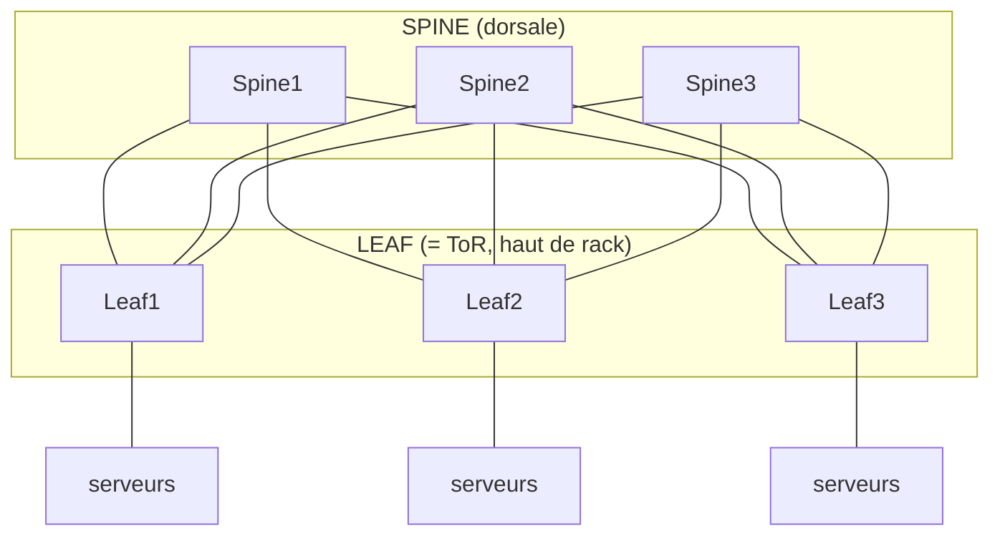

# Cours Active Directory & Windows Server — Partie 8
## Gestion de flotte & Data Center : du fer au network-as-code
### Windows Server 2022 — la couche physique, enfin

---

> **Prérequis** : Parties 1 à 7-bis. Tout ce qu'on a construit tournait *sur du matériel, dans un rack, relié à un réseau* — sans jamais le nommer. Cette partie comble ce trou : le **fer, l'électron et le paquet**. On ne descend pas là pour devenir électricien ou câbleur ; on descend pour **comprendre, dimensionner, sécuriser et automatiser** la couche physique — et voir qu'elle sous-tend ta résilience (P3), ton tiering (P4/P7) et ta Trajectoire 3.
>
> **Posture (casquette Google/SRE)** : à l'échelle, on ne materne pas un serveur, on **gère une flotte**. Le matériel tombe en permanence — c'est un fait statistique, pas un incident. La bonne architecture **absorbe la panne** au lieu de la subir : la couche logicielle encaisse le disque mort, le serveur défaillant, le switch qui redémarre. On ne se lève pas à 3h pour un ventilateur HS ; un ticket de remplacement se crée tout seul. Ta vraie compétence ici n'est pas de cliquer dans iDRAC — c'est le **modèle *cattle* automatisé**, transférable à l'on-prem comme au cloud (où l'instance est le même bétail, en plus jetable).
>
> **Fil rouge** : *comprendre le physique pour bien concevoir, tout automatiser, tout segmenter, tout versionner.* Le raccordement (dual-homing, OOB séparé) sert la **résilience** ; la segmentation sert le **tiering** ; l'automatisation sert le **DevSecOps**.

## Structure (12 modules, 3 blocs)

- **Bloc A — Le physique** : 81 Facilities · 82 Connectivité serveur · 83 Fabric réseau
- **Bloc B — La flotte automatisée** : 84 Pets vs cattle · 85 BMC/Redfish · 86 Provisioning bare-metal · 87 Firmware as code · 88 CMDB/DCIM · 89 Télémétrie matérielle
- **Bloc C — Sécurité & cycle de vie** : 90 Segmentation & sécurité du management · 91 Cycle de vie matériel · 92 Flotte & réseau as code

---

# BLOC A — LE PHYSIQUE

---

# Module 81 — Fondamentaux du data center (facilities)

## 81.1 Pourquoi un ingénieur logiciel doit connaître l'électron

Tu ne tireras pas de câble d'alimentation de ta vie. Mais si tu ne comprends pas la **chaîne électrique et le refroidissement**, tu concevras des architectures qui tombent pour des raisons invisibles depuis ta console. L'exemple canonique : tu montes un cluster HA impeccable en Partie 3… et tu branches les deux nœuds sur **le même circuit électrique**. Un disjoncteur saute, ta « haute disponibilité » s'éteint d'un coup. Le SPOF n'était pas logique, il était **physique**. Ce module te donne les yeux pour voir ces SPOF-là.

## 81.2 La chaîne d'alimentation

```
Arrivée électrique (utility) ──▶ Transfert (ATS) ──▶ Groupe électrogène (secours)
        │
        ▼
     UPS / onduleur (batterie : tient le temps que le groupe démarre)
        │
        ▼
     PDU (Power Distribution Unit) dans le rack
        │
        ├── Alimentation A ──▶ Serveur (PSU 1)
        └── Alimentation B ──▶ Serveur (PSU 2)   ◀── dual-feed
```

Notions à maîtriser :

- **UPS (onduleur)** : absorbe les micro-coupures et tient sur batterie le temps que le **groupe électrogène** prenne le relais.
- **PDU** : la multiprise intelligente du rack (souvent mesurée/pilotable en réseau — donc un objet à surveiller *et* à sécuriser, cf. module 90).
- **Dual-feed A/B** : deux chaînes électriques **indépendantes** (deux UPS, deux PDU). Un serveur de prod a **deux alimentations (PSU)**, une sur A, une sur B.

## 81.3 La redondance électrique : N, N+1, 2N

C'est le vocabulaire qu'on te demandera :

| Niveau | Signification | Exemple |
|---|---|---|
| **N** | Juste ce qu'il faut, zéro secours | 1 UPS pour la charge |
| **N+1** | Un composant de secours en plus | 4 UPS quand 3 suffisent |
| **2N** | Chaîne entièrement doublée, indépendante | Deux infrastructures complètes (A et B) |
| **2N+1** | Doublée + un secours par côté | Maximal (banques, Tier IV) |

> **La règle d'or du branchement HA** : tes deux nœuds de cluster (P3), tes deux DC, tes deux ToR (module 82) doivent tirer leur alimentation de **côtés opposés (A et B)**. Un serveur avec deux PSU branchées sur le **même** PDU n'a **aucune** redondance électrique réelle — erreur classique et coûteuse.

## 81.4 Le refroidissement

Un serveur transforme ~100 % de son électricité en chaleur. La densité au rack est **limitée par le thermique** avant de l'être par l'espace ou le réseau.

- **Confinement allées chaudes/froides** (hot/cold aisle) : les serveurs aspirent l'air froid en façade (allée froide) et rejettent le chaud à l'arrière (allée chaude, confinée et évacuée). On ne mélange jamais les deux.
- **Delta T** : l'écart de température entrée/sortie ; pilote le dimensionnement de la clim (CRAC/CRAH).
- **Conséquence design** : un rack « plein » de serveurs denses peut être **thermiquement infaisable** bien avant d'être plein en U. On répartit la charge thermique.

## 81.5 La métrique reine : le PUE

Le **PUE** (Power Usage Effectiveness) mesure l'efficacité énergétique du DC :
```
PUE = Énergie totale consommée par le DC / Énergie consommée par l'IT seule
```
- PUE = 2,0 → pour 1 W utile à l'IT, 1 W est « gaspillé » (clim, pertes). Médiocre.
- PUE ≈ 1,1–1,2 → hyperscalers (Google, etc.), excellent.
Le PUE pilote les **coûts** et l'**empreinte carbone** — donc les décisions d'architecture (densité, refroidissement liquide, placement géographique). Un ingénieur cloud/infra doit savoir ce que ça signifie.

## 81.6 Espace, mécanique, tiers

- **Rack 42U** : l'unité de base. Un « U » = 44,45 mm. Serveurs de 1U, 2U, 4U ; compter le **poids** (un rack plein peut peser > 1 tonne) et les **flux d'air**.
- **Câblage structuré** : gestion des chemins, repérage, séparation courants forts/faibles.
- **Tiers Uptime Institute (I → IV)** : classification de disponibilité d'un DC.

| Tier | Redondance | Disponibilité annoncée | Indispo/an (~) |
|---|---|---|---|
| I | N, aucune | 99,671 % | ~28,8 h |
| II | N+1 partiel | 99,741 % | ~22 h |
| III | N+1, **maintenable sans coupure** | 99,982 % | ~1,6 h |
| IV | **2N+1, tolérant aux pannes** | 99,995 % | ~26 min |

> **Le lien avec ta P3** : un Tier ne remplace pas ta HA logicielle, il la **complète**. Promettre un RTO/SLA de « 5 neuf » (P3 M23) sur un DC Tier II est incohérent — le plancher physique ne suit pas. L'architecte aligne SLA logiciel *et* Tier physique.

## 81.7 Sûreté physique (dans le modèle de menace)

Angle DevSecOps souvent oublié : **l'accès physique bat presque toutes tes défenses logiques.** Quelqu'un devant le serveur peut booter sur un média externe, extraire un disque, brancher sur le port de management. Donc :

- Contrôle d'accès (badge, biométrie, mantrap, journalisation).
- Détection/extinction incendie (pré-action, agents propres).
- **Chiffrement au repos (BitLocker + TPM)** pour que le vol d'un disque ne livre pas les données — le pont entre facilities et ta sécurité logique.
- Le port BMC/console physiquement protégé (module 90).

## 81.8 Exercice n°68
1. Dessine la chaîne électrique de ton (futur) rack et place un serveur **dual-PSU en dual-feed A/B**. Où est le SPOF si tu branches les deux PSU sur le même PDU ?
2. Pour tes 2 DC et ton cluster P3, écris le plan d'alimentation (quel nœud sur quel côté) qui survit à la perte d'un UPS.
3. Un client exige 99,99 % de dispo. Quel Tier minimum, et pourquoi ta HA logicielle ne suffit-elle pas seule ?
4. Explique en 5 lignes pourquoi le PUE influence une décision d'architecture (ex. densité vs refroidissement).

---

# Module 82 — Connectivité physique : comment chaque serveur se branche

## 82.1 Le module que tu attendais

« Gérer un serveur » sans savoir **comment il se raccorde au réseau**, c'est parler de HA sans parler d'électricité. On formalise le raccordement — et tu verras que le **réseau heartbeat séparé** de ta Partie 3 était déjà de la conception de câblage résilient.

## 82.2 Les interfaces d'un serveur de production

Un serveur DC typique n'a pas « une » carte réseau, mais **trois familles** :

| Interface | Rôle | Débit typique | Réseau |
|---|---|---|---|
| **NIC production** (×2) | Trafic applicatif/clients | 10 / **25** GbE | Data (VLAN prod) |
| **NIC management (BMC)** | iDRAC/iLO — piloter la machine | 1 GbE (dédiée) | **Out-of-band (isolé)** |
| **NIC stockage** (opt.) | iSCSI / RDMA (S2D, P3) | 25 / 100 GbE | Storage (souvent RDMA) |

> **Règle d'or n°1** : la **NIC de management (BMC) part TOUJOURS sur un réseau out-of-band (OOB) séparé**, jamais sur le réseau data. Le BMC peut allumer/éteindre/réinstaller la machine (module 85) — l'exposer sur le réseau de prod, c'est offrir les clés physiques à quiconque atteint ce réseau. On y revient au module 90.

## 82.3 Le câblage : cuivre, fibre, DAC

- **Cuivre RJ45 (Cat6/6a)** : 1/10 GbE, jusqu'à ~100 m. Simple, pour le management et le 1 GbE.
- **Fibre optique** + **transceivers** : **SFP+ (10G)**, **SFP28 (25G)**, **QSFP28 (100G)**. Pour les débits élevés et les distances.
- **DAC (Direct Attach Copper)** : câble cuivre à transceivers intégrés, **courtes distances (intra-rack)**, moins cher et moins gourmand que la fibre pour relier un serveur à son ToR. **AOC** = équivalent fibre active.
- **Débits serveur aujourd'hui** : le **25 GbE** est le standard d'accès serveur (le 10G est legacy), le **100 GbE** en uplink ToR→spine. Le 40G est en voie de disparition au profit du 25/100.

## 82.4 Le schéma de raccordement : dual-homing vers deux ToR

Chaque serveur se relie à un switch **Top-of-Rack (ToR)** placé en haut de son rack. Pour la résilience, **jamais un seul lien vers un seul switch** :

```
         ┌─────────── ToR-A ───────────┐        ┌─────────── ToR-B ───────────┐
         │ (switch haut de rack, côté A)│        │ (switch haut de rack, côté B)│
         └──────┬───────────────────────┘        └───────┬──────────────────────┘
                │ NIC0 (25G)                              │ NIC1 (25G)
                └──────────────┬──────────────────────────┘
                               ▼
                    ┌──────────────────────┐
                    │  SERVEUR             │
                    │  bond0 = NIC0 + NIC1 │  ◀── dual-homing, agrégation
                    │  BMC ──▶ réseau OOB  │
                    │  PSU-A│PSU-B (M81)   │
                    └──────────────────────┘
```

Les deux NIC production vont vers **deux ToR distincts** → si un switch (ou un lien, ou un transceiver) tombe, l'autre prend le relais. C'est le pendant réseau du dual-feed électrique (M81) et du cluster (P3). Deux modes d'agrégation :

- **LACP (802.3ad)** — agrégation active/active négociée avec le switch. Débit cumulé + résilience. Nécessite que les deux ToR forment un **MLAG** (module 83) pour présenter un LAG unique.
- **Actif/passif (switch-independent)** — un lien actif, l'autre en secours. Aucune config switch requise, plus simple, moins de débit.

## 82.5 Côté Windows : NIC teaming & SET

```powershell
# --- NIC Teaming classique (LBFO) : serveurs Windows, hors Hyper-V ---
New-NetLbfoTeam -Name "Team-Prod" -TeamMembers "NIC0","NIC1" `
    -TeamingMode Lacp -LoadBalancingAlgorithm Dynamic
Get-NetLbfoTeam

# --- SET (Switch Embedded Teaming) : LE standard pour les hôtes Hyper-V (P3) ---
# SET s'intègre au vSwitch, requis pour RDMA/RoCE (S2D). LBFO est déprécié sous Hyper-V.
New-VMSwitch -Name "vSwitch-SET" -NetAdapterName "NIC0","NIC1" `
    -EnableEmbeddedTeaming $true -AllowManagementOS $true
# Ajouter les vNIC de l'hôte (management, cluster, stockage) sur le SET :
Add-VMNetworkAdapter -ManagementOS -Name "Mgmt"    -SwitchName "vSwitch-SET"
Add-VMNetworkAdapter -ManagementOS -Name "Cluster" -SwitchName "vSwitch-SET"
Add-VMNetworkAdapter -ManagementOS -Name "Storage" -SwitchName "vSwitch-SET"
# Isoler les rôles par VLAN (cf. le heartbeat séparé de la P3) :
Set-VMNetworkAdapterVlan -ManagementOS -VMNetworkAdapterName "Cluster" -Access -VlanId 20
Set-VMNetworkAdapterVlan -ManagementOS -VMNetworkAdapterName "Storage" -Access -VlanId 30
```
> **Point d'ingénieur** : sous Hyper-V/S2D (P3), on utilise **SET**, pas LBFO (déprécié pour ce cas et incompatible RDMA). SET converge les cartes physiques et sépare les flux (management/cluster/stockage) en **vNIC + VLAN** sur le même bond physique — exactement la séparation logique de ta Partie 3, posée proprement.

## 82.6 Exercice n°69
1. Schématise un serveur dual-homé vers ToR-A/ToR-B, avec BMC sur OOB et dual-PSU A/B. Marque chaque SPOF éliminé.
2. Sur un hôte Hyper-V de lab, crée un **SET** sur 2 cartes, ajoute 3 vNIC (Mgmt/Cluster/Storage) et sépare-les en VLAN.
3. Explique quand tu choisis LACP vs actif/passif, et ce que LACP exige côté switches.
4. Pourquoi la NIC BMC ne doit-elle jamais partager le réseau data ? (relie au module 90)

---

# Module 83 — L'architecture réseau du data center (fabric)

## 83.1 Pourquoi le vieux modèle est mort

L'architecture historique en trois couches (**core → agrégation → accès**) a été conçue pour du trafic **nord-sud** (client ↔ serveur). Or le DC moderne (virtualisation, microservices, stockage distribué type S2D) génère surtout du trafic **est-ouest** (serveur ↔ serveur). Le vieux modèle, dépendant du **Spanning Tree** (qui bloque la moitié des liens pour éviter les boucles), gaspille la bande passante et scale mal. D'où le **leaf-spine**.

## 83.2 Le fabric leaf-spine


Chaque leaf est relié à **chaque** spine (jamais leaf-à-leaf, jamais spine-à-spine).

Propriétés fondamentales :

- Chaque **leaf** (= le ToR du module 82) est connecté à **tous les spines** — jamais leaf-à-leaf, jamais spine-à-spine.
- **Tout serveur est à exactement 2 sauts de tout autre** (leaf → spine → leaf) : latence prévisible, débit est-ouest élevé.
- **Scalabilité horizontale** : besoin de plus de bande passante ? on ajoute un spine. Plus de serveurs ? on ajoute un leaf.
- **ECMP** (Equal-Cost Multi-Path) : tous les liens sont **actifs** (plus de STP qui en bloque la moitié).

## 83.3 L2, L3, VLAN et trunking

- **Couche 2 (L2)** : commutation par adresse MAC, au sein d'un même domaine de diffusion.
- **VLAN (802.1Q)** : segmenter un switch physique en réseaux logiques isolés (prod, management, stockage, DMZ). Un **trunk** transporte plusieurs VLAN sur un même lien (tag 802.1Q) — c'est ce qui relie serveur↔ToR quand le serveur porte plusieurs VLAN (cf. le SET/VLAN du module 82).
- **Couche 3 (L3)** : routage par adresse IP entre segments.
- **Tendance moderne** : pousser le **routage L3 au plus près (jusqu'au leaf, voire au serveur)** pour limiter les grands domaines L2 (fragiles, sujets aux tempêtes de broadcast).

```
# Concept : port d'accès (un seul VLAN) vs trunk (plusieurs VLAN taggés)
# Port serveur en accès (VLAN prod 10) :
interface Ethernet1/10
  switchport mode access
  switchport access vlan 10
# Port serveur en trunk (prod + cluster + stockage) :
interface Ethernet1/11
  switchport mode trunk
  switchport trunk allowed vlan 10,20,30
```

## 83.4 Le routage : BGP dans le data center

Contre-intuitif au début : **BGP** (le protocole d'Internet) est devenu le standard de routage *intra*-DC, sur des fabrics leaf-spine. Pourquoi : il scale, il est stable, il gère nativement l'ECMP. On parle de **BGP in the Data Center** (design de Dinesh Dutt), parfois poussé jusqu'au serveur (**BGP-to-the-host**). OSPF reste présent mais BGP domine les grands fabrics.

## 83.5 Overlay : VXLAN / EVPN

Pour découpler le réseau **logique** du réseau **physique** (indispensable en cloud/multi-tenant) :

- **VXLAN** : encapsule du L2 dans du L3 (UDP) → on étend un VLAN au-dessus d'un fabric routé, à travers tout le DC, sans grand domaine L2 physique. Le VLAN devient un **VNI** (VXLAN Network Identifier), 16 M possibles vs 4094 VLAN.
- **EVPN** (via BGP) : le **plan de contrôle** de VXLAN — distribue les adresses MAC/IP proprement, remplace le « flood-and-learn ». **VXLAN/EVPN** est le socle du DC moderne et du SDN.

## 83.6 Redondance des switches : MLAG (et l'adieu à STP)

Comment un serveur dual-homé (module 82) voit-il **deux ToR comme un seul** pour faire du LACP actif/actif ? Le **MLAG** (Multi-Chassis Link Aggregation) : deux switches ToR se présentent comme un LAG unique au serveur. Résultat : les deux liens serveur sont **actifs**, et la perte d'un ToR est transparente — **sans Spanning Tree** qui bloquerait un lien. (Noms vendeurs : vPC chez Cisco, MLAG chez Arista, etc.)

> **La boucle bouclée avec le module 82** : serveur → bond LACP → **MLAG** de deux ToR → chaque ToR = un leaf → relié à tous les spines. Voilà le chemin complet, physiquement redondant de bout en bout, d'un paquet qui sort de ton serveur Hyper-V.

## 83.7 Exercice n°70
1. Dessine un fabric leaf-spine à 2 spines / 4 leaf et place 2 serveurs dans des racks différents. Combien de sauts entre eux ? Combien de chemins ?
2. Explique pourquoi leaf-spine + ECMP rend le Spanning Tree inutile dans le fabric.
3. Décris le rôle du MLAG pour un serveur dual-homé faisant du LACP.
4. En une phrase chacun : à quoi servent VLAN, VXLAN et EVPN, et pourquoi VXLAN dépasse la limite des VLAN.

---

# BLOC B — LA FLOTTE AUTOMATISÉE

---

# Module 84 — Philosophie : pets vs cattle

## 84.1 Le changement de mentalité fondateur

C'est **le** module conceptuel de toute la partie. Deux façons opposées de traiter les serveurs :

| | **Pets (animaux de compagnie)** | **Cattle (bétail)** |
|---|---|---|
| Identité | Nom unique, chéri (`zeus`, `hera`) | Numéroté (`web-042`) |
| Panne | On **soigne**, on répare, on veille | On **remplace**, sans émotion |
| Config | Manuelle, artisanale, unique | Générée, identique, reproductible |
| Provisioning | Des heures/jours à la main | Minutes, automatique |
| Échelle | Ne scale pas (limité par l'humain) | Scale à l'infini |

**Le modèle cattle** : les serveurs sont **interchangeables et jetables**. Un serveur défaillant n'est pas réparé en urgence — il est **sorti et remplacé**, sa charge ayant déjà basculé (P3). C'est la seule façon de gérer des centaines/milliers de machines sans armée d'admins.

## 84.2 Design-for-failure : la panne est normale

À l'échelle, le matériel tombe **en permanence** — c'est statistique. Sur 1000 serveurs, il y a toujours quelque chose de cassé *maintenant*. La conséquence Google/SRE :

- On **conçoit pour que la panne d'un composant soit un non-événement** : la couche logicielle (clustering P3, réplication P1, load balancing) absorbe.
- On ne se lève pas la nuit pour un disque : la **redondance** encaisse, un **ticket de remplacement** se génère, le remplacement se fait en journée, en lot.
- Le **MTTR** (P7) d'un serveur devient « temps de re-provisionnement automatique », pas « temps de réparation manuelle ».

> **Le lien avec tout ton cours** : c'est *pour ça* que tu as bâti la HA (P3), l'IaC (Trajectoire 3), la télémétrie (P7). Le modèle cattle n'est possible que **parce que** les couches du dessus tolèrent la perte d'une unité. Sans elles, chaque serveur redevient un pet.

## 84.3 La limite honnête (casquette Google)

Le pet n'est pas *toujours* un péché : une base de données monolithique historique, un contrôleur de domaine PDC, certains actifs restent semi-« pets ». L'art est de **minimiser** les pets et de les **traiter avec un soin proportionné** (sauvegarde, HA), tout en poussant **tout le reste** vers le cattle. À l'échelle hyperscale, le pet tend vers zéro.

## 84.4 Exercice n°71
1. Classe les serveurs de ton lab (DC, cluster, SIEM, serveurs de fichiers) en pets/cattle et justifie.
2. Pour un « pet » identifié, explique comment tu réduirais son statut de pet (redondance, automatisation).
3. Décris ce qui doit exister *au-dessus* pour qu'un serveur web soit du vrai cattle (indice : P3 + LB + IaC).

---

# Module 85 — Out-of-band management : BMC & Redfish

## 85.1 Piloter la machine sans la toucher

Le **BMC** (Baseboard Management Controller) est un **micro-ordinateur autonome intégré à la carte mère**, avec son propre processeur, sa RAM, son OS et son port réseau — **indépendant du serveur principal**. Il fonctionne même serveur éteint (tant qu'il y a du courant). Noms commerciaux : **iDRAC** (Dell), **iLO** (HPE), **XCC** (Lenovo), **IPMI** (le vieux standard générique).

Ce qu'il permet, **à distance, sans présence physique** :

- Allumer / éteindre / redémarrer (power cycle).
- **Console distante (KVM-over-IP)** : voir l'écran, le BIOS, comme si tu étais devant.
- Monter une **ISO virtuelle** → réinstaller l'OS à distance.
- Lire les **capteurs** (température, ventilateurs, alimentation, santé matérielle).
- Flasher le **firmware** (BIOS, BMC, cartes).

C'est ce qui rend le modèle cattle possible : provisionner, réparer, réinstaller **1000 serveurs sans jamais entrer dans la salle**.

## 85.2 IPMI (l'ancien) — commandes ipmitool

```bash
# Depuis une station de management (réseau OOB). -H = IP du BMC, -U/-P = creds BMC
# État d'alimentation
ipmitool -I lanplus -H 10.0.0.42 -U admin -P '***' power status
# Allumer / éteindre / cycle
ipmitool -I lanplus -H 10.0.0.42 -U admin -P '***' power on
ipmitool -I lanplus -H 10.0.0.42 -U admin -P '***' power cycle
# Capteurs (thermique, ventilos, alim)
ipmitool -I lanplus -H 10.0.0.42 -U admin -P '***' sensor list
# Forcer le prochain boot sur PXE (pour réinstaller, module 86)
ipmitool -I lanplus -H 10.0.0.42 -U admin -P '***' chassis bootdev pxe
# Journal des événements matériels (SEL)
ipmitool -I lanplus -H 10.0.0.42 -U admin -P '***' sel list
```

## 85.3 Redfish (le standard moderne) — API REST

**Redfish** (DMTF) remplace IPMI par une **API REST/JSON** sur HTTPS : scriptable, sécurisée, uniforme entre constructeurs. C'est **la** bonne façon d'automatiser le matériel aujourd'hui.

```bash
# Inventaire d'un système (GET JSON)
curl -sk -u admin:'***' https://10.0.0.42/redfish/v1/Systems/System.Embedded.1 | jq .

# État d'alimentation + santé
curl -sk -u admin:'***' https://10.0.0.42/redfish/v1/Systems/System.Embedded.1 \
  | jq '{Power: .PowerState, Health: .Status.Health}'

# Allumer (POST d'une action ResetType)
curl -sk -u admin:'***' -X POST \
  -H 'Content-Type: application/json' -d '{"ResetType":"On"}' \
  https://10.0.0.42/redfish/v1/Systems/System.Embedded.1/Actions/ComputerSystem.Reset

# Forcer le boot PXE une fois (override) puis redémarrer
curl -sk -u admin:'***' -X PATCH -H 'Content-Type: application/json' \
  -d '{"Boot":{"BootSourceOverrideTarget":"Pxe","BootSourceOverrideEnabled":"Once"}}' \
  https://10.0.0.42/redfish/v1/Systems/System.Embedded.1

# Capteurs thermiques
curl -sk -u admin:'***' https://10.0.0.42/redfish/v1/Chassis/System.Embedded.1/Thermal | jq '.Temperatures[].ReadingCelsius'
```

> **Pourquoi Redfish > IPMI** : REST/JSON (scriptable, intégrable en Ansible/Terraform — module 92), HTTPS (chiffré), modèle de données riche et normalisé, versionné. IPMI est fonctionnel mais vieillissant et cryptographiquement faible. **Vise Redfish**, garde ipmitool pour le legacy.

## 85.4 Exercice n°72
1. (Si accès à un serveur avec BMC / un simulateur Redfish comme `DMTF/Redfish-Mockup-Server`) : récupère l'inventaire et l'état d'alimentation en Redfish.
2. Scripte en `curl`/PowerShell un « power cycle » et un « boot PXE once ».
3. Lis les capteurs thermiques et imagine le seuil d'alerte à remonter au SIEM (module 89).
4. Explique pourquoi le BMC doit être sur le réseau OOB (rappel M82) et jamais exposé.

---

# Module 86 — Provisioning bare-metal

## 86.1 Le graal : rack → boot → OS → config, sans les mains

Le modèle cattle exige qu'un serveur neuf devienne opérationnel **sans intervention manuelle**. Tu le racks, tu le câbles (M82), tu l'alimentes — il démarre sur le réseau, s'installe et se configure tout seul. C'est le **provisioning bare-metal automatisé**.

## 86.2 Le socle : PXE / iPXE

**PXE** (Preboot Execution Environment) permet à une carte réseau de **booter depuis le réseau** :
```
1. Serveur allumé (boot PXE, forcé via Redfish M85) → la NIC émet un DHCP DISCOVER
2. DHCP répond : IP + "next-server" (TFTP) + "filename" (le bootloader)
3. Le serveur télécharge le bootloader en TFTP  (ex. iPXE / pxelinux)
4. iPXE charge un noyau + une image d'installation (souvent via HTTP, plus rapide/robuste que TFTP)
5. L'installeur se déroule sans intervention (réponse automatisée, §86.4)
```
**iPXE** (le PXE moderne) sait booter en **HTTP/HTTPS**, scripter la logique (« si ce MAC → cette image »), et chaîner — bien plus puissant que le PXE d'origine.

```bash
# Exemple de config DHCP (isc-dhcp / Kea) orientant vers iPXE
# /etc/dhcp/dhcpd.conf
option arch code 93 = unsigned integer 16;
next-server 10.0.0.10;                 # serveur TFTP/HTTP
if exists user-class and option user-class = "iPXE" {
    filename "http://10.0.0.10/boot.ipxe";   # iPXE déjà chargé → script HTTP
} else {
    filename "undionly.kpxe";                # 1er étage : charger iPXE
}
```
```ipxe
#!ipxe
# boot.ipxe — logique de démarrage réseau
dhcp
# Choisir l'image selon l'architecture / le MAC / un inventaire (NetBox, M88)
kernel http://10.0.0.10/images/winpe/boot.wim
initrd http://10.0.0.10/images/winpe/initrd
boot
```

## 86.3 Côté Windows : WDS / MDT & autounattend

- **WDS** (Windows Deployment Services) : le rôle Windows qui sert les images (`.wim`) en PXE.
- **MDT** (Microsoft Deployment Toolkit) : orchestre des séquences de tâches (partitionnement, image, pilotes, jonction au domaine, applis).
- **`autounattend.xml`** : le fichier de **réponse** qui automatise 100 % de l'installation (langue, disque, compte, **jonction au domaine** `corp.lab.local`).

```xml
<!-- Extrait autounattend.xml : installation Windows Server sans interaction -->
<settings pass="specialize">
  <component name="Microsoft-Windows-UnattendedJoin">
    <Identification>
      <Credentials>
        <Domain>corp.lab.local</Domain>
        <Username>svc-join</Username>            <!-- compte délégué à la jonction, pas admin -->
        <Password>***</Password>
      </Credentials>
      <JoinDomain>corp.lab.local</JoinDomain>
      <MachineObjectOU>OU=Serveurs,OU=CORP,DC=corp,DC=lab,DC=local</MachineObjectOU>
    </Identification>
  </component>
</settings>
```
> **Idéal** : le compte de jonction est **délégué** (droit de créer des objets ordinateur dans l'OU cible seulement — rappel P1 M6.6 / P7-bis M78), **jamais** Domain Admin. Et la machine atterrit directement dans la bonne OU → elle **hérite** de Sysmon + Detection Baseline (P7-bis M77) dès le premier boot. Le provisioning et la gouvernance se rejoignent.

## 86.4 Les orchestrateurs bare-metal modernes (mixte/Linux)

Pour gérer une flotte hétérogène **as-a-service** :

- **MAAS** (Metal-as-a-Service, Canonical) : transforme le bare-metal en « cloud privé » — commissioning automatique, déploiement d'OS à la demande, API.
- **Foreman** : provisioning + gestion de configuration (Puppet/Ansible), inventaire.
- **Tinkerbell** (CNCF) : provisioning bare-metal cloud-native, orienté workflow.
- **Cobbler** : le vétéran (PXE + kickstart) pour le monde Linux/Red Hat.

## 86.5 Exercice n°73
1. Décris la séquence complète PXE→iPXE→installation d'un serveur, message par message (DHCP/TFTP/HTTP).
2. Écris un `autounattend.xml` (extrait) qui joint la machine à `corp.lab.local` dans `OU=Serveurs` avec un compte **délégué**.
3. Explique comment le provisioning se relie à la gouvernance P7-bis (héritage GPO/Sysmon dès le boot).
4. Compare WDS/MDT (Windows) et MAAS (mixte) : quand choisir quoi ?

---

# Module 87 — Firmware & BIOS as code

## 87.1 Le firmware : la couche qu'on oublie, et qui fait mal

Sous l'OS vit le **firmware** : BIOS/UEFI, firmware du BMC, des NIC, des contrôleurs de stockage, des disques. On l'ignore jusqu'à ce qu'il cause : instabilités inexplicables, incompatibilités (S2D refuse un firmware non certifié — rappel P3), **et failles de sécurité** (un implant firmware survit à la réinstallation de l'OS). Le gérer **comme du code** est une exigence de stabilité *et* de sécurité.

## 87.2 Le problème de la dérive de firmware

Sur une flotte, les serveurs arrivent avec des versions de firmware **différentes** (dates d'achat, lots). Cette **dérive** provoque des comportements incohérents difficiles à diagnostiquer. La discipline cattle : **une baseline de firmware unique par modèle**, appliquée et vérifiée sur toute la flotte.

## 87.3 Les outils (par constructeur et via Redfish)

- **Dell** : OpenManage Enterprise, `racadm`, **Redfish** (`UpdateService`), catalogues DSU.
- **HPE** : OneView, iLO, **SPP** (Service Pack for ProLiant), Redfish.
- **Lenovo** : XClarity.
- **Standard** : **Redfish `UpdateService`** — pousser une image firmware par API, uniformément, multi-constructeur.

```bash
# Redfish : appliquer une image firmware (SimpleUpdate)
curl -sk -u admin:'***' -X POST -H 'Content-Type: application/json' \
  -d '{"ImageURI":"http://10.0.0.10/fw/bios_2.15.0.exe","TransferProtocol":"HTTP"}' \
  https://10.0.0.42/redfish/v1/UpdateService/Actions/UpdateService.SimpleUpdate

# Lire l'inventaire firmware (pour détecter la dérive)
curl -sk -u admin:'***' https://10.0.0.42/redfish/v1/UpdateService/FirmwareInventory | jq .
```
```bash
# racadm (Dell) — version BIOS + mise à jour depuis un partage
racadm -r 10.0.0.42 -u admin -p '***' get BIOS.SysInformation.SystemBiosVersion
racadm -r 10.0.0.42 -u admin -p '***' update -f bios.exe -l //10.0.0.10/fw
```

## 87.4 Firmware as code

L'approche d'ingénieur : la **version cible de firmware par modèle** est déclarée dans un dépôt Git, un pipeline (module 92) lit l'inventaire Redfish de chaque serveur, **compare à la cible**, et applique/planifie les mises à jour sur les machines dérivées — le tout en fenêtre de maintenance, un rack à la fois (design-for-failure, la charge bascule avant). C'est du **config management appliqué au métal**.

## 87.5 Exercice n°74
1. Via Redfish, lis l'inventaire firmware d'un serveur (ou d'un mock) et repère les composants.
2. Écris la logique (pseudo) d'un contrôle de dérive : « pour chaque serveur, si BIOS != version_cible → planifier update ».
3. Explique pourquoi un implant firmware est plus dangereux qu'un malware d'OS (survie à la réinstallation).

---

# Module 88 — Inventaire, CMDB & DCIM

## 88.1 La source de vérité : tu ne gères pas ce que tu ne connais pas

À l'échelle, la première question est : *qu'ai-je, où, dans quel état ?* Sans **source de vérité** fiable, l'automatisation provisionne à l'aveugle. On distingue :

- **CMDB** (Configuration Management Database) : l'inventaire logique des actifs et de leurs relations.
- **DCIM** (Data Center Infrastructure Management) : le physique — racks, U, alimentation, thermique, câblage.

## 88.2 NetBox : la source de vérité de l'infra moderne

**NetBox** (open source) est devenu le standard de fait. Il modélise : sites, racks et **position U**, appareils (serveurs, switches), **interfaces et câblage** (quel port serveur → quel port switch), **IPAM** (adressage IP, VLAN, préfixes), et l'**état** (actif, en panne, décommissionné).

Sa vraie valeur n'est pas d'être une jolie base : c'est d'être **la source de vérité qui alimente l'automatisation** (module 92). Exemple : NetBox sait que `web-042` est dans le rack R12-U20, relié à `leaf-R12` port et12, sur le VLAN 10, IP 10.10.10.42 → un pipeline **génère** la config du switch et le `autounattend.xml` **depuis NetBox**. C'est l'**intent-based networking / infrastructure**.

```bash
# NetBox expose une API REST (et un module Ansible / un inventaire dynamique)
# Récupérer les serveurs d'un rack :
curl -s -H "Authorization: Token $NETBOX_TOKEN" \
  "https://netbox.corp.lab.local/api/dcim/devices/?rack=R12" | jq '.results[].name'

# Récupérer le câblage d'un serveur (quel port va où) :
curl -s -H "Authorization: Token $NETBOX_TOKEN" \
  "https://netbox.corp.lab.local/api/dcim/interfaces/?device=web-042" | jq .

# NetBox comme INVENTAIRE DYNAMIQUE Ansible (module 92) :
#   ansible-inventory -i netbox_inventory.yml --graph
```

## 88.3 Le principe « single source of truth »

**Une** seule source fait autorité (NetBox), tout le reste en **découle** (config switch, DNS, monitoring, provisioning). On ne configure jamais un switch à la main *puis* on met NetBox à jour — on **décrit l'intention dans NetBox** et on **génère** la réalité. Toute divergence entre NetBox et le terrain = dérive à corriger (drift, module 92).

## 88.4 Exercice n°75
1. (En lab, NetBox en conteneur) modélise 1 site, 1 rack, 2 serveurs, 2 switches, et le **câblage** entre eux.
2. Renseigne l'IPAM (préfixe, VLAN, IP des serveurs).
3. Via l'API, extrais la liste des interfaces d'un serveur.
4. Explique le principe « source de vérité qui génère la config » vs « config à la main puis inventaire ».

---

# Module 89 — Télémétrie matérielle

## 89.1 Détecter la panne matérielle avant qu'elle ne frappe

Le modèle cattle ne veut pas dire « ignorer le matériel » — il veut dire **détecter et remplacer proprement**. Pour ça, il faut de la **télémétrie matérielle** : température, ventilateurs, alimentation, **SMART des disques**, **erreurs ECC mémoire**, état des composants. L'objectif est la **détection prédictive** : un disque qui multiplie les secteurs réalloués (SMART) *va* tomber — on le remplace avant, en journée, sans incident.

## 89.2 Les sources et le pipeline

```
BMC (Redfish/IPMI) ──┐
Capteurs SMART       ├──▶ exporters ──▶ Prometheus ──▶ Grafana (dashboards) + Alertmanager
SNMP (switches, PDU) ─┘                       │
                                              └──▶ SIEM (P7) : corrélation sécu + matériel
```

Exporters Prometheus dédiés au matériel :

- **`ipmi_exporter`** : capteurs via IPMI.
- **`redfish_exporter`** : santé/capteurs via Redfish (moderne).
- **`node_exporter`** : côté OS (dont SMART via `smartmon` textfile collector).
- **`snmp_exporter`** : switches, PDU, onduleurs.

```yaml
# prometheus.yml — scraper les BMC via redfish_exporter
scrape_configs:
  - job_name: 'redfish-bmc'
    static_configs:
      - targets: ['10.0.0.42', '10.0.0.43']   # IP des BMC (réseau OOB)
    metrics_path: /redfish
    params: { module: ['default'] }
    relabel_configs:
      - source_labels: [__address__]
        target_label: __param_target
      - source_labels: [__param_target]
        target_label: instance
      - target_label: __address__
        replacement: redfish-exporter:9610
```
```yaml
# Règle d'alerte : disque en pré-défaillance (SMART) → remplacement planifié
groups:
  - name: hardware
    rules:
      - alert: DiskPreFailure
        expr: smartmon_reallocated_sector_ct > 0
        for: 1h
        labels: { severity: warning }
        annotations:
          summary: "Disque en pré-défaillance sur {{ $labels.instance }} — planifier RMA"
      - alert: MemoryECCErrors
        expr: increase(node_edac_correctable_errors_total[1h]) > 100
        labels: { severity: warning }
      - alert: ServerThermal
        expr: redfish_temperature_celsius > 75
        labels: { severity: critical }
```

## 89.3 Le pont avec le reste du cours

- **4 signaux d'or (P4 M35)** : la **saturation** inclut le thermique et l'usure matérielle. La télémétrie DC alimente tes SLI.
- **SOC (P7)** : un capteur BMC qui devient injoignable, un flash firmware non planifié, un power cycle inattendu → **signaux de sécurité** (accès physique/BMC hostile). On route la télémétrie matérielle **aussi** vers le SIEM.
- **Design-for-failure (M84)** : l'alerte SMART ne réveille personne — elle **crée un ticket de remplacement**. Le matériel est du bétail surveillé, pas materné.

## 89.4 Exercice n°76
1. Monte `redfish_exporter` (ou `ipmi_exporter`) + Prometheus en lab, scrape un BMC/mock.
2. Écris 3 règles d'alerte : disque pré-défaillant (SMART), erreurs ECC, seuil thermique.
3. Explique comment une alerte matérielle devient un ticket de remplacement **sans réveiller** l'astreinte.
4. Cite 2 événements matériels qui sont aussi des **signaux de sécurité** à envoyer au SIEM.

---

# BLOC C — SÉCURITÉ & CYCLE DE VIE

---

# Module 90 — Segmentation & sécurité de la couche management

## 90.1 Le BMC : ton plus grand pouvoir, ta plus grande surface d'attaque

Le BMC (M85) peut tout : allumer, réinstaller, monter une ISO, lire la console. **Compromettre le BMC = posséder physiquement le serveur, à distance.** Or le BMC est un point faible notoire :

- Il fait tourner **son propre OS embarqué** (souvent Linux léger), rarement patché, avec un **historique de CVE graves** (certaines permettant la prise de contrôle totale).
- Il est **trop souvent sur un réseau de management à plat**, accessible depuis trop d'endroits, avec des **identifiants par défaut** jamais changés.
- Il **survit à la réinstallation de l'OS** → un implant BMC est quasi indélogeable.

> **Règle de sécurité n°1 du DC** : le réseau **out-of-band (OOB)** des BMC est un **enclave isolée**, jamais routée vers le réseau de prod ni vers Internet, accessible **uniquement** depuis un PAW/bastion Tier 0. Un BMC atteignable depuis un poste bureautique est une compromission qui attend son heure.

## 90.2 Durcir la couche management

```bash
# Redfish : créer un compte dédié, supprimer/désactiver les comptes par défaut, forcer HTTPS
# (via l'API AccountService — jamais laisser admin/calvin, root/root, etc.)
curl -sk -u admin:'***' -X PATCH -H 'Content-Type: application/json' \
  -d '{"Password":"<long-aléatoire>"}' \
  https://10.0.0.42/redfish/v1/AccountService/Accounts/2
```
Checklist de durcissement BMC :

- **Changer tous les identifiants par défaut** (idcalvin/root…), comptes **individuels** (pas de compte partagé), idéalement fédérés à AD/LDAP avec MFA quand le BMC le supporte.
- **HTTPS/Redfish uniquement**, désactiver IPMI-over-LAN si non nécessaire (protocole faible), désactiver les services legacy.
- **Réseau OOB isolé** (VLAN/VRF dédié), ACL stricte, accès via **bastion Tier 0** seulement.
- **Firmware BMC à jour** (M87) — c'est le composant le plus exposé.
- **Journaliser et surveiller** les accès BMC → **SIEM (P7)** : tout login BMC, tout power action, tout montage d'ISO, tout flash firmware = événement de sécurité à haute valeur.

## 90.3 La segmentation réseau au service du tiering

C'est ici que ton **modèle de tiering (P4/P5/P7)** devient **physique**. La segmentation réseau *matérialise* les frontières logiques :

```
VLAN/VRF 10  — Production        (serveurs applicatifs)
VLAN/VRF 20  — Cluster/Storage   (heartbeat, S2D — P3)
VLAN/VRF 99  — OOB Management     (BMC, iDRAC — ISOLÉ, Tier 0)
VLAN/VRF 50  — Tier 0 Admin       (DC, PKI, SIEM — P7-bis)
VLAN/VRF 66  — DMZ
```
- **Micro-segmentation** : au-delà des VLAN, restreindre les flux *est-ouest* (est-ce qu'un poste utilisateur a une raison de parler au SIEM ? Non → bloqué). Coupe le **mouvement latéral** (P6 M57) au niveau réseau.
- **VRF** : des tables de routage étanches → un compromis dans un VRF ne route pas vers un autre.
- **Pare-feu inter-VLAN** : les flux entre tiers passent par un contrôle explicite (moindre privilège réseau).

> **La boucle bouclée** : ton tiering identitaire (qui peut s'authentifier où, P4/P7-bis) **doit** s'appuyer sur une segmentation réseau (qui peut *joindre* qui). Sans elle, un Tier 0 logique reste joignable depuis un Tier 2 — la frontière est fictive. Sécurité identité + sécurité réseau = la même frontière, vue de deux côtés.

## 90.4 Supply chain firmware & racine de confiance matérielle

- **Firmware signé** + **Secure Boot** (UEFI) : n'exécuter que du code signé, du firmware à l'OS.
- **TPM** + **attestation** : prouver cryptographiquement que le serveur a booté un firmware/OS de confiance (mesure d'intégrité). Base du **boot mesuré** et du zero-trust matériel.
- **Root of Trust** silicium (ex. dispositifs de vérification firmware au démarrage) : détecter/refuser un firmware altéré.
- Vérifier l'**intégrité de la chaîne d'approvisionnement** (matériel non altéré entre l'usine et le rack) — préoccupation réelle à grande échelle.

## 90.5 Exercice n°77
1. Décris le scénario d'attaque « BMC exposé + identifiants par défaut » et son impact (jusqu'où va l'attaquant ?).
2. Écris la checklist de durcissement BMC et la règle SIEM « login/power-action BMC ».
3. Conçois un plan de VLAN/VRF qui matérialise ton tiering (OOB, Tier 0, prod, cluster). Justifie l'isolation de l'OOB.
4. Explique comment Secure Boot + TPM + attestation défendent contre un implant firmware.

---

# Module 91 — Cycle de vie du matériel

## 91.1 Gérer le fer du berceau à la tombe

Un serveur a un cycle de vie que l'ingénieur pilote — pas juste « on l'installe et on oublie » :

```
Planification capacité ──▶ Procurement ──▶ Réception/rack/câblage (M82)
   ──▶ Provisioning (M86) ──▶ Exploitation (surveillé, M89)
   ──▶ Panne composant ──▶ RMA / remplacement (cattle, M84)
   ──▶ Fin de vie ──▶ Décommissionnement ──▶ EFFACEMENT SÉCURISÉ ──▶ Recyclage
```

## 91.2 Planification de capacité

- Suivre l'**utilisation** (CPU/RAM/stockage/thermique/puissance — via la télémétrie M89) pour anticiper la saturation **avant** qu'elle ne bride (rappel 4 signaux d'or, P4).
- Modéliser la croissance, le **lead time** d'achat (des semaines/mois), l'espace rack, le budget électrique/thermique (M81).
- Le **capacity planning** est une discipline SRE : on provisionne pour la demande future, pas pour hier.

## 91.3 RMA & remplacement (le réflexe cattle)

- **RMA** (Return Merchandise Authorization) : le processus de retour d'un composant défaillant sous garantie.
- Réflexe cattle (M84) : la panne détectée (M89) **crée un ticket**, la charge a déjà basculé (P3), on remplace **en lot, en journée**, on RMA le défaillant. Zéro urgence nocturne.

## 91.4 Décommissionnement & effacement sécurisé (l'angle sécu à ne jamais oublier)

Un serveur qui sort **contient encore tes données** (disques, mais aussi caches, **configs BMC avec identifiants**, clés). Le décommissionner sans effacer = fuite. La référence est **NIST SP 800-88** (Guidelines for Media Sanitization), qui définit trois niveaux :

| Niveau | Méthode | Quand |
|---|---|---|
| **Clear** | Réécriture logique (overwrite) | Réutilisation interne |
| **Purge** | **Crypto-erase** (destruction de la clé de chiffrement), Secure Erase ATA/NVMe, dégaussage | Sortie de l'organisation |
| **Destroy** | Broyage/incinération physique | Données très sensibles, média défaillant |

```bash
# Crypto-erase (SED - Self-Encrypting Drive) : on détruit la clé → données irrécupérables, instantané
#   NVMe :
nvme format /dev/nvme0n1 --ses=2        # ses=2 = cryptographic erase
#   ATA Secure Erase (SED/SATA) :
hdparm --user-master u --security-erase-enhanced p /dev/sdX
# BitLocker (Windows, P4/M81) : la donnée est déjà chiffrée → détruire les protecteurs de clé suffit
manage-bde -off C:   # ou révoquer/détruire la clé de récupération côté AD/Escrow
```
> **Le point crucial** : sur un **disque auto-chiffré (SED)** ou avec **BitLocker**, l'effacement sécurisé = **détruire la clé** (crypto-erase), pas réécrire chaque secteur. C'est **instantané** et irréversible. C'est *pour ça* qu'on chiffre au repos dès le module 81 : ça sécurise l'exploitation **et** trivialise le décommissionnement. **Ne jamais** oublier d'effacer la config **BMC** (elle contient des identifiants).

## 91.5 Exercice n°78
1. Trace le cycle de vie complet d'un serveur de ton lab, du procurement au recyclage.
2. Pour un décommissionnement, choisis le niveau NIST 800-88 adapté à 3 cas (réutilisation interne, revente, disque HS sensible) et la méthode.
3. Explique pourquoi le chiffrement au repos (BitLocker/SED) **trivialise** l'effacement sécurisé.
4. Qu'oublie-t-on souvent d'effacer en plus des disques ? (indice : M85/M90)

---

# Module 92 — Flotte & réseau as code + projet final

## 92.1 L'aboutissement : le data center piloté par du code

Tout ce qui précède — provisioning, firmware, config switch, inventaire — devient **déclaratif, versionné, testé**. C'est la **Trajectoire 3 appliquée au métal et au réseau**, et le sommet de cette partie. Principe : **NetBox (M88) est la source de vérité ; les pipelines génèrent et appliquent la réalité ; toute dérive est détectée.**

## 92.2 Network as code : Ansible + NAPALM / Netmiko

On ne configure plus un switch en CLI à la main (le « pet » du réseau). On **décrit l'intention** et on **génère/pousse** la config.

- **Netmiko** : bibliothèque Python de connexion SSH multi-constructeur aux équipements réseau.
- **NAPALM** : abstraction multi-vendor (Cisco, Arista, Juniper…) — mêmes fonctions (get_config, load_merge, diff, commit/rollback) quel que soit le constructeur.
- **Ansible** (collections `arista.eos`, `cisco.nxos`, `napalm`…) : l'orchestrateur déclaratif.

```yaml
# playbook Ansible : configurer un port d'accès serveur DEPUIS NetBox (intent-based)
- name: Configurer les ports serveurs du fabric
  hosts: leaf_switches
  connection: network_cli
  tasks:
    - name: Récupérer l'intention depuis NetBox (inventaire dynamique)
      # NetBox fournit : quel port → quel VLAN, via l'API (M88)
    - name: Appliquer la config d'interface (idempotent)
      arista.eos.eos_l2_interfaces:
        config:
          - name: Ethernet12
            mode: access
            access: { vlan: 10 }   # VLAN issu de NetBox, pas codé en dur
        state: merged
    - name: Vérifier et sauvegarder
      arista.eos.eos_config:
        save_when: modified
```
```python
# NAPALM : diff avant application + rollback (sécurité du changement)
from napalm import get_network_driver
driver = get_network_driver("eos")
dev = driver(hostname="leaf-r12", username="netops", password="***")
dev.open()
dev.load_merge_candidate(filename="leaf-r12.cfg")
print(dev.compare_config())      # DIFF : voir avant d'appliquer
dev.commit_config()              # ou dev.discard_config() / rollback
dev.close()
```

## 92.3 Metal as code : Redfish/IPMI en Ansible/Terraform

```yaml
# Ansible : piloter le matériel via Redfish (collection community.general / redfish)
- name: Provisionner le métal
  hosts: localhost
  tasks:
    - name: Forcer le boot PXE une fois (pour réinstaller — M86)
      community.general.redfish_command:
        category: Systems
        command: SetOneTimeBoot
        bootdevice: "Pxe"
        baseuri: "10.0.0.42"
        username: "admin"
        password: "***"
    - name: Power cycle
      community.general.redfish_command:
        category: Systems
        command: PowerForceRestart
        baseuri: "10.0.0.42"
        username: "admin"
        password: "***"
```
- **Terraform** : des providers bare-metal (Redfish, MAAS, etc.) permettent de déclarer l'état matériel désiré. Combiné à **Packer** pour construire des images durcies (rappel Trajectoire 3).
- **Secrets** : les identifiants BMC dans **Vault** (jamais en clair dans le playbook — rappel Trajectoire 3), injectés au runtime.

## 92.4 GitOps du data center & détection de dérive

```
NetBox (source de vérité)  ─────┐
Dépôt Git (intentions/config)   ├──▶  CI/CD  ──▶  génère config switch + provisioning
                                │        │         + pousse via Ansible/NAPALM/Redfish
                                │        └──▶  DIFF : compare terrain vs intention
                                └──────────────▶  drift détecté = alerte (et/ou correction)
```
- L'**intention** (VLAN, câblage, firmware cible, config port) vit dans Git + NetBox.
- Le pipeline **applique** et surtout **vérifie** : `napalm compare_config`, inventaire firmware Redfish vs cible (M87), état NetBox vs réalité.
- Toute **dérive** (un port modifié à la main, un firmware hors baseline) est **détectée** — et, en sécurité, une dérive non planifiée **est un signal** (M90).

## 92.5 Projet fil rouge : « Data Center CORP as Code »

**Objectif** : provisionner et gouverner une (petite) flotte de bout en bout, déclarativement.

Checklist :

- [ ] **NetBox** modélise racks, serveurs, switches, câblage, IPAM, VLAN — source de vérité.
- [ ] **Fabric** leaf-spine (même simulé) ; serveurs **dual-homés** (M82) vers 2 ToR en MLAG.
- [ ] **Alimentation** dual-feed A/B planifiée (M81) ; réseau **OOB isolé** pour les BMC (M90).
- [ ] **Provisioning** bare-metal automatisé (PXE/iPXE + autounattend) → la machine atterrit dans la bonne OU et hérite de la gouvernance P7-bis.
- [ ] **Firmware** : baseline cible en Git, contrôle de dérive via Redfish.
- [ ] **Télémétrie** matérielle (Redfish/IPMI → Prometheus), alertes SMART/ECC/thermique → tickets, pas de réveil.
- [ ] **Sécurité** : BMC durci (comptes, HTTPS, OOB), segmentation VLAN/VRF matérialisant le tiering, Secure Boot/TPM.
- [ ] **Network + metal as code** : config switch générée depuis NetBox (Ansible/NAPALM), matériel piloté par Redfish, secrets dans Vault.
- [ ] **GitOps** : intentions dans Git, CI applique + détecte la dérive.
- [ ] **Décommissionnement** documenté avec crypto-erase (NIST 800-88), y compris config BMC.

## 92.6 Questions type entretien (infra/DC/SRE)

1. Explique dual-feed A/B et pourquoi deux PSU sur le même PDU n'est pas de la redondance.
2. Comment chaque serveur se raccorde-t-il pour la résilience ? (dual-homing, MLAG, OOB séparé)
3. Pourquoi leaf-spine a-t-il remplacé core/agrégation/accès ? Rôle de l'ECMP et fin du STP.
4. Pets vs cattle : définis, et dis ce qui doit exister au-dessus pour traiter un serveur en cattle.
5. Redfish vs IPMI : pourquoi Redfish pour l'automatisation ? Pourquoi le BMC sur OOB isolé ?
6. Décris le provisioning bare-metal PXE→OS→jonction domaine, et son lien avec la gouvernance P7-bis.
7. Pourquoi gérer le firmware comme du code, et pourquoi un implant firmware est-il si grave ?
8. À quoi sert NetBox comme « source de vérité », et que signifie « générer la config depuis l'inventaire » ?
9. Comment la segmentation réseau matérialise-t-elle ton tiering identitaire (P4/P7) ?
10. Effacement sécurisé : pourquoi le crypto-erase, et qu'oublie-t-on d'effacer en plus des disques ?

## 92.7 Conclusion — la couche physique, maîtrisée et automatisée

Cette Partie 8 pose le sol qui manquait : le **fer, l'électron, le paquet**, sous tout ce que tu avais construit. Et fidèle à la casquette : tu ne l'as pas appris pour tirer du câble, mais pour **comprendre, sécuriser et automatiser** la flotte — pets vs cattle, provisioning déclaratif, firmware as code, segmentation au service du tiering, et data center as code.

Le fil qui traverse la partie : *le physique bien conçu sert le logique.* Le dual-feed sert ta HA (P3), le dual-homing sert ta résilience réseau, la segmentation matérialise ton tiering (P4/P7), le crypto-erase clôt le cycle de sécurité, et le tout **piloté par du code** rejoint ta Trajectoire 3. Le matériel n'est plus une boîte noire sous le plancher : c'est une flotte gouvernée comme le reste.

**Et honnêtement, avec la casquette Google** : à l'hyperscale, cette couche est largement **abstraite** — des systèmes internes gèrent le provisioning, la réparation, le placement, et tu ne vois presque jamais un serveur physique. Ta compétence durable n'est donc pas iDRAC par cœur, c'est le **modèle cattle automatisé et le raisonnement design-for-failure** — exactement ce qui se transpose au **cloud**, où l'instance est le même bétail, en plus jetable. C'est le pont naturel vers la **Trajectoire 2 (cloud/hybride)**.

---

## Annexe — Aide-mémoire Partie 8

```
# Facilities
# Redondance : N / N+1 / 2N / 2N+1 ; dual-feed A/B ; PUE = total/IT ; Tiers I-IV

# Connectivité serveur
New-NetLbfoTeam -TeamingMode Lacp          NIC teaming (hors Hyper-V)
New-VMSwitch -EnableEmbeddedTeaming $true   SET (Hyper-V/S2D, RDMA)
# dual-homing → 2 ToR en MLAG ; BMC → réseau OOB isolé ; 25G accès / 100G uplink

# Fabric
# leaf-spine + ECMP (pas de STP) ; VLAN 802.1Q ; BGP in the DC ; VXLAN/EVPN ; MLAG

# BMC / Redfish
ipmitool -I lanplus -H <bmc> power status|on|cycle ; chassis bootdev pxe
curl -sk -u u:p https://<bmc>/redfish/v1/Systems/...      GET inventaire/état
curl ... -X POST .../ComputerSystem.Reset -d '{"ResetType":"On"}'

# Provisioning
# PXE/iPXE + DHCP/TFTP/HTTP ; WDS/MDT + autounattend.xml (jonction OU déléguée) ; MAAS/Foreman

# Firmware / Inventaire / Télémétrie
curl .../redfish/v1/UpdateService/FirmwareInventory     dérive firmware
# NetBox = source de vérité (API) ; redfish_exporter/ipmi_exporter → Prometheus ; SMART/ECC/thermique

# Sécurité & cycle de vie
# BMC durci (no default creds, HTTPS, OOB) ; VLAN/VRF = tiering ; Secure Boot/TPM
nvme format /dev/nvmeXn1 --ses=2            crypto-erase (NIST 800-88 Purge)

# As code
# Ansible + NAPALM/Netmiko (réseau) ; Redfish via Ansible/Terraform (métal) ; Vault (secrets)
napalm compare_config ; commit/rollback    ; GitOps + drift depuis NetBox
```

*Fin de la Partie 8. La ligne qui la résume : le matériel tombe — c'est un fait, pas un incident. On ne materne pas le serveur, on gouverne la flotte : conçue pour la panne, provisionnée par du code, segmentée pour la sécurité, surveillée pour être remplacée sans bruit. Le meilleur data center est celui qu'on n'a jamais besoin de visiter.*
